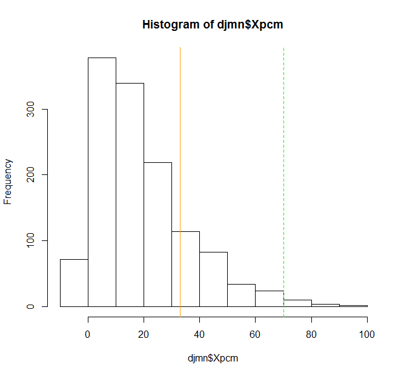
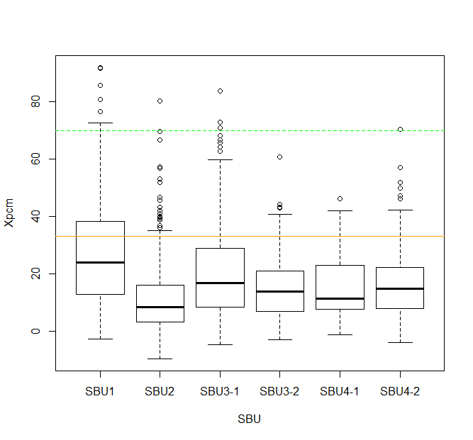

# JEE-Main NEET
An educational institution D has extended its data for its internal online mock tests based on [JEE-Main] and [NEET] exam patterns. The [author](mailto:yadevinit@gmail.com) thanks them for that. Following is a preliminary investigation for [JEE-Main] related data, and initial findings are in comments (following a `#`) within code blocks.

## Data
[NEET] related data is yet to be studied. Meanwhile, here's a summary of the data `DJMN` for [JEE-Main]:
```r
> summary(djmn) # djmn$Xpcm Q3=27% suggests on par with JEE-Main (cutoff and) distribution out there. Xc mean is lower.
     SBU      Course       StudentID         Student.Name             Campus   
 SBU1  :381   JMN:1279   Min.   :1.001e+10   Mode:logical   DCFL         :253  
 SBU2  :325              1st Qu.:1.003e+10   NA's:1279      Chethana     :158  
 SBU3-1:323              Median :1.008e+10                  Miranda      :136  
 SBU3-2:101              Mean   :1.027e+10                  Miyapur      :135  
 SBU4-1: 62              3rd Qu.:1.057e+10                  Madhapur Boys:120  
 SBU4-2: 87              Max.   :1.066e+10                  JnanaSweekar : 69  
                                                            (Other)      :408  
    Physics         Chemistry          Maths           Total       
 Min.   :-20.00   Min.   :-15.00   Min.   :-15.0   Min.   :-29.00  
 1st Qu.:  6.00   1st Qu.:  3.00   1st Qu.:  7.0   1st Qu.: 22.00  
 Median : 17.00   Median : 10.00   Median : 19.0   Median : 45.00  
 Mean   : 20.97   Mean   : 13.78   Mean   : 23.3   Mean   : 58.05  
 3rd Qu.: 32.00   3rd Qu.: 21.00   3rd Qu.: 35.0   3rd Qu.: 81.00  
 Max.   :100.00   Max.   : 90.00   Max.   :100.0   Max.   :276.00  
                                                                   
   Max.Marks        Rank             Xpcm             Xp        
 Min.   :300   Min.   :   1.0   Min.   :-9.70   Min.   :-20.00  
 1st Qu.:300   1st Qu.: 317.0   1st Qu.: 7.30   1st Qu.:  6.00  
 Median :300   Median : 638.0   Median :15.00   Median : 17.00  
 Mean   :300   Mean   : 635.5   Mean   :19.35   Mean   : 20.97  
 3rd Qu.:300   3rd Qu.: 950.0   3rd Qu.:27.00   3rd Qu.: 32.00  
 Max.   :300   Max.   :1279.0   Max.   :92.00   Max.   :100.00  
                                                                
       Xc               Xm       
 Min.   :-15.00   Min.   :-15.0  
 1st Qu.:  3.00   1st Qu.:  7.0  
 Median : 10.00   Median : 19.0  
 Mean   : 13.78   Mean   : 23.3  
 3rd Qu.: 21.00   3rd Qu.: 35.0  
 Max.   : 90.00   Max.   :100.0
> summary(djmn$Campus) # purpose here is help you relate and choose improvement actions; no other intention
         Chethana              DCFL                EB Global-Whitefield 
              158               253                59                29 
           Hyd_EB      JnanaSweekar              KMWA     Madhapur Boys 
               23                69                40               120 
   Madhapur Girls            Malnad           Maruthi           Miranda 
               47                23                14               136 
          Miyapur      NTR-Sarjapur             SGPTA Sri Venkateshwara 
              135                33                27                54 
           Surana      Surana-South            Teresa 
               17                37                 5
```
`Xpcm` denotes percentage marks for `pcm`, i.e., Physics, Chemistry, and Maths together.

## Data Distribution
```r
hist(djmn$Xpcm) # consider fitting a distribution to estimate CI given uncertainty in parameters.
  myPlotOverlay(hTvF=FALSE, ixVec=c(1:2), myLabel="", limList=cLimList)
```


## (Environmental) Factors that Impact
```r
plot(Xpcm ~ SBU, data=djmn)
  myPlotOverlay(hTvF=TRUE, ixVec=c(1:2), myLabel="", limList=cLimList)
  # SBU2 quartiles appear lower than others'. SBU1 seems to vary the most and has higher median.
  # SBU1 appears to be the only one with quarter present above a lower limit. Mostly only outliers above higher limit.
plot(Xpcm ~ Campus, data=djmn) # beware: re-factor Campus considering sample sizes.
  myPlotOverlay(hTvF=TRUE, ixVec=c(1:2), myLabel="", limList=cLimList)
  # EB shows highest median, though with large inter-quartile ranges; next Hyd_EB. "Madhapur Girls" seems lowest.
  # DCFL shows large inter-quartile ranges too.
  # about 3/4th of EB seems above lower limit. Hyd_EB, DCFL, Chethana follow.
```




[JEE-Main]: <https://jeemain.nta.nic.in/webinfo/public/home.aspx>
[NEET]: <https://ntaneet.nic.in/ntaneet/welcome.aspx>
