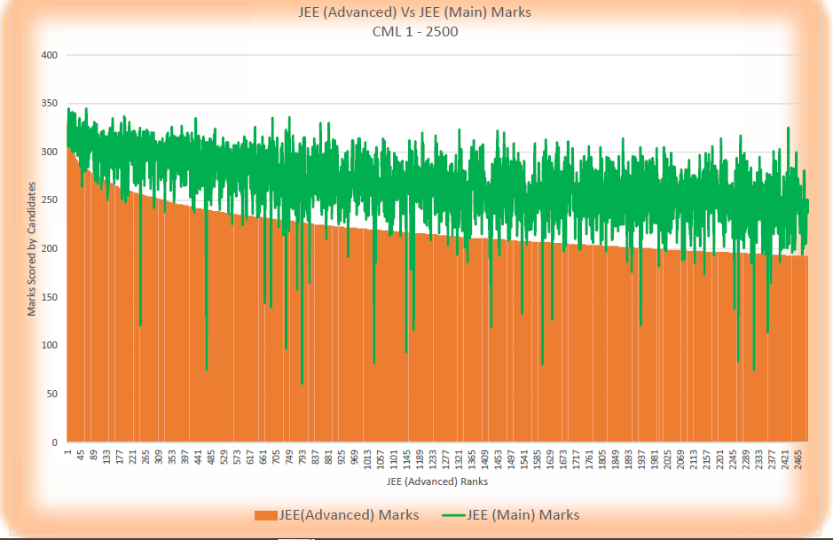
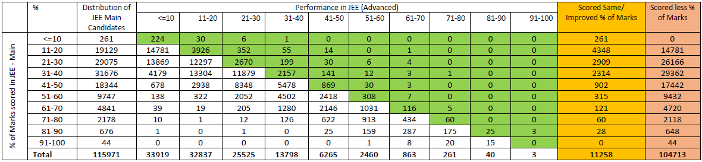
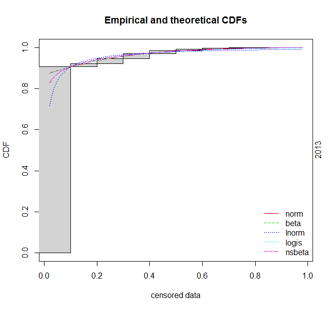
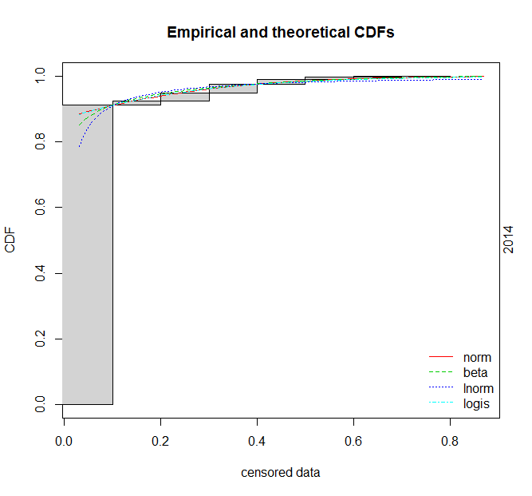
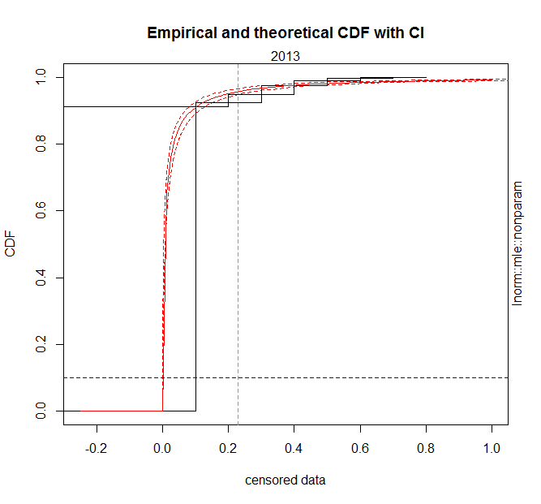

# JEE: Main Advanced
A [JEE-Advanced 2013 Report] (a) cross-tabulates (frequencies of) scores (ranges or intervals) from JEE-Advanced with those examinees' (prior) [JEE-Main] scores and (b) plots them with Common-Merit (or Rank) List (CRL) ranks as shown in following screenshots:




The Report also goes on to say that very few score the same or more as they progress from JEE-Main to JEE-Advanced. This [author](mailto:yadevinit@gmail.com) explores this further, along with JEE-Main cutoff scores.

## JEE-Main Cutoffs
[JEE-Main cutoff data] was compiled by the author from various sources, including <https://en.wikipedia.org/wiki/Joint_Entrance_Examination>, <https://collegedunia.com/exams/jee-main>, and <https://jeeadv.ac.in>. Following table is generated from that:

```
> JMN <- getJMNdata()
'data.frame':   9 obs. of  9 variables:
[... snip ...]
  year genCutoffPtileMarks genCutoffMarks totMarks openCRL qualCandidates appearCandidates rGenCutoff rOpenCRL
1 2020               89.50             NA      300      NA             NA           934000         NA       NA
2 2019               89.75             NA      360  108229         245000           958619         NA    0.113
3 2018                  NA             74      360  111275         231024          1043739      0.206    0.107
4 2017                  NA             81      360  109842         221834          1186454      0.225    0.093
5 2016                  NA            100      360   98238         198228          1194938      0.278    0.082
6 2015                  NA            105      360      NA             NA          1292917      0.292       NA
7 2014                  NA            115      360   75859         154032          1356805      0.319    0.056
8 2013                  NA            113      360   75750         152351          1282000      0.314    0.059
9 2012                  NA             NA       NA      NA             NA               NA         NA       NA
```

What can be observed (for JEE-Main) is as follows:
- `rGenCutoff (=genCutoffMarks / totMarks)` shows a reducing trend from about 32% to 21%. That's the cutoff for General Category.
- `rOpenCRL (=openCRL / appearCandidates)` shows an increasing trend from about 6% to 11%. That's the ratio of examinees listed in open-Category CRL vs. total (across Categories) examinees. So, it appears that scoring over 23% in the JEE-Main could get one into the open-Category CRL and eligible to write the JEE-Advanced.
- 2019 onwards, a percentile-based cutoff is apparently what's disclosed, and not the cutoff marks. As per the following code block, the author estimates `estCutoffPtileMarks` based on `rOpenCRL`, spots a similarity between that and `genCutoffPtileMarks`, and therefore, sees no reason that (23%) marks cutoff would not work.

```
> JMN <- cbind(JMN, estCutoffPtileMarks=100*(1-JMN$rOpenCRL))
> JMN[,c(1,2,10,8,9)]
  year genCutoffPtileMarks estCutoffPtileMarks rGenCutoff rOpenCRL
1 2020               89.50                  NA         NA       NA
2 2019               89.75                88.7         NA    0.113
3 2018                  NA                89.3      0.206    0.107
4 2017                  NA                90.7      0.225    0.093
5 2016                  NA                91.8      0.278    0.082
6 2015                  NA                  NA      0.292       NA
7 2014                  NA                94.4      0.319    0.056
8 2013                  NA                94.1      0.314    0.059
9 2012                  NA                  NA         NA       NA
```

## Score Mapping from JEE Main to Advanced
Looking at the earlier screenshots (for 2013), you can observe:
- A green band about 100 JEE-Main marks wide that moves lower as the orange JEE-Advanced marks move lower, as one moves away from JEE-Advanced Rank 1 right along the x-axis.
- That band shows the extent of variation. You can also see there are spikes downward much more than upward, which show JEE-Main marks of about 50 too have gone on to fetch subsequent JEE-Advanced marks of over 200.

That plot's underlying data is not on `www` and unavailable to the author, but looking at the other crosstab screenshot, you can observe that cells a row or two below the green diagonal account for much of the data. That [JMAD-crosstab data] from JEE-Advanced Reports has been assembled as follows for 2013 as well as 2014:

```
> JMAD <- read.csv(file=paste0(c.path.local, "dataJMADcrosstab.csv"), stringsAsFactors=TRUE)
> JMAD$year <- as.factor(JMAD$year)
> JMAD.cols <- c(3:13); levels(JMAD$JMpctBin) <- colnames(JMAD[,JMAD.cols])
> JMAD
   year JMpctBin j.25.00 j00.10 j11.20 j21.30 j31.40 j41.50 j51.60 j61.70 j71.80 j81.90 j91.100
1  2014  j.25.00 1236420     NA     NA     NA     NA     NA     NA     NA     NA     NA      NA
2  2014   j00.10       0    293     81     13      2      0      0      0      0      0       0
3  2014   j11.20       0   9030   5372    545     76      7      1      1      0      0       0
4  2014   j21.30       0   9310  17890   5626    558     60     13      4      0      0       0
5  2014   j31.40       0   1938  11953  15912   4465    358     23      5      0      0       0
6  2014   j41.50       0    296   1996   8016   7662   1779    105      7      1      0       0
7  2014   j51.60       0     62    162   1206   4054   3296    780     32      0      0       0
8  2014   j61.70       0     11     14     54    666   1949   1358    282      8      0       0
9  2014   j71.80       0      3      3      3     32    266    703    557     85      1       0
10 2014   j81.90       0      1      0      0      0     16     56    199    202     26       0
11 2014  j91.100       0      0      0      1      0      0      1     10     53     29       1
12 2013  j.25.00 1144029     NA     NA     NA     NA     NA     NA     NA     NA     NA      NA
13 2013   j00.10       0    224     30      6      1      0      0      0      0      0       0
14 2013   j11.20       0  14781   3926    352     55     14      0      1      0      0       0
15 2013   j21.30       0  13869  12297   2670    199     30      6      4      0      0       0
16 2013   j31.40       0   4179  13304  11879   2157    141     12      3      1      0       0
17 2013   j41.50       0    678   2938   8348   5478    869     30      3      0      0       0
18 2013   j51.60       0    138    322   2052   4502   2418    308      7      0      0       0
19 2013   j61.70       0     39     19    205   1280   2146   1031    116      5      0       0
20 2013   j71.80       0     10      1     12    126    622    913    434     60      0       0
21 2013   j81.90       0      1      0      1      0     25    159    287    175     25       3
22 2013  j91.100       0      0      0      0      0      0      1      8     20     15       0
```

What the author has included are counts of those who wrote the JEE-Main and did not get to appear for the JEE-Advanced exam, e.g., the row for `year=2013 JMpctBin=j.25.00` says 1144029 JEE-Main examinees scored anywhere between a symbolic (theoretical) minimum `-25` to a (JEE-Main) cutoff origin denoted by `00` and did not score anything in the subsequent JEE-Advanced (since they were not eligible to write it). (Note that `00` might not be numeric `0` and might differ between JEE-Main and JEE-Advanced; it's just a symbol here.) Row and column for `j00.10` match what you see in the earlier crosstab screenshot's row and column for `<=10` (for `year=2013`), e.g., column for `j00.10` has counts of examinees who wrote the JEE-Advanced and scored no more than 10%. With such data, what useful knowledge can be generated? Basically, this dataset is a sample for:
- JEE-Main mark (interval) distribution (censored by cutoff).
- Cross-tabulated frequencies of mark (intervals) between JEE-Main and JEE-Advanced.

## Discovery of the Latent JEE-Main Distribution
With the [JMAD-crosstab data], following plots show various (theoretical) distributions considered for fitting the sample observed for similar-looking years 2013 and 2014. Recall that the data is *censored* (minimums below 10% are not disclosed) and is *interval* data since it has frequencies (counts of examinees) for intervals of marks; that's why you see grey-shaded boxes (rather than the usual points) and without left boundaries:




Considering the above plots, the author chooses Log-normal distribution as reasonably representing the latent (hidden) JEE-Main (marks) distribution. There is uncertainty in that chosen distribution's parameters, as one would expect in the real world. The following plots 95%-Confidence Intervals around the median estimates (after what's statistically called *bootstrapping*). What this plot additionally tells you is that the Confidence Interval is less than 0.1 wide near the cutoff marks, which means instead of the 23% JEE-Main cutoff that seemed reasonable earlier in this article, the author recommends `0.23+0.10=` **33%** as the cutoff to target through the JEE Main to ensure eligibility for the JEE-Advanced exam. So:
- Please advise examinees to reduce their risk of scoring below that cutoff, preferably to less than 0.05 chance. For example as per the author's other Project [JEE: Enlighten], Ind runs a risk of over 0.20 in meeting this (lower) cutoff limit. And by the way, Project [JEE: Enlighten] uses a 35% JEE-Advanced cutoff, which is close to the 33% JEE-Main cutoff developed here. So to make it easy to remember, feel free to memorize 1/3rd or 33% as cutoff for either JEE exam.
- What's worth re-iterating is that scoring at the JEE-Main open-Category-CRL cutoff level does not guarantee a JEE-Advanced performance that might be wanted. The examinee will need to consider a JEE-Main score that matters, e.g., for admission to an NIT or IIIT and branch of choice.
- Just as the author, you too might have never come across *the* population distribution underlying JEE-Main performance. Now, this is out in front of you. Such a fitted distribution is a model to explain this part of the world, and its parameter estimates allow you to explore further, e.g., estimate various quantiles.



As always, you're welcome to extend this Project, e.g., to model (a) the Odds of JEE-Advanced marks given JEE-Main marks and using the [JMAD-crosstab data] or (b) the negative side of JEE-Main marks. Here's this Project's [R-source code].

[JEE-Advanced 2013 Report]: <https://jeeadv.ac.in/reports.php>
[JEE-Main]: <https://jeemain.nta.nic.in/webinfo/public/home.aspx>
[JEE-Main cutoff data]: <./dataJMNgenCutoff.csv>
[JMAD-crosstab data]: <./dataJMADcrosstab.csv>
[R-source code]: <./src-cutoffJMADmap.R>
[JEE: Enlighten]: <https://notebooks.azure.com/yadevinit/projects/jeeenlighten>
