# JEE: What Maximum can an Average Be?
A student Ind aspiring to qualify through the JEE (Joint Entrance Examination) has already been introduced at [JEE: Enlighten] by this [author](mailto:yadevinit@gmail.com). Here in this Project, institution D's average (mean of students') performance is dwelt upon, along with maximum performance.

## From Average
Data `Dscores` containing test-wise `avg` and `max` for over 240 students during their 11th and 12th standard (or school grade) is introduced at [JEE: Enlighten], though not used there. It has missing data (`NA` values), but before attempting any data imputation, let's see a (sample) frequency distribution for `avg` for the 'competitive' `pattern`:

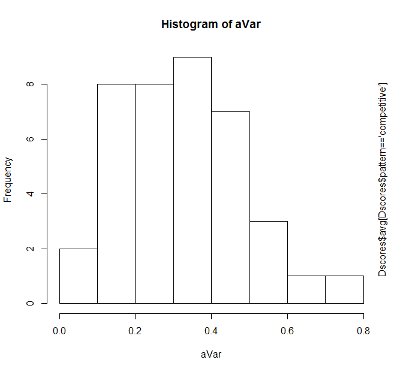

It shows `avg` with a (positive or) right skew, i.e., long tail to the right. This sample lies in the interval `[0,1]`, but we know the true range is `[-0.25,1.00]` as test questions can negatively mark incorrect answers. (There are individual marks, e.g., `ind`, that has a negative total mark on a test. And there are `avg,max` pairs such as `0.078,0.672`, which indicate likely negative marks.)

By now, we know sample quantiles give an air of point certainty, whereas the unknown population is what we're dealing with. Therefore, we can choose to embrace---or at least tolerate---uncertainty. Here are plots to assess Goodness-of-Fit (GoF) to various statistical distributions:
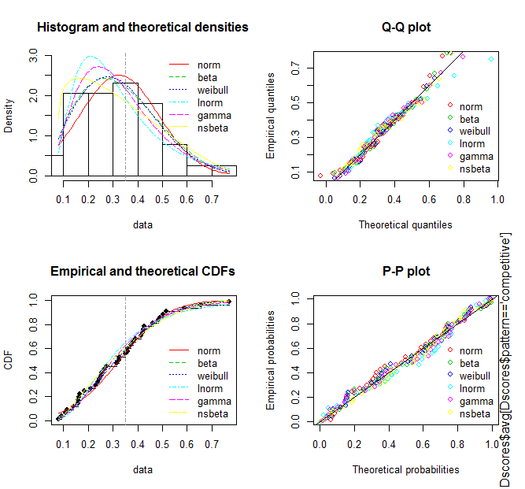

Recall from [JEE: Enlighten] that 35% is a marks' limit worth crossing for a place in JEE-Advanced's open-Category Common Rank List (CRL). That's shown as a "dotdash" vertical line in the GoF plots above. How well does `avg` avoid the risk of being left behind by that limit? For that, the following plot uses log axes to magnify the fits at the left tail of the distributions being compared. Considering these and other GoF statistics, the author chooses `nsbeta` (Non-Standard Beta) as a fitting distribution for `avg`.

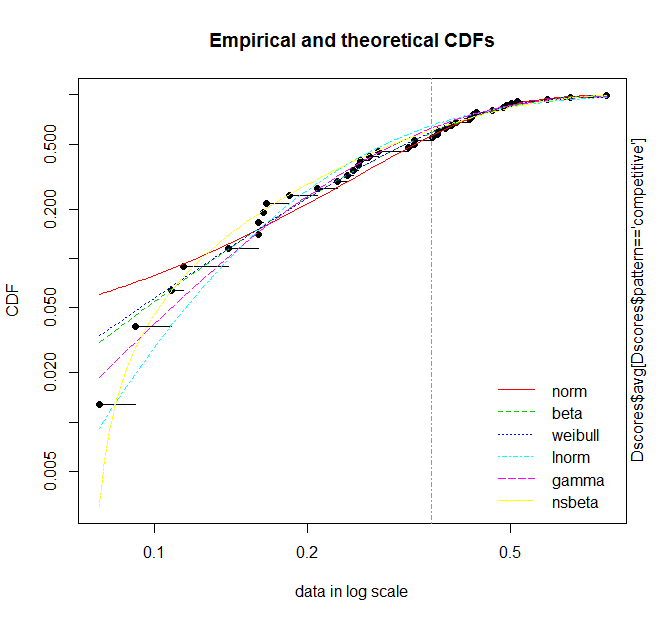

The chosen `nsbeta` has uncertainty in its distribution parameters. That's "bootstrapped" to generate the Confidence Intervals in the following plot. Simply put: `avg` faces a median 60% chance of failing the 35% limit, and with 95% Confidence, we can say that chance lies between 45% and 70%. Alternatively, we could say `avg` has a median 40% chance of success: crossing that 35% CRL limit. That's less than a 50:50 chance of heads in a random toss of a (fair) coin. But compare it with the odds through the JEE, which selects less than 5% from about a million examinees. Surely, the odds have been raised at least 8x times (from less than 5% to 40%), thanks to the children and the rest of the teaching-learning community including D's.

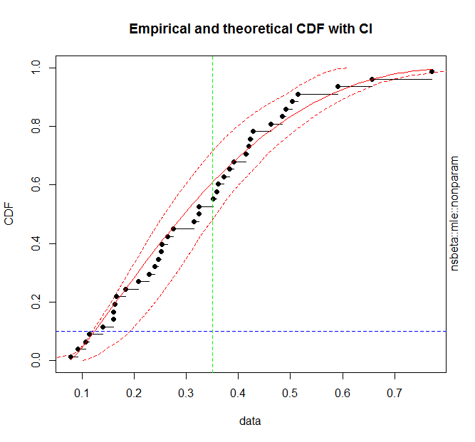

## To Maximum
Now, consider `max`, which can be a basis for new actions for a raised `avg`. The following plots `max` (marked `m`) with `avg` (marked `a`) and `ind` (marked `i`) in date sequence.

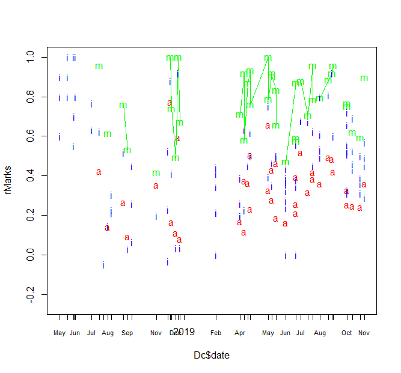

What you can observe is:
- Initially, there's missing data for `max` and `avg`.
- `ind` oscillates initially to extremes, up to `max` and including below `avg` which is the mean of over 240 students' marks for a given test. Later, `ind` oscillates lesser.
- `max` seems to oscillate between 1.00 and 0.40. Recalling the 35% JEE minimum chosen in [JEE: Rank Tails with Knee Marks], the author thinks that D might be pragmatically causing this considering students' motivation: D raises test difficulty whenever `max` touches 1.00, while students naturally raise effort to cause up trends.
- `max` does not move independently of `avg` or `ind`. There's a similarity to their trends.

Similar to what was done and reported earlier with `avg`, a (Weibull) distribution has been fitted with its Confidence Interval for `max`:

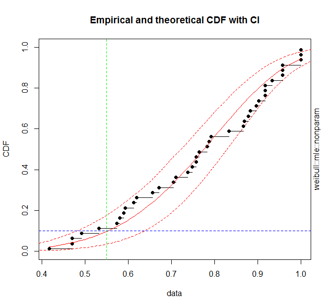

What this reveals is:
- Almost certainly, `max` exceeds the chosen 35% JEE minimum.
- Consider a knee corresponding to about 55% (JEE-Advanced `pattern`) marks. This is shown as a vertical green dashed line. With 95% Confidence, we can say there's less than 20% chance of `max` failing that limit. This appears to be good news.
- Suppose D wants to raise chances of `max` getting 1/3rd (or even better than 1/3rd) the rank that the multi-year (overall) knee suggests. Looking at the knee curves in [JEE: Rank Tails with Knee Marks], D must then consider a limit of 65% or higher marks. But there's already over 2/3rd chance of `max` (and nearby D scores) exceeding that 65% limit already. D therefore can surely act to raise that probability. But it's first worthwhile for D to check whether the 2/3rd chance estimate is really materializing:
  - If D's `max` has already been fetching 3-digit or better ranks through the JEE Advanced, there's much to celebrate. And D can raise the bar further.
  - If not, there's a calibration missing: D's "JEE-Advanced" tests are easier than what's JEE Advanced out there and might be on par with (or easier than) what's JEE Main out there. It might be that D is aware of this and has chosen pragmatic "workable comfort" in its relationship with students. After all, dealing with such highly-competitive exams demands a tenacity: recovering from and dealing with "failure" in every few questions. Even if D is aware of the missed calibration, it must re-consider the ethical dilemma since there's a committment to JEE-Advanced performance in its JEE-Advanced-stream relationship with over 240 students. If D is unaware of the missing calibration, it can choose to:
    - Use its finer student-wise data across years to examine for itself using the method used by this author or a superior method and
    - Concurrently raise students' learning levels.
  - Till D expresses its view on this matter, D's present students' community can inform itself of this likely calibration gap (and risks) and raise efforts considering the few months before the coming JEE Main while making suitable requests to D's teaching faculty.
  
## In Conclusion
> "What the mind can conceive and believe, and the heart desire, you can achieve."---Norman Vincent Peale

The author attempted to answer what maximum an average can be. What emerged, so far, is a likely missing calibration. Considering the inertial trajectory of D's institutional life, D will almost certainly not act on this. There are few months on hand before the JEE Main. What's possible is that from the `avg` (which includes the present `max` and `ind`) an extraordinary maximum can be achieved. It's up to you, dear reader, to take action for this. Probabilities, no matter how confidently expressed, cannot stop human beings; indeed, those probabilities did not stop student learners or D from joining hands in the JEE-Advanced stream. To cause a never-before maximum, D, students, and others in the teaching-learning community can partner at another level and use the missing calibration as a reason to "re-set" any stopped actions. Be unstoppable! Eventually, a seat selection will happen. Some will not get the seats they wanted, but the renewed learning experience will be etched forever. That's living powerfully, by choice. `inD`go!

# Appendix: Diagnostics and More
For bootstrapping and exploring distributions to fit `avg` 'competitive' `pattern` data:

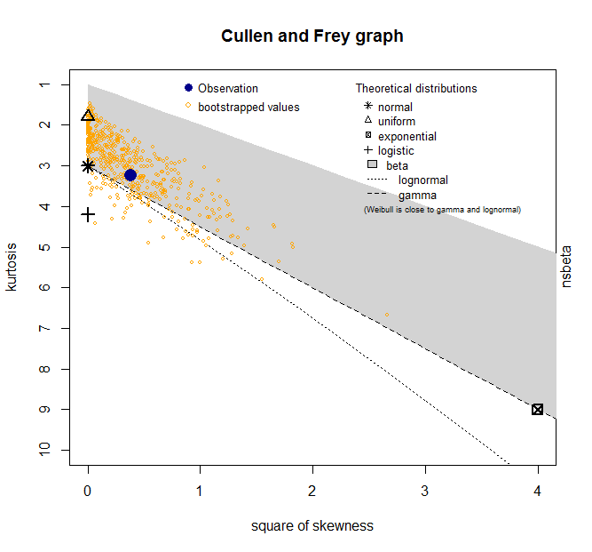

Similarly, to fit `max` 'competitive' `pattern` data, the last of which maximizes fit with greater weightage to right tails using advanced Goodness-of-Fit statistics ADR and AD2R (Anderson-Darling statistics of 1st and 2nd order weighing one tail more):

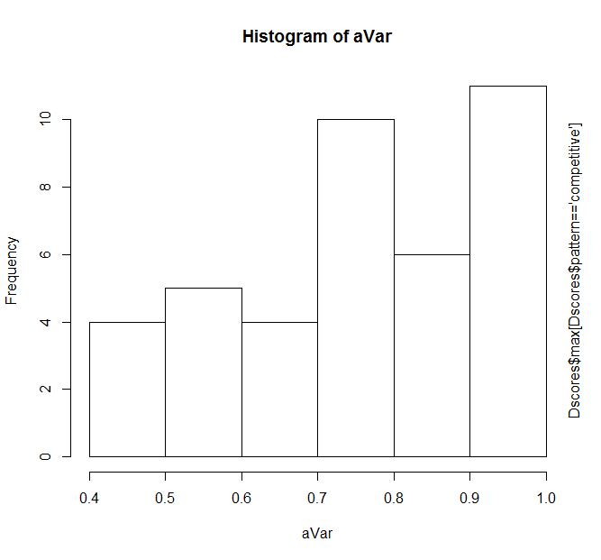
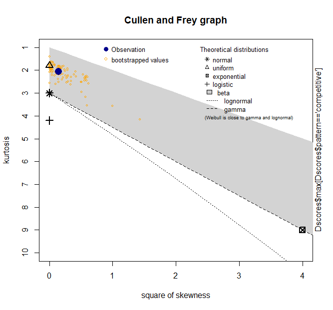

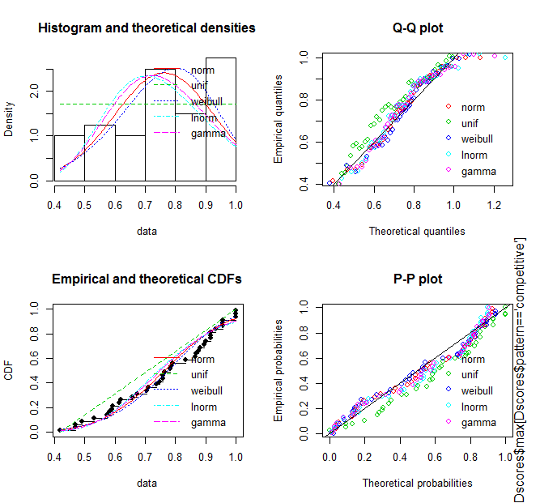
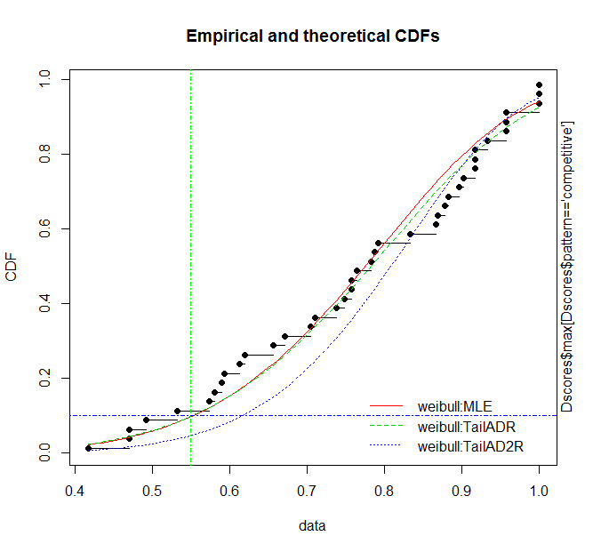

As you can see, `max` is left skewed, more than `ind` and unlike `avg`.

You are welcome to see the [data](dataDscores.csv) and [R-source code](srcDavg2max.R) and extend this Project.

[JEE: Enlighten]: <https://notebooks.azure.com/yadevinit/projects/jeeenlighten>
[JEE: Rank Tails with Knee Marks]: <https://notebooks.azure.com/yadevinit/projects/jeeknee>
