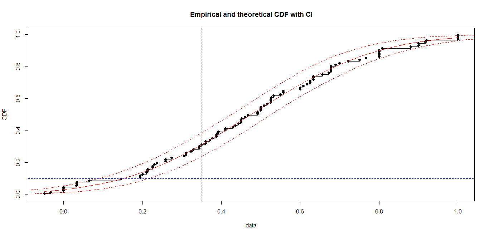
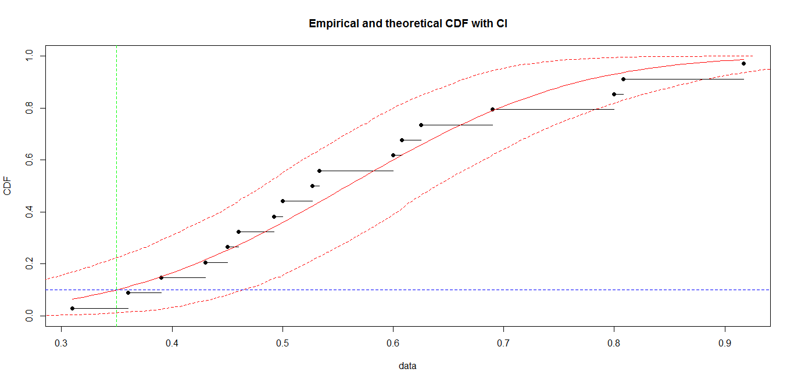
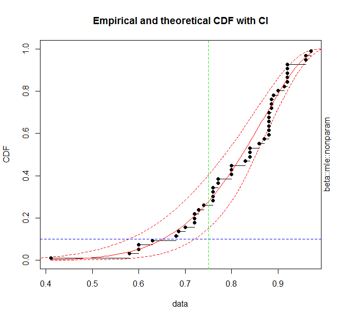
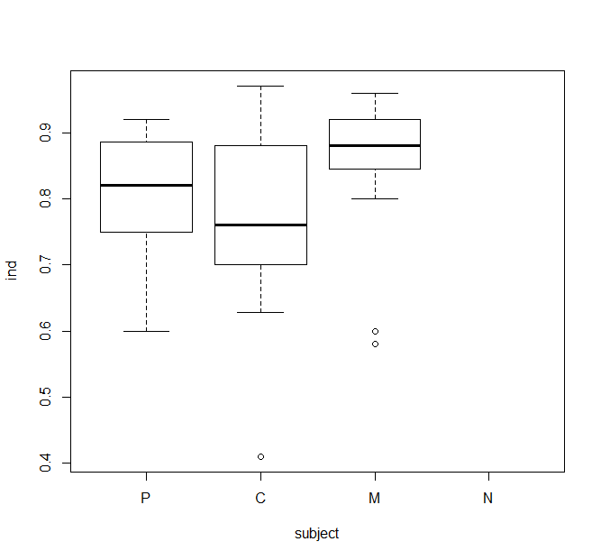
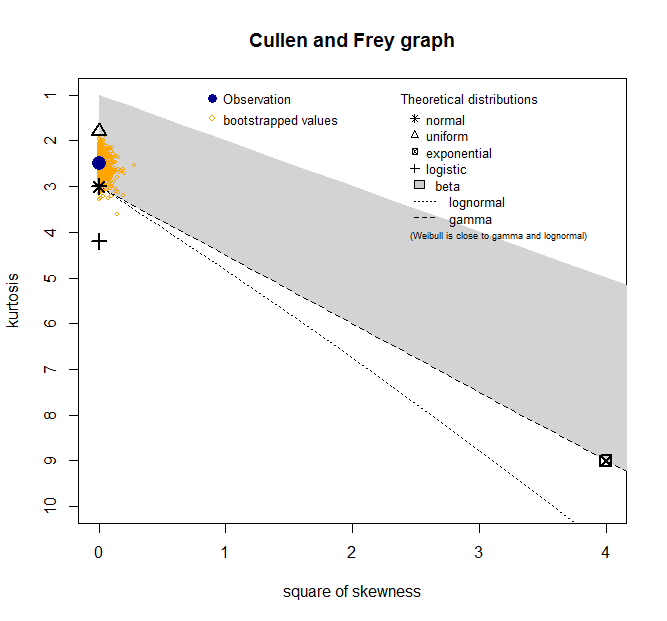
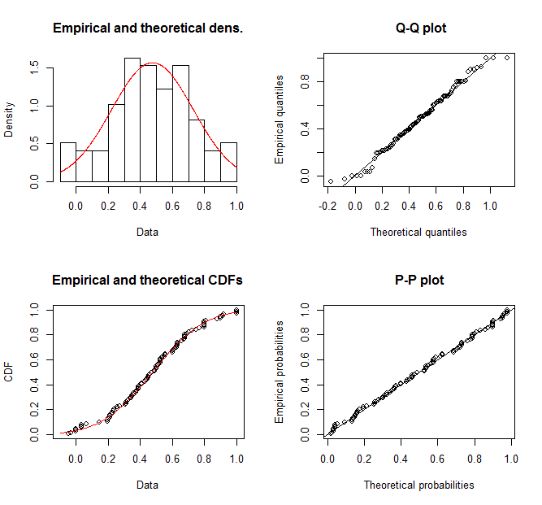
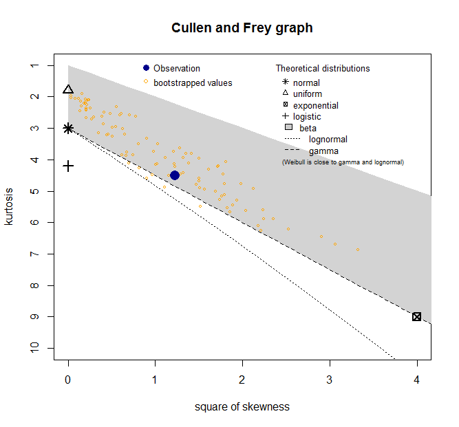
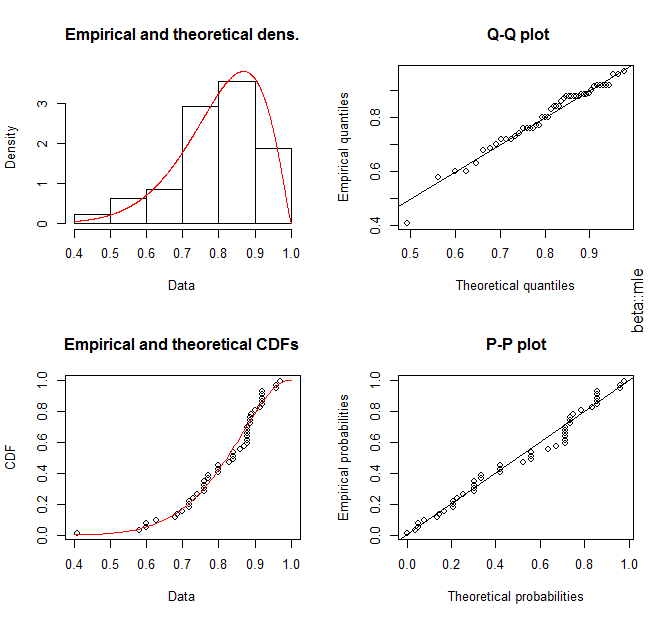

# JEE: Enlighten
Consider an individual student learner Ind who will appear for the JEE Main in 2 months. (The competitive JEE or Joint Entrance Examination has Main and Advanced sections and is taken by about 1.5 million youth each year. About 1%-5% of these youth are offered seats at the Indian Institutes of Technology.) Life seems to move on some "automatic" trajectory. Sometimes, Ind and his mother are "comfortable" with it, given that there are already enough daily gyrations to deal with. At other times, his mother is concerned, wants him to limit playing games and study more, and unveils a "failed future." To present an alternative to that lifestyle, what's an "enlightened" assessment of the situation, including the near future? The [author](mailto:yadevinit@gmail.com) takes on this question in this article.

Ind and his mother are committed to scoring 60% (or more) through the JEE Main to qualify for the subsequent JEE Advanced (and "perform well" there to unlock access to the premier technology institutions of the country). The author has already dealt with performance at the JEE Advanced through [JEE: Rank Tails with Knee Marks]. And leadership insights [I is not Absolute] and [Mistakes as Invention] empower us to use past mistakes and present gaps as a light to shine forward on any possibility that matters in future. To support that with a touch of rational logic and realism, the author ponders: what's likely to happen for Ind through the JEE Main, if no new action is taken on life's "automatic" trajectory?
## Individual Performance Good Enough?
The author looks for data on which to build and verify an assessment. Ind's college D (for 11th and 12th grade) has been sharing his marks `ind` on various tests and exams, along with corresponding college averages `avg` and maximums `max`. What does `ind` reveal?

Following shows D's data structure for over 240 students who joined a "JEE-Advanced" stream in 2018-May, are expected to take the JEE Main in 2020-Jan couple of months from now, and will graduate from the College few months after that. Subject of the test (or exam) is Physics, Chemistry, Maths, or combined (`N`). Each test has a `date`—mapped to `daysIn1112` as a count of days from start of 11th grade—and a `pattern` that's either 'competitive' (JEE) or 'PU' (Pre-University Board) pattern. `JADremark` is used to map to `subPattern`: JEE-Advanced (JAD), JEE-Main (JMA or JMN), or PU. `ind` has an individual student's scores—a ratio of marks got divided by total marks—while `avg` and `max` have the average and maximum scores for that test. `avg.ind`, `max.ind`, and `avgByMax` have respective ratios: `avg/ind`, `max/ind`, and `avg/max` scores for that test.

    > str(Dscores)
    'data.frame':   146 obs. of  13 variables:
     $ subject   : Factor w/ 4 levels "P","C","M","N": 1 2 3 1 2 3 1 2 3 2 ...
     $ date      : Date, format: "2018-05-25" "2018-05-25" "2018-05-25" "2018-05-28" ...
     $ pattern   : Factor w/ 2 levels "competitive",..: 2 2 2 1 1 1 1 1 1 1 ...
     $ JADremark : chr  "weekly" "weekly" "weekly" "weekly" ...
     $ ind       : num  0.6 0.9 0.6 0.8 0.6 0.9 0.8 0.9 1 1 ...
     $ avg       : num  NA NA NA NA NA NA NA NA NA NA ...
     $ max       : num  NA NA NA NA NA NA NA NA NA NA ...
     $ avg.ind   : num  NA NA NA NA NA NA NA NA NA NA ...
     $ max.ind   : num  NA NA NA NA NA NA NA NA NA NA ...
     $ avgByMax  : num  NA NA NA NA NA NA NA NA NA NA ...
     $ class12   : logi  FALSE FALSE FALSE FALSE FALSE FALSE ...
     $ subPattern: Factor w/ 3 levels "JAD","JMA","PU": 3 3 3 1 1 1 1 1 1 1 ...
     $ daysIn1112: int  0 0 0 3 3 3 17 17 17 28 ...
    > head(Dscores[,-4]); print("..."); tail(Dscores[,-4]) # without column "JADremark"
    subject       date     pattern ind avg max avg.ind max.ind avgByMax class12 subPattern daysIn1112
    1         P 2018-05-25          PU 0.6  NA  NA      NA      NA       NA   FALSE         PU          0
    13        C 2018-05-25          PU 0.9  NA  NA      NA      NA       NA   FALSE         PU          0
    110       M 2018-05-25          PU 0.6  NA  NA      NA      NA       NA   FALSE         PU          0
    2         P 2018-05-28 competitive 0.8  NA  NA      NA      NA       NA   FALSE        JAD          3
    21        C 2018-05-28 competitive 0.6  NA  NA      NA      NA       NA   FALSE        JAD          3
    210       M 2018-05-28 competitive 0.9  NA  NA      NA      NA       NA   FALSE        JAD          3
    [1] "..."
        subject       date     pattern   ind   avg   max avg.ind max.ind avgByMax class12 subPattern daysIn1112
    932       M 2019-10-21 competitive 0.690    NA    NA      NA      NA       NA    TRUE        JMA        514
    933       N 2019-10-21 competitive 0.527 0.246 0.620   0.467   1.176    0.397    TRUE        JMA        514
    94        P 2019-11-04 competitive 0.360    NA    NA      NA      NA       NA    TRUE        JMA        528
    941       C 2019-11-04 competitive 0.310    NA    NA      NA      NA       NA    TRUE        JMA        528
    942       M 2019-11-04 competitive 0.500    NA    NA      NA      NA       NA    TRUE        JMA        528
    943       N 2019-11-04 competitive 0.390 0.240 0.593   0.615   1.521    0.405    TRUE        JMA        528

From the following (sample) percentile values of `ind`, you can see 'competitive' `pattern` has a 66.7th percentile of 0.600. So, in a random test (observation), there's about 2/3rd of a chance that `ind` is less than (or equal to) 0.6. This also means there's about 1/3rd chance of that learner's score over the committed 60%. So, what's a score with a greater chance? 25% chance of `ind` no more than 0.31, i.e., a (likelier) 3/4th of a chance of score over 31%, which is half way to the committed 60%. (For the related sample frequency distribution or histogram, refer to Appendix.) That's to visualize a gap from past performance to the possible (near and dear) future.

    > ind.ptiles <- aggregate(Dscores['ind'], by=list(Dscores$pattern), FUN=myQtiles); colnames(ind.ptiles)[2] <- ""; print(ind.ptiles)
          Group.1     0%    10%    25%  33.3%    50%  66.7%    75%    90%   100%
    1 competitive -0.048  0.179  0.310  0.363  0.480  0.600  0.650  0.800  1.000
    2          PU  0.410  0.665  0.737  0.760  0.840  0.880  0.886  0.920  0.971

## Tests’ Difficulty on Par?
We're dealing with thinking minds here. Some argue: "But D's tests might not be on par with JEE Main's." That's a matter of calibrating the test "gauge," and so, best answered by the test designers, but since D is not participating for this article, the author attempts an answer. The difficulty-on-par question is partly addressed in [Chapter Skipped?](<https://docs.google.com/document/d/16nh-mq1bF8kjx_t6UezKINf6SAK1GG2whWGeSvlcUbo/edit?usp=sharing>) (pages 2-4). If you strongly believe D's tests have been easier, choose a conversion function, e.g., `0.9*ind`, when comparing with JEE data. And now if you want a rigorous answer, [JEE: What Maximum can an Average Be?] reasons that D's tests are likely easier than the JEE-Advanced pattern out there and there is a calibration gap.
## Past Relevant for Future?
  > *"If you want to achieve excellence, you can get there today. As of this second, quit doing less-than-excellent work."*—Thomas J. Watson.

We've been dealing with samples from a relevant past. What we can do is compare estimates of the unknown "population" denoted by the statistical variable `ind` vs. a safe minimum of 35% for CRL (merit) `rMarks`, which the author judgmentally chose from sample minima of the unknown "population" of JEE-Advanced performance through data used in [JEE: Rank Tails with Knee Marks]:

    > aggregate(CRLmarks["rMarks"], by=list(CRLmarks$JADyear), FUN=min)
      Group.1  rMarks
    1    2013 35.0000
    2    2014 35.0000
    3    2016 20.1613
    4    2017 34.9727
    5    2018 25.0000

Now, fit a (statistical) normal (Gaussian) distribution to the sample of `ind` (black dots), bootstrap to deal with uncertainty in parameters (mean and standard deviation) of that distribution, and plot the (95%) Confidence Intervals (dashed red curves making a band around the fitted red curve) for the Cumulative Distribution Function (CDF) for `ind`:

(If you are not daunted by statistics, you can refer to Appendix for diagnostics generated en route.) Simply put, right of this graph's green vertical (dashed) line and above its blue horizontal line is where merit is recognized and scored (by Ind) almost certainly. What it also shows, for example, is that Ind runs up to 40% risk of missing the CRL cutoff, whereas the sample percentiles suggested a lesser risk of 1/3rd.

Ah, now someone says "But all 'competitive' tests are not the same: there are JEE-Main `subPattern` tests where Ind is almost certain to qualify by scoring beyond the cutoff." So, let's see the sample percentiles first:

    > ind.ptiles <- aggregate(Dscores['ind'], by=list(Dscores$subPattern), FUN=myQtiles); colnames(ind.ptiles)[2] <- ""; print(ind.ptiles)
      Group.1     0%    10%    25%  33.3%    50%  66.7%    75%    90%   100%
    1     JAD -0.048  0.065  0.258  0.338  0.450  0.572  0.656  0.800  1.000
    2     JMA  0.310  0.378  0.450  0.470  0.527  0.605  0.625  0.803  0.917
    3      PU  0.410  0.665  0.737  0.760  0.840  0.880  0.886  0.920  0.971

Sure enough, the sample's 10th percentile for JEE-Main `subPattern` is 0.378, which exceeds the 35%
cutoff chosen by the author. Let's now fit a (statistical) normal (Gaussian) distribution and see the Confidence Intervals of
that fitted distribution:

Partly due to the smaller sample size of about 17 observations, including across subjects, `ind` for the JEE-Main `subPattern` test shows a wider Confidence Interval. Specifically, there can be up to 0.25 chance of Ind missing the cutoff, whereas seeing the sample alone indicated a 0.10 chance of missing. But yes, the risk is lesser.
## What about that Board Pattern?
Yes, that matters since JEE Advanced ranks have required a minimum Board score of 75% to be eligible, as per policy for the open General Category. So, how does Ind fare?

Ind's 'PU' `pattern` data is negatively (or left) skewed, i.e., has a long tail on the left and peak is to the right of its frequency distribution. Fitting a (statistical) beta distribution with related Confidence Intervals shows Ind has a chance from 0.15 up to 0.4 of missing that Board cutoff. (For details, refer the Appendix.) So, what's a possible factor? Following boxplots show how Ind's 'PU' scores vary with `subject`: 'C' (Chemistry) median (thick horizontal line) is relatively lower, and 'M' (Maths) has the least inter-quartile gap and variability.

## As You Detach (from this Conversation) for Now ...
Ind's mother can ponder this article. Further, she can consider this: when a rocket is about to take off, the scaffolding that holds it steady (with "umbilical cords") is peeled off; otherwise, the intended take off might be thwarted. If you prefer something more poetic, read [Khalil Gibran on Children]. And if you prefer more soul, consider "the path of unselfish action" mentioned in [Karma Yoga] or [Gita].

## Appendix: Diagnostics for Fitting Distributions and More
For Ind's 'competitive' `pattern` data:

For Ind's 'PU' (Board) `pattern` data:

You are welcome to (a) see the [data](dataDscores.csv) and [R-language-source code](srcJEE-enlighten.R) and (b) to extend this Project.

[JEE: Rank Tails with Knee Marks]: <https://notebooks.azure.com/yadevinit/projects/jeeknee>
[I is not Absolute]: <https://landmarkinsights.com/2019/10/the-i-as-we-know-it-is-not-an-absolute/>
[Mistakes as Invention]: <https://landmarkinsights.com/2015/07/mistakes-as-an-invention-afford-us-a-larger-opening/>
[Khalil Gibran on Children]: <https://en.wikiquote.org/wiki/The_Prophet#On_Children>
[Karma Yoga]: <https://en.wikipedia.org/wiki/Karma_yoga>
[Gita]: <https://www.holy-bhagavad-gita.org/chapter/2/verse/47>
[JEE: What Maximum can an Average Be?]: <https://notebooks.azure.com/yadevinit/projects/jeeavg2max>
