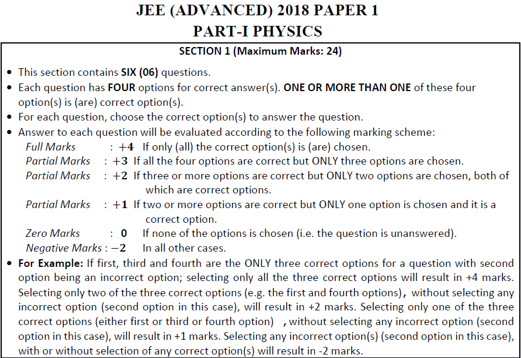

# When life's invisible hand throws unfair dice, you can choose to learn
About 1 in 5 candidates rightly answers a given random (highly-competitive JEE-Advanced-exam) question. Put the other way, typically 4/5th of candidates do not get it right, i.e., do not attempt it or get it wrong (accompanied by “-ve” marking which is on about 2/3rd of all questions). On the “hardest” end, there are about 1 in 10 questions where about 92% or more candidates do not get it right, i.e., where almost all have a learning gap. On the “easiest” extreme, there are about 1% questions where almost 70% or more candidates get it right, and there’s no question where all get it right.

The type of question makes a difference: a Numerical-Answer type question is the “hardest.” A random question of this type gets less than 1/3rd the frequency of right answers that a Two-List-Match-Single-Answer type question gets, about 40% of the count of right answers that a Single-Correct-Answer type question gets, and about 63% the count of right answers that a Multiple-Correct-Answer type question gets. Multiple-Correct-Answer type questions are the “next hardest,” and about 1/3rd of questions each year are of Multiple-Correct-Answer type whereas Numerical-Answer type made up 44% (=48/108) questions in 2018 and did not occur prior till at least 2012.

Using this insight, JEE candidates could practise diverting resources (such as time) from Two-List-Match-Single-Answer type questions to Numerical-Answer type questions with “-ve” marking scheme. That way, they could match (and economize) where most candidates answer right, and go beyond, by rightly answering even those questions that most do not get right. For more insight over 6 years of data from the JEE-Advanced exams taken by over a million candidates each year, read ahead (or refer to https://notebooks.azure.com/yadevinit/projects/jeeinsight).
## Background
The rest of this document expresses the above synopsis with details. Here's a background to relate with. The Joint Entrance Examination (JEE) is for admission to the Indian Institutes of Technology (IIT) and other institutions for undergraduate and other programs in engineering, science, and architecture. It is taken by over a million candidates each year. (For an Information Brochure in English, refer https://drive.google.com/file/d/1xTk8FAJ7IYe7kkHgyTr-vaoatefQIzeY/view?usp=sharing.) Its question-wise data is tabulated inside reports at https://jeeadv.ac.in/archives/jee-reports.html. The data includes question-wise counts of candidates who got it correct (sometimes partially), got it wrong (sometimes with negative marking), and did not attempt. To see what can be scientifically learnt from it, the [author](mailto:yadevinit@gmail.com) created this project, in which the author compiled 6 years of this data: of about 680 JEE-Advanced-Exam questions across 2 papers each of Physics, Chemistry, and Maths subjects. Through a statistical-modeling exercise, the author preferred a Negative-Binomial Generalized Linear Model (NB GLM) for regression. Following are the findings and a way forward.
## Key Findings
1. Incidence Rate (*rightIR*) of right answers (considering partially-correct ones too, over the set of candidates' answers for a question) has a median of about 0.215. Simply put, about 1 in 5 candidates rightly answers a given random (JEE-Advanced) question; 4/5th of candidates do not get it right, i.e., do not attempt it or get it wrong. The 10th percentile of rightIR is about 0.079; simply put, there are about 1 in 10 questions where about 92% or more candidates do not get it right, i.e., a narrow area where almost all are missing a learning. On the other end of the distribution, the 99th percentile is about 0.687, i.e., there are about 1% questions where almost 70% or more candidates get it right, and no question where all get it right. This tells you how unfair is the dice thrown, revealing learning opportunities for all.
2. A random Two-List-Match-Single-Answer type question has a rightIR that is 3.2 times that of a (baseline reference) random Numerical-Answer type question. Seen the other way, a Numerical-Answer type question gets about 1/3rd the right answers compared to that of a Two-List-Match-Single-Answer type question. The next biggest difference in rightIR is for a random Single-Correct-Answer type question: it has a rightIR 2.4 times that of the baseline. (These are when you hold the year, subject, and marking scheme as constant.)
3. A "+ve" marking-scheme question has a rightIR 1.3 times that of a (baseline reference) "-ve" marking-scheme question, which deducts marks for an incorrect (or partially-incorrect) answer. Regarding occurrence, "+ve" marking-scheme questions comprise over 1/3rd of all questions; the rest use a "-ve" marking-scheme.
## Way Forward
1. You, the reader, can choose to apply these findings. For example, you could ask JEE candidates to practise diverting resources (such as time) from Two-List-Match-Single-Answer type questions to Numerical-Answer type questions (48/108 questions in 2018 and 0 questions in years going back to 2012) with "-ve" marking scheme. That way, they could match (and economize) where most candidates answer right, and go beyond, by rightly answering even those questions that most do not get right. If one wants to invest in an alternative, Multiple-Correct-Answer type questions are the nearest to and occur more often than Numerical-Answer type with a rightIR that is 1.6 times. About one third of questions each year are of Multiple-Correct-Answer type.
2. You are also invited to verify, generate, and share new learnings from this project, which includes the [data](./qaJEEadvanced.csv) and [code](./JEEinsight.ipynb) in R-programming environment, which you can use as a base to program in many languages of your choice. There is more on the data in the Appendix ahead, and please see the Appendix if you wish to build on this project further. The author acknowledges the JEE committees for reporting the data, which he subsequently compiled. The author also acknowledges all the communities involved: candidates, their family and friends, exam organizers, questionnaire designers, educationists, the government, and the ecosystem for quantitative thinking.
## Appendix 1: More on the Data
Some might be sceptical regarding this (data and) project's relevance for the larger population that appears for the JEE-Main exam. For that, the JEE Reports of 2013 and 2014 carry scatter plots relating JEE-Main vs. corresponding JEE-Advanced scores and cross tabulate the score intervals; considering those, one cannot deny their relationship, and hence, the relevance of this project for JEE-Main performance too.

Another belief might be that performance outcomes differ from paper 1 to 2, considering paper 2 could be for Architecture applicants. Boxplots show no apparent difference; so, the author sees no reason to drop data for paper 2 for JEE Advanced. Also, the JEE Reports themselves combine paper 1 and 2 outcomes when showing distributions.

The data excludes 2015's data as it could not be located. 2011's Report did not have such data; so, prior reports were excluded. Candidates must qualify through the JEE-Main Exam with a score beyond a cut-off as a pre-requisite to write the JEE-Advanced exam. JEE-Main exam's data could not be located on www, but the 2012 data that has been included in this project is for 479,651 candidates, which is about 3 times the count for more-recent years and includes their JEE-Main performance.

Year to year, total count of candidates varies, and in 2012, it is about 3 times. For a multi-year study, therefore, the output (or response or dependent) variable must adjust (or offset) for that.

Each question can be uniquely identified by its year, subject, paper, and sequence number (qaNum) within. To see the actual question and details of its markScheme, the reader would have to refer the corresponding question paper, which is also on the www.

From 2016 onwards, there are questions with Multiple Correct Answers (MCAQ) whose marks range as follows: \[-2,0,1,2,3,4\]. This range set is correspondingly mapped and counted (aggregated) into \[Wrong, Unattempted, 1/4 * partialCorrect1m, 2/4 * partialCorrect2m, 3/4 * partialCorrect3m, Correct\]. The project needs a reasonable outcome indicator that is comparable across years even prior to 2016. So, the author created (Incidence of) *right* which (a) is equal to (Incidence of) Correct for non MCAQ and (b) equates to (1/4 * partialCorrect1m + 2/4 * partialCorrect2m + 3/4 * partialCorrect3m + Correct) for MCAQ. The corresponding Incidence Rate is being called *rightIR*. Though this does not match the tabulated percentages for partial-correct answers in the JEE Reports, the author believes that this indicator is more consistent with the marks scored by candidates and (due to *right*) with the candidates' count.

2016's data for questions 14 to 18 of Maths Paper 1 incorrectly had 147,678 as count for partial marks. That has been corrected to 0.
## Appendix 2: Multiple-Correct-Answer Questions Type
Here is a snapshot of an example "-ve" markScheme from a JEE-Advanced question paper:

## Appendix 3: What you could consider to build on this project
This is primarily for those with expertise in statistical modelling. Others might feel challenged reading this section.
+ By using the question ID, browsing the corresponding question paper, and mapping to subject *topics* (using syllabus data), you could (extend the previous study and) estimate aggregated-topic-wise risks for low-performance over high-performance outcomes. This risk assessment can be used by teachers and learners to economically prioritize resource allocation. One could consider discovering latent clusters too.
+ If the JEE Committee publishes candidate-wise answer data (not just aggregate population data), one could consider using Item Response Theory (IRT) with parameters of Difficulty beta, Discrimination alpha, and (latent person) Ability. The author made related requests to the JEE Committee 2019 and the National Test Agency (NTA) in 2019-April.
+ 2013 and 2014 Reports tabulate candidate counts for corresponding marks intervals of JEE-Main and JEE-Advanced exams. Each JEE Report also gives seat-allotment statistics and school-board-wise statistics, e.g., with Karnataka Board of Pre-University Education, 5,361 registered of which 417 (~8% vs 2017's 16%=829/5036) qualified compared to Central Board of Secondary Education's 71,403 registered of which 17,820 (25% vs. 2017's 34%=26127/75955) qualified. Such data could be included in a study.
+ JEE 2013 Report says "maximum numbers of un-attempted questions are invariably in Mathematics." *Unattempted* or *wrong* Incidence Ratios could be studied.
+ To raise the analysis and modeling to another level, you could consider the following:
  - https://bbolker.github.io/stat4c03/notes/binomial_poisson.pdf gives clear steps and checks and says: "(Aggregated) binomial regression ... need to specify response either as a two-column matrix: cbind(num_successes,num_failures) or (recommended) as a proportion with the additional weights variable giving the total number of trials."
  - https://cran.r-project.org/web/packages/pscl/vignettes/countreg.pdf guides on pscl::hurdle() and pscl::zeroinfl() while also suggesting to base inference on the more robust sandwich covariance matrix estimator.
  - https://www.jstatsoft.org/article/view/v034i12/v34i12.pdf consider for actual-best model through automatic model selection and multi-model inference with GLMs. Consider crit=qaic or crit=qaicc for over-dispersed data.
  - http://www.contrib.andrew.cmu.edu/~achoulde/94842/homework/regression_diagnostics.html suggests investigating and theorizing with extreme observations, e.g., using those "Cook's distance" dashed curves. https://us.sagepub.com/sites/default/files/upm-binaries/38503_Chapter6.pdf suggests deeper interpretation of diagnostics, eg, using car::avPlots(). http://www.columbia.edu/~so33/SusDev/Lecture_5.pdf too. https://journal.r-project.org/archive/2012-2/RJournal_2012-2_Nieuwenhuis~et~al.pdf suggests influence.ME for mixed-effect models. https://stats.stackexchange.com/questions/70558/diagnostic-plots-for-count-regression gives diagnostics for count regression.
  - https://maths-people.anu.edu.au/~johnm/stats-issues/hurricnames.html ends with NBI NBII and various implementation packages.
  - https://cran.r-project.org/web/packages/MASS/MASS.pdf says polr() for Ordered Logistic or Probit Regression, with default case of proportional odds logistic regression.
  - www.stat.wisc.edu/~ane/st572/notes/lec06.pdf for Logistic Regression which misses ordering, uses Odds Ratio, and is most common in publications. http://www.utstat.toronto.edu/~brunner/oldclass/appliedf12/lectures/2101f12LogisticRegressionWithR1.pdf gives further details.
  - http://scs.math.yorku.ca/images/6/63/DDAR-Ch11.pdf compiles Generalized Linear Models for Count Data.
  - https://stats.idre.ucla.edu/r/dae/multinomial-logistic-regression/ guides on multinom().