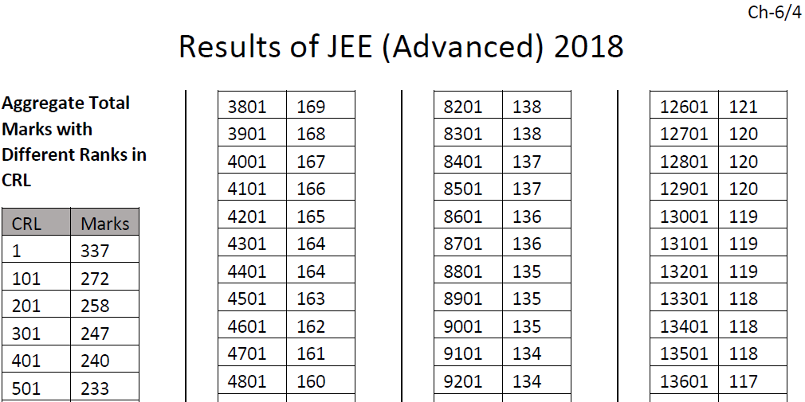
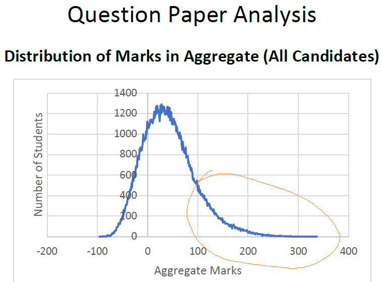
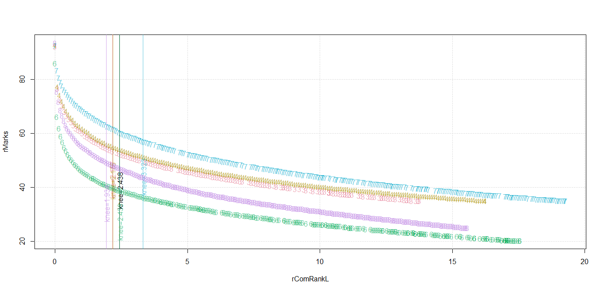

# JEE: Rank Tails with Knee Marks
What marks must I almost-certainly score at the (Joint Entrance Examination) JEE to get the branch and undergraduate institution of choice? What rank can I get for my JEE marks? These are questions posed by student learners on the verge of seeking admission to undergraduate programs in science, technology, or engineering. And these are scientifically answered here through this [author](mailto:yadevinit@gmail.com).

The open Common Rank List (CRL, also known as Common Merit List) from the competitive JEE-Advanced 2018 and the CRL's related marks are tabulated at <https://jeeadv.ac.in/>. Here's a screenshot from that table:



As you can see, every 100th CRL rank is what's tabulated with its corresponding marks. The author has added data for the maximum CRL rank (for completeness and from the same JEE Report) though it is not 100 ranks away from its nearest data. This author encircled that region of qualifiers in orange colour over a separate marks-distribution screenshot for *all* who appeared from 2018's JEE-Advanced Report:



This author then plotted that orange-encircled (open-Category) qualifiers' CRL-marks data with points labeled '8' (for every 100th rank), along with similar qualifiers' data from 2014 (with points labeled '4') and other years, as shown ahead. The y-axis `rMarks` has `100*(marks /max marks)`; the x-axis `rComRankL` has the corresponding `100*(CRL rank /count of examinees who appeared)`. This scaling (using ratios) eases comparison across years.



From this plot, you can observe the following:
- The density of points reduces with higher marks.
- The CRL-Marks curve varies across years, i.e., it is not constant or pre determined. The following summary shows the minimum `rMarks` itself (for entering the CRL) varies from about 20% to 35%. So in the absence of any JEE-policy announcement, the author chooses *35% `rMarks`* to be a safe minimum for being in the CRL.
```R
> aggregate(JAD["rMarks"], by=list(JAD$JADyear), FUN=summary)
  Group.1 rMarks.Min. rMarks.1st Qu. rMarks.Median rMarks.Mean rMarks.3rd Qu. rMarks.Max.
1    2013    35.00000       38.05560      42.77780    45.24982       49.44440    92.22220
2    2014    35.00000       38.05560      42.22220    44.97307       49.23613    92.77780
3    2016    20.16130       22.84950      27.01610    29.60277       34.07260    86.02150
4    2017    34.97270       38.25140      43.71580    46.82010       52.45900    92.62300
5    2018    25.00000       28.88890      33.88890    36.90444       41.80555    93.61110
```

- For each year's and (overall) multi-year data plotted, there is a *knee*, whose x-abscissa is shown as a vertical line. Beyond it, much-more marks have to be scored to cause a corresponding rise in rank. (Words such as "tipping point," "threshold," "inflection point," "hockey stick," "bend," and "turning point," all relate with the knee.) Year-wise knees for `rComRankL` are labelled at corresponding median `rMarks` using year-wise colours. There's a zone between a knee's `rMarks` and the minimum-cutoff `rMarks` for entering the CRL: that's a zone to aspire for, in the author's opinion. For example:
  - A multi-year `rComRankL` knee of 2.438 (labelled along a vertical black line) means a CRL rank of `(2.438*150,000/100=) 3657` considering 150,000 appearing for the JEE Advanced. Or if 250,000 appear, then `(2.438*250,000/100=) 6095` would be the CRL rank.
  - That knee corresponds to about 52% `rMarks` multi-year median through the JEE Advanced, as per following code block. In case a tail curve like 2017's happens, that knee corresponds to almost 60% `rMarks` as per where the "7" curve meets the black knee line in earlier plot. (In turn, a JEE-Advanced `rMarks` might likely go with a higher JEE-Main score, e.g., a 52% JEE-Advanced score might go with a prior 62%--72% score through the JEE Main. Such a JEE Main-to-Advanced score mapping deserves a separate study.)
  
```R
  >   print(CRL.knee.agg1 <- knee.agg1 * 150000/100)
[1] 3657.6
>   myJitter <- 0.1
>   print(summary(dhxyp[(x >= knee.agg1-myJitter) & (x <= knee.agg1+myJitter), ]))
   rComRankL         rMarks      JADyear 
 Min.   :2.342   Min.   :38.71   2013:2  
 1st Qu.:2.393   1st Qu.:46.74   2014:3  
 Median :2.442   Median :52.36   2016:3  
 Mean   :2.442   Mean   :50.28   2017:3  
 3rd Qu.:2.505   3rd Qu.:54.10   2018:3  
 Max.   :2.514   Max.   :60.38           
>   print(summary(dhxyp[(x >= rCRL.want-myJitter) & (x <= rCRL.want+myJitter), ]))
   rComRankL         rMarks      JADyear 
 Min.   :0.903   Min.   :45.43   2013:2  
 1st Qu.:0.949   1st Qu.:54.72   2014:3  
 Median :1.004   Median :60.00   2016:3  
 Mean   :1.004   Mean   :58.06   2017:3  
 3rd Qu.:1.051   3rd Qu.:62.08   2018:4  
 Max.   :1.096   Max.   :69.13           
```
  
  - That estimated CRL rank could be compared with prior-year cutoff ranks for assessing feasibility of admission into preferred branch and undergraduate institution. If that CRL rank is not good enough, you can consider scoring higher marks.
- A knee of 2.4 `rComRankL` means about 2.4% of (this sample of JEE-Advanced) ranks better or equal that knee. Stated another way, that denotes about the 97.6th (sample) percentile of `rMarks`, i.e., no less than about 97.6% of (scaled) marks that were scored.
- As per year 2017's curve, the zone to aspire for was from 35% to 55%--60% `rMarks`, in the author's opinion. `rMarks` below 35% would have eliminated the examinee from the (open-Category) CRL. `rMarks` above 55% (corresponding to 2017's `rComRankL` blue knee) do not fetch proportionate ranks, although you might have other reasons to aim there for, e.g., considering closing or cutoff ranks for a branch and institution of choice.
- As per the code block above, if one (individual or institution) wants an `rComRankL` of 1 or better, median `rMarks` wanted is about 60%. That `rComRankL` of 1 corresponds to a rank of `1*150,000/100= 1500` if 150,000 appear; or if 250,000 appear, then it corresponds to a rank `1*250,000/100= 2500`.

What will happen in future is really unknown to everyone. What is the *population* denoted by the statistical pair of variables (`rComRankL`, `rMarks`) is also unknown to everyone. But looking at samples from a relevant past as in this Project, we can generate and use estimates. Unit Invariant Knee (UIK) method has been used here for finding the knee point of a curve with only a set of points. For technical details on UIK (e.g., to confirm that UIK does not vary upon scaling the rank and marks variables as done here), refer [UIK R package 'inflection'], [UIK 2017], and [UIK 2014]. To delve deeper, you can access the [data](dataJEE-CRLmarks.csv) and the [source code in R language](src-kneeCRLmarks.R). You are welcome to extend this Project.

[UIK R package 'inflection']: <https://cran.r-project.org/web/packages/inflection/inflection.pdf>
[UIK 2017]: <https://papers.ssrn.com/sol3/papers.cfm?abstract_id=3043076>
[UIK 2014]: <https://www.researchgate.net/publication/268977798_Reliable_computations_of_knee_point_for_a_curve_and_introduction_of_a_unit_invariant_estimation>
