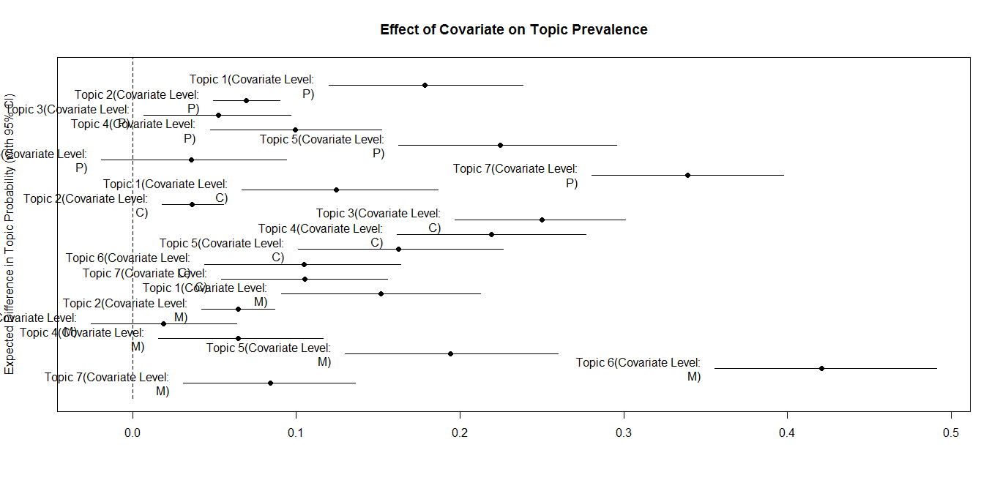
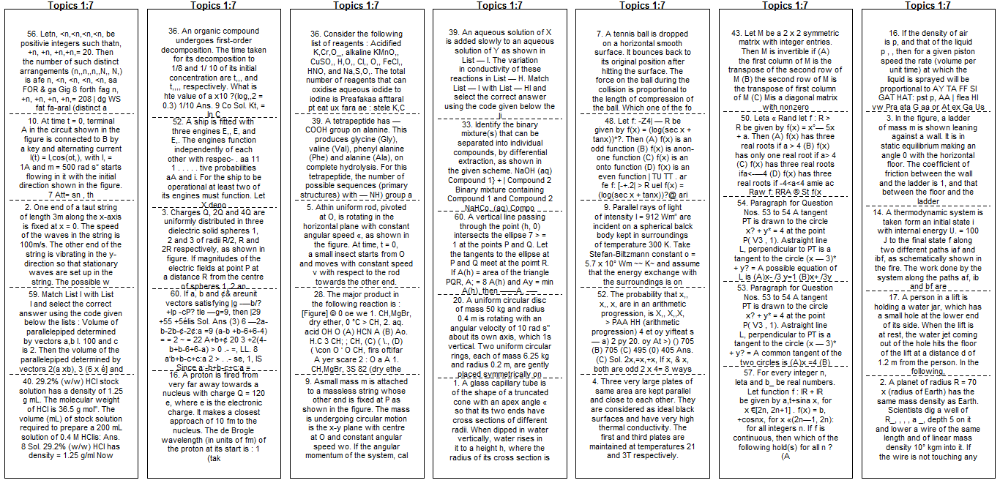
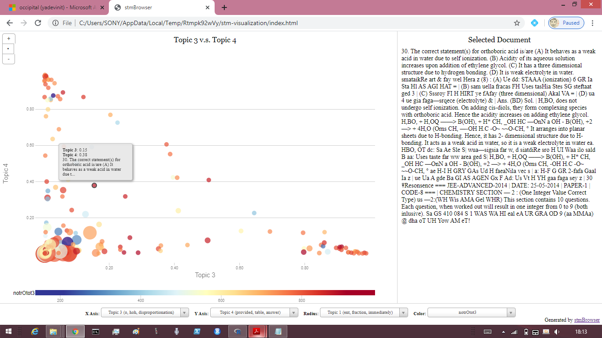
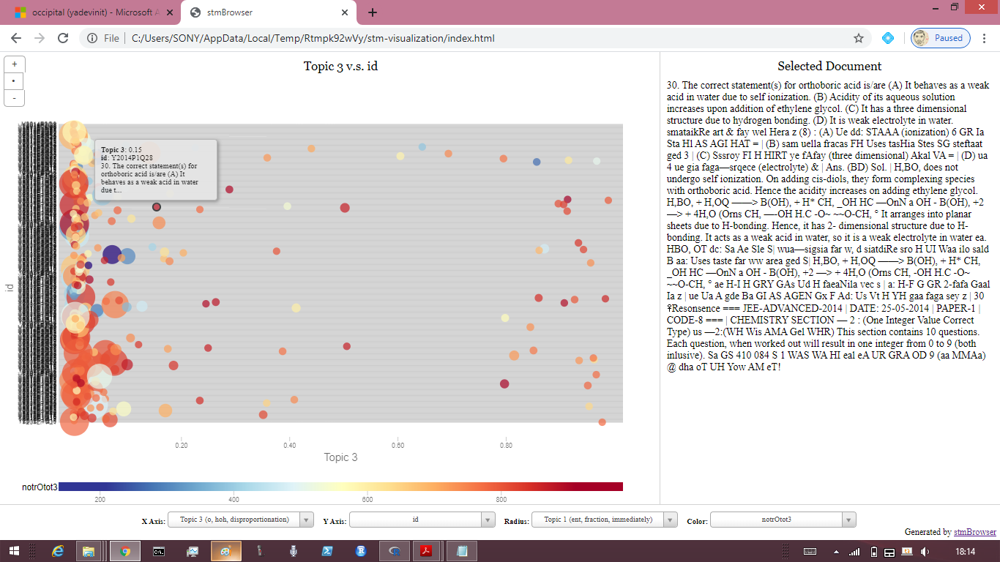

# Project Occipital's Outputs
## Background to Relate with
This [author](mailto:yadevinit@gmail.com) humbly submits that a missing element for the next level of teaching and learning is: what and where do (student) learners experience difficulty? That's what has now been modeled, using what you might call AI/ML (Artificial Intelligence and Machine Learning) as a piece of reproducible (applied) research available for scrutiny here. Without that missing element, you are in the dark, without knowing it.

[Project Occipital] (3 pages) introduces the Project that the author created to alter teaching-learning for a million population. As stated there, [Project Occipital] is to learn from past [JEE-Advanced] exams such that:
- Individual learners (such as this Project's participants) benefit in 2020 itself.
- Chronic and acute learning gaps for a population of 1 million learners are bridged, in time for [India's impact through PISA 2021] and systematically.

[Project Occipital] refers to [Project PeTaL] (3 slides) as making a Case for Action for a Project such as this one, which shows up from nowhere. As stated there by this author, [Project PeTaL] is to invite India's well wishers to offer Projects for extraordinary Teaching and Learning. [Project PeTaL] invites [MHRD] to lead it considering its interest in growing a knowledge economy.

This Notebook has outputs initiated by [Project Occipital]. Specifically, it has outputs from an STM (Structural Topic Model), which have in turn been included into a (statistical) regression model for Incidence Rate of `right` answers to [JEE-Advanced] questions over the years. If most of the [JEE-Advanced] examinees are unable to answer a question correctly, those questions are surely difficult for the rest of the population too, considering that each cohort of these examinees has already been filtered through [JEE-Main].

## Model for Ease
[JEEinsight] offers a model already for a student population's ease of question answering, and correspondingly, its difficulty. Its Appendix (3's first bullet point) mentions how one could build further and impact teaching-learning of an entire population. That's what's been done here:
- Dataset `datJEEinsight` has been expanded to `datJEEinsightPlus` to include QOS (question, options, and solution for each question), Topic-prevalence Proportions from a Structural Topic Modeling (STM) exercise, and other measures derived from QOS. Presently, this has data for 358 QOSs; up to 680 QOSs can be worked on and included.
- That expanded `JEEinsightPlus` has been used to develop a model that better explains ease denoted by `rOtot3`: Incidence Rate of `right` answers, using a count of up to 3 digits of examinees who got a given question `right` over a total examinee population scaled to 1000. Refer Appendices for details.

## "Ramp Walk" any Difficulty
The following actions are being attempted, as of 2020-Feb, and you are welcome to contribute:
- Invite [MHRD] to lead [Project PeTaL]. In turn, that will anchor [Project Occipital] with national imperatives.
- Use this model (including STM Topic-content labels) to relate with the (machine-augmented) design of (multiple-choice question) MCQ Distractors and teaching-learning improvement actions.

## Acknowledgment
- [JEE-Advanced] website for past question papers and question-wise frequency data in their annual reports. (That open reporting seems to have stopped in 2019.)
- [Resonance] and [FIITJEE] websites for openly giving solutions to JEE-Advanced questions over the years.
- Frontier researchers such as [Dr Anima A for Spectral Learning and more], evolvers of a software environment for statistics and machine learning such as [`stm` an `R` package], and workshop creators such as [Wesslen Topic Modeling Workshop with `R`].
- My own gurus over the years.

# Appendices
## Appendix: Details of Model for Ease
Similar to [JEEinsight], this Project too finally chose a Negative-Binomial Generalized Linear Model (NB GLM) for regression. Following code session output shows the model development, comparison, choice, and corresponding coefficients. For example, it says:
- A unit rise in `topicProp3` (topic #3 proportion for a QOS) translates to about `0.679*rOtot3` baseline, i.e., a baseline Incidence Rate of `right` answers drops to 70% of that.
- Given `subject M` for a QOS translates to about `79*rOtot3` baseline.
- Given `qaType MultCorrAns` for a QOS translates to about `0.279*rOtot3` baseline. That baseline corresponds to `qaType TwoListMatchSingleAns`. Paraphrased, this means if `qaType TwoListMatchSingleAns` corresponds to an expected output `Y`, altering to `qaType MultCorrAns` alters expected output to `0.279*Y`, i.e., to less than `30% Y`.
- Relative to baseline corresponding to `markScheme.grp +ve`, altering to `markScheme.grp -ve` alters expected output to `0.77*rOtot3`, i.e., lowers it by over 20% when holding all other covariates at constant values or levels.
- Mathematically, what's modelled is `log(rOtot3/1000) = coef1*covar1 + ... + coefN*covarN`. Here, each `coef` is a coefficient estimated and tabulated ahead (with corresponding Confidence Interval that incorporates uncertainty) near the end of following code session output, and each `covar` is a covariate or explanatory variable such as `topicProp3`.

``` r
>   fit.glmnb203 <- MASS::glm.nb(update(mdl.spec, ~ . -qaType.grp-1-topicProp7-topicProp2-topicProp1-topicProp6-topicProp5),
+     data=myData)
>   myGOFglm(fit.glmnb203)
[1] "deviance, df, theta (viz. Shape or Dispersion parameter for Negative Binomial), AIC, logLik, estVar, chkDispersion"
[1]  375.093  341.000    3.582 4448.809 4412.809    0.279    1.100

z test of coefficients:

                          Estimate  Std. Error z value  Pr(>|z|)    
subjectC                4.6353e+00  1.7373e-01 26.6809 < 2.2e-16 ***
subjectM                4.3703e+00  1.6636e-01 26.2704 < 2.2e-16 ***
subjectP                4.5508e+00  1.7419e-01 26.1258 < 2.2e-16 ***
YPY2012P2               2.2312e-02  1.0045e-01  0.2221 0.8242258    
YPY2013P1               3.5231e-01  9.2858e-02  3.7941 0.0001482 ***
YPY2013P2               4.2768e-01  1.3172e-01  3.2470 0.0011664 ** 
YPY2014P1               5.5326e-01  1.1616e-01  4.7628 1.909e-06 ***
YPY2014P2               4.5734e-01  1.2066e-01  3.7904 0.0001504 ***
qaTypeCompr            -8.0039e-01  1.3914e-01 -5.7524 8.796e-09 ***
qaTypeMultCorrAns      -1.2769e+00  1.4325e-01 -8.9133 < 2.2e-16 ***
qaTypeParaSingleAns    -7.5314e-01  1.3547e-01 -5.5595 2.705e-08 ***
qaTypeSingCorrAns      -6.3402e-01  1.2166e-01 -5.2116 1.872e-07 ***
qaTypeSingDigitInteger -1.1376e+00  1.5763e-01 -7.2169 5.319e-13 ***
markScheme.grp-ve      -2.5605e-01  8.1809e-02 -3.1299 0.0017487 ** 
QOS.nchar              -2.2918e-04  6.5072e-05 -3.5220 0.0004282 ***
topicProp3             -3.8737e-01  1.2878e-01 -3.0079 0.0026306 ** 
topicProp4             -3.1027e-01  1.0196e-01 -3.0431 0.0023418 ** 
---
Signif. codes:  0 ‘***’ 0.001 ‘**’ 0.01 ‘*’ 0.05 ‘.’ 0.1 ‘ ’ 1


Call:
MASS::glm.nb(formula = update(mdl.spec, ~. - qaType.grp - 1 - 
    topicProp7 - topicProp2 - topicProp1 - topicProp6 - topicProp5), 
    data = myData, init.theta = 3.582134159, link = log)

Deviance Residuals: 
    Min       1Q   Median       3Q      Max  
-3.3382  -0.8929  -0.1181   0.5071   2.7739  

Coefficients:
                         Estimate Std. Error z value Pr(>|z|)    
subjectC                4.635e+00  1.893e-01  24.482  < 2e-16 ***
subjectM                4.370e+00  1.832e-01  23.852  < 2e-16 ***
subjectP                4.551e+00  1.904e-01  23.903  < 2e-16 ***
YPY2012P2               2.231e-02  1.104e-01   0.202 0.839779    
YPY2013P1               3.523e-01  9.761e-02   3.609 0.000307 ***
YPY2013P2               4.277e-01  1.219e-01   3.509 0.000450 ***
YPY2014P1               5.533e-01  1.189e-01   4.653 3.27e-06 ***
YPY2014P2               4.573e-01  1.319e-01   3.466 0.000528 ***
qaTypeCompr            -8.004e-01  1.879e-01  -4.260 2.04e-05 ***
qaTypeMultCorrAns      -1.277e+00  1.486e-01  -8.590  < 2e-16 ***
qaTypeParaSingleAns    -7.531e-01  1.526e-01  -4.935 8.03e-07 ***
qaTypeSingCorrAns      -6.340e-01  1.437e-01  -4.413 1.02e-05 ***
qaTypeSingDigitInteger -1.138e+00  1.690e-01  -6.730 1.69e-11 ***
markScheme.grp-ve      -2.561e-01  8.489e-02  -3.016 0.002558 ** 
QOS.nchar              -2.292e-04  7.187e-05  -3.189 0.001428 ** 
topicProp3             -3.874e-01  1.258e-01  -3.079 0.002078 ** 
topicProp4             -3.103e-01  1.180e-01  -2.629 0.008568 ** 
---
Signif. codes:  0 ‘***’ 0.001 ‘**’ 0.01 ‘*’ 0.05 ‘.’ 0.1 ‘ ’ 1

(Dispersion parameter for Negative Binomial(3.5821) family taken to be 1)

    Null deviance: 66381.66  on 358  degrees of freedom
Residual deviance:   375.09  on 341  degrees of freedom
AIC: 4448.8

Number of Fisher Scoring iterations: 1


              Theta:  3.582 
          Std. Err.:  0.262 

 2 x log-likelihood:  -4412.809 
Waiting to confirm page change...
Waiting to confirm page change...
Waiting to confirm page change...
Waiting to confirm page change...
[1] 1.099979
>   anova(fit.glmpois1, fit.glmpois2, fit.glmpois3, fit.glmnb1, fit.glmnb2, fit.glmnb201, fit.glmnb202, fit.glmnb203)
Analysis of Deviance Table

Model 1: rOtot3 ~ subject + YP + qaType + qaType.grp + markScheme.grp + 
    QOS.nchar + topicProp1 + topicProp2 + topicProp3 + topicProp4 + 
    topicProp5 + topicProp6 + topicProp7 + offset(log(tot))
Model 2: rOtot3 ~ subject + YP + qaType + markScheme.grp + QOS.nchar + 
    topicProp1 + topicProp2 + topicProp3 + topicProp4 + topicProp5 + 
    topicProp6 + topicProp7 + offset(log(tot))
Model 3: rOtot3 ~ subject + YP + qaType + markScheme.grp + QOS.nchar + 
    topicProp3 + topicProp4 + topicProp5 + topicProp6 + offset(log(tot))
Model 4: rOtot3 ~ subject + YP + qaType + qaType.grp + markScheme.grp + 
    QOS.nchar + topicProp1 + topicProp2 + topicProp3 + topicProp4 + 
    topicProp5 + topicProp6 + topicProp7 + offset(log(tot))
Model 5: rOtot3 ~ subject + YP + qaType + markScheme.grp + QOS.nchar + 
    topicProp1 + topicProp2 + topicProp3 + topicProp4 + topicProp5 + 
    topicProp6 + topicProp7 + offset(log(tot))
Model 6: rOtot3 ~ subject + YP + qaType + markScheme.grp + QOS.nchar + 
    topicProp1 + topicProp2 + topicProp3 + topicProp4 + topicProp5 + 
    topicProp6 + topicProp7 + offset(log(tot)) - 1
Model 7: rOtot3 ~ subject + YP + qaType + markScheme.grp + QOS.nchar + 
    topicProp3 + topicProp4 + topicProp5 + topicProp6 + offset(log(tot)) - 
    1
Model 8: rOtot3 ~ subject + YP + qaType + markScheme.grp + QOS.nchar + 
    topicProp3 + topicProp4 + offset(log(tot)) - 1
  Resid. Df Resid. Dev Df Deviance
1       337    21931.2            
2       337    21931.2  0      0.0
3       339    21989.5 -2    -58.3
4       337      374.9  2  21614.6
5       337      374.9  0      0.0
6       337      374.9  0      0.0
7       339      375.0 -2     -0.1
8       341      375.1 -2     -0.1
> 375.0/339
[1] 1.106195
> 375.1/341
[1] 1.1
> 374.9/337
[1] 1.112463
> date()
[1] "Thu Feb 27 22:49:04 2020"
>   fit.chosen <- fit.glmnb203 # preferred model coz least (Resid Dev / Resid DF).
>   est.betahat <- round(exp(cbind(Estimate=coef(fit.chosen), confint(fit.chosen))), cDecimalDigits)
Waiting for profiling to be done...
>   print(est.betahat)
                       Estimate  2.5 %  97.5 %
subjectC                103.057 70.465 151.725
subjectM                 79.071 54.816 114.821
subjectP                 94.705 64.429 140.278
YPY2012P2                 1.023  0.826   1.267
YPY2013P1                 1.422  1.173   1.725
YPY2013P2                 1.534  1.206   1.951
YPY2014P1                 1.739  1.367   2.206
YPY2014P2                 1.580  1.222   2.046
qaTypeCompr               0.449  0.309   0.655
qaTypeMultCorrAns         0.279  0.207   0.373
qaTypeParaSingleAns       0.471  0.347   0.635
qaTypeSingCorrAns         0.530  0.394   0.709
qaTypeSingDigitInteger    0.321  0.227   0.450
markScheme.grp-ve         0.774  0.652   0.919
QOS.nchar                 1.000  1.000   1.000
topicProp3                0.679  0.532   0.873
topicProp4                0.733  0.582   0.933
>   # ref: https://stats.idre.ucla.edu/r/dae/negative-binomial-regression/
>   # We might be interested in looking at incident rate ratios rather than coefficients. So, exponentiate
>   # incident rate (IRR) for levelA is Est times the incident rate for the reference group
```

## Appendix: Details of STM (Structural Topic Model)
Typically, we are used to topics that are listed in a course or exam syllabus. That's from the domain of subject matter. In this Project, considering the inadequate subject-matter expertise to categorize or label each QOS, the author chose instead to discover latent topics, possibly multiple of them, that each QOS could be associated with. And the author adopted the unsupervised STM approach for it. You can visualize how topic prevalence co-varies with `subject` in the following point-estimate chart, e.g., you can conclude that topic 6 occurs essentially with Maths and topic 3 and 4 occur mostly with Chemistry:



To relate with the latent topics, you can see the 5 most-associated QOSs (also referred to as Documents in STM terminology) listed vertically separated by a dashed horizontal line within each topic column in the following plot:



To relate with and dynamically visualize interactions of the (generated or) modeled topics, from within `R`, you can (a) launch `stmBrowser()` as shown in [topic source code] if you can program with `R` or (b) directly launch Chrome browser on `stm-visualization/index.html` within the extracted folder after downloading [zipped `stmBrowser` folder]. Some QOS "Documents" that show up might not be good enough, despite the author's best efforts in (Optical-Character Recognition) OCR-based extraction, e.g., the chemical and mathematical formulae and drawing images might not be preserved. For that and for relating with topics and their STM covariates, following are example screenshots showing how a chosen (clicked) QOS on the left image can be referred through its `idYPq` to its particular question paper at [JEE-Advanced] by selecting `idYPq` as Y-axis and hovering above the chosen QOS:




For Project Occipital, [topic source code] has comments on a rationale for covariate choices during STM model specification. Regarding diagnostics, here's its code snippet that did not reject the chosen STM model:
``` r
  chkb <- checkBeta(stmFit) # [Looks for words that load exclusively onto a topic]. Nothing seems to be "overloaded".
  stopifnot(chkb$check) # [boolean representing if the check was passed].
  chkr <- checkResiduals(stmFit, out$documents)
  stopifnot(chkr$dispersion <= 1)
    # [If we calculate the sample dispersion and the value is greater than one, this implies that the number of topics
    # is set too low, because the latent topics are not able to account for the overdispersion.]
```

[Project Occipital]: <https://docs.google.com/document/d/1S0FB4TTPh6XZE14oMUHKr3IYdmqxsSaTy1DnT0MmzL0/edit?usp=sharing>
[Project PeTaL]: <https://docs.google.com/presentation/d/1PukmJ9U2datAsJGvEkF3-gZc-mUig_67LcoCAzzjbkY/edit>
[JEE-Advanced]: <https://jeeadv.ac.in/>
[India's impact through PISA 2021]: <https://pib.gov.in/newsite/PrintRelease.aspx?relid=187830>
[MHRD]: <https://mhrd.gov.in/>
[JEEinsight]: <https://notebooks.azure.com/yadevinit/projects/jeeinsight>
[Resonance]: <https://www.resonance.ac.in/answer-key-solutions/JEE-Advanced.aspx>
[FIITJEE]: <https://www.fiitjee.com/DownLoads/jee-advanced-(earlier-iit-jee)-solutions>
[Dr Anima A for Spectral Learning and more]: <https://anima-ai.org/>
[`stm` an `R` package]: <https://cran.r-project.org/web/packages/stm/vignettes/stmVignette.pdf>
[Wesslen Topic Modeling Workshop with `R`]: <https://github.com/wesslen/Topic-Modeling-Workshop-with-R>
[topic source code]:(./src-eduCTeDtopic.R)
[zipped `stmBrowser` folder]: (./Rtmpk92wVy-stmBrowser-2020Feb25.zip)
[JEE-Main]: <https://jeemain.nta.nic.in/webinfo/public/home.aspx>
