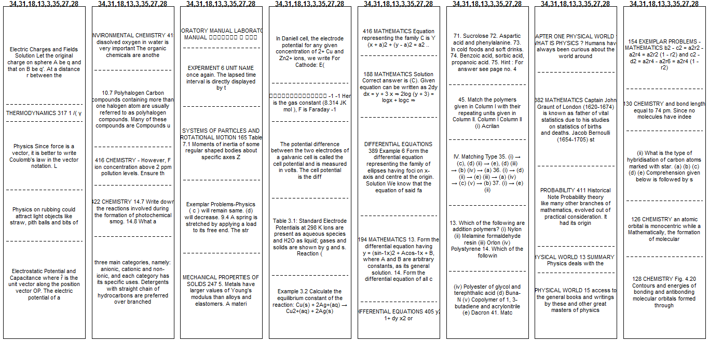
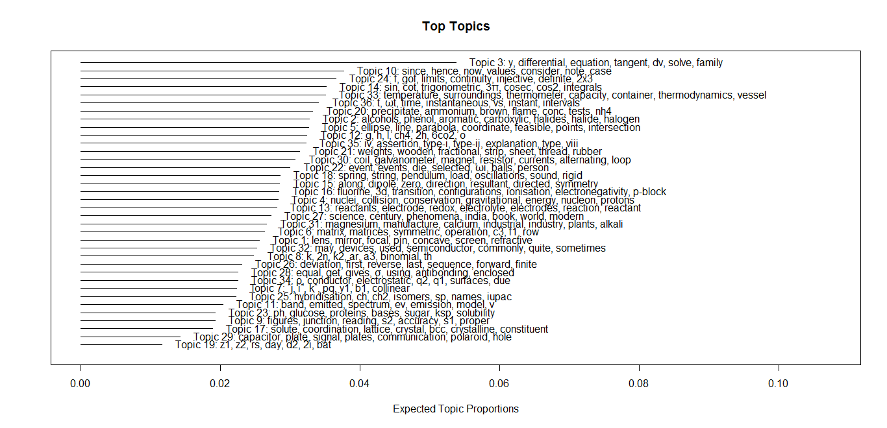
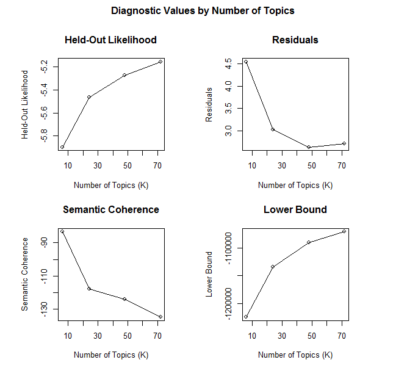
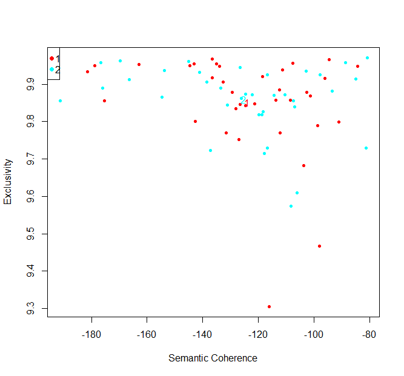
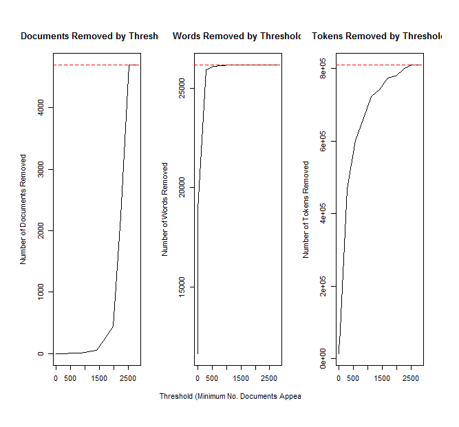
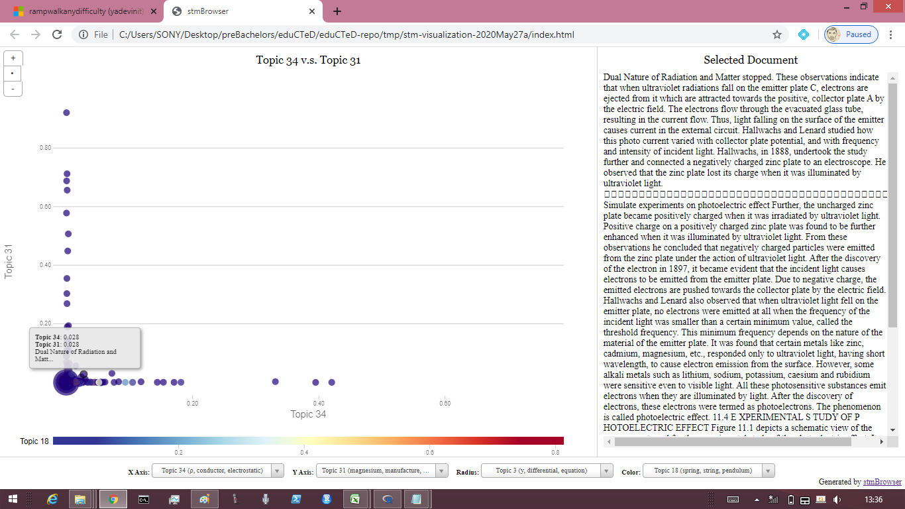
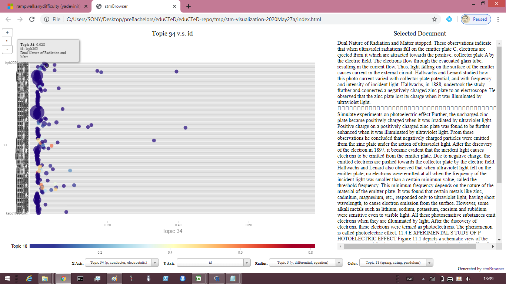

# "Ramp Walk" any (Occipital) Difficulty
## Synopsis
[MHRD] has expressed a "sankalp" of giving India her demographic dividend; that's reflected in the Vision and Objectives of institutions such as the [NTA]. While much of the world locked down facing the [COVID-19 pandemic], [Union HRD Minister launches AI-powered mobile app for mock tests of JEE Main, NEET 2020, other competitive exams]. That was after [MHRD webinar with students] from over a million about to face competitive exams.

Concurrently and like never before, this Project extended [Project Occipital] that was shared with MHRD and others earlier, revised the discovery of (JEE) topics using AI/ML, and re-estimated the topic-wise difficulty. For example: the Incidence Rate of right answers `rightIR` rises `6.5` times if a unit increase in prevalence is done of Maths topic "Differential Equations" instead of Physics topic "Electrostatics; Thermodynamics". (`rightIR` is the proportion of examinees who get a related question right.) Put simply, `6.5` times as many examinees find (questions from) this Physics topic difficult as that Maths topic.

Right now, NTA is well poised to leverage this Project: choose which topics to improve, and bridge related teaching-learning gaps. Would MHRD like to (a) invite NTA to do so and (b) lead the invitation to well wishers of India to offer projects for extraordinary teaching and learning, as called upon by [Project PeTaL]? By also (unlearning and) re-learning pre-requisite topics with the near-15-year-old students, what's possible is the next orbit of India's impact for the world through PISA 2021. This [author](mailto:yadevinit@gmail.com) invites you to consider and act now while you read ahead at [Project RampWalkAnyDifficulty]. There's something in it for (student) learners and others too.

(If you're new to such a URL link, you have to only scroll to read the document page there after clicking the link and launching it in a web browser. By mistake, some click at various places and end up downloading Project `.zip` or other files.)

## A Further Background to Relate with
Welcome to this page!
- If you are a (student) learner:
   - And if have already mastered all relevant topics, you have much to give, e.g., (a) by mentoring others or (b) by creating new realities using what you've got. Consider that possibility as you read ahead.
   - And if you haven't mastered all yet, there's much the world wants for and from you. As you read ahead, consider (a) expanding learning resources, e.g., through the abundant `www`, and (b) choosing where to invest the finite learning time.
- If you lead human education and development in any capacity (including through an institution or as part of government such as [MHRD]), this author acknowledges your contributions as an education-system leader. You could ask yourself whether the education system has a history of raised Learning Outcomes and other achievement results for the population it served over the years.
   - If yes, you have much to give. You could extend this Project, or create your own. Consider that as you read ahead.
   - If not, you can consider the possibility of your education system performing that way as you read ahead. [NTA] Objectives include "To undertake research on educational, professional and testing systems to identify gaps in the knowledge systems and take steps for bridging them." [MHRD] can ask [NTA] to integrate this Project with that Objective and bridge gaps in the knowledge systems. Consider that as you read ahead.
   - What's an alternative, you might ask? [NTA] Vision states "The right candidates joining best institutions will give India her demographic dividend." If you believe India will (almost certainly) get "her demographic dividend," that Vision calls for no new action. What we do know is that the future is really unknown and unknowable, even to a wise group. Now, you can ask yourself and answer a question: "Who is being responsible for entire generations with learning gaps and India possibly missing her demographic dividend, especially when the government has decided on mandatory education and [MHRD] role has led this system to deliver it for the population?" That question is also asked by present minds and and will be asked by future generations, just as the common refrain in [Mahabharat].

By now, you have a background to relate with as you read ahead. What's difficult for student (learners), or where do they find it difficult? This author discovers and relates with (latent) *topics* to answer that question in [Project Occipital] using data from [JEE-Advanced] and other sources. Here, the author has (a) used double that data for a revised discovery of topics that (along with other covariates) explain difficulty better through another quantitative model and (b) dwelt further on a "ramp walk" to bridge any difficulty.

This document is styled like a research viewpoint. It exposes and gets the reader to relate with a piece of (applied) research with further details available in Appendices and accompanying source-code and data repository. Being part of a transformative Project, it also attempts to move the reader's viewpoint on the matter and requests the reader to act now.

## "Ramp Walk"
> *Once you know what failure feels like, determination chases success.* --- Kobe Bryant.

Put simply, "Electrostatics" topic questions (from Physics) tend to be one of the most difficult for most ([JEE-Advanced] examinee) learners to answer right. (The Revised Discovery heading ahead reveals more.) What a competitive learner can do is to exploit this situation: bridge any of her learning gaps (on this and prerequisite) topics and outscore her competition. Given the Appendix (near the end of this document) and other considerations, following is a "ramp walk" for any difficulty, including for bridging learning gaps:
1. Realize that any "difficulty" or "failure" is an opinion: an assessment and not really what happened or exists. For example, this author labelled as "difficult" those questions that most examinees did not get right. What really happened was question `q1` got `r1` right answers, ..., `qN` got `rN` right answers in an exam. *Difficulty* doesn't exist really, except as a label.
2. Be mindful of your [Right for Action detached from its Fruit]. Without anyone generating leadership and taking responsibility for what's not working as well as wanted (or what to be raised to another level), that would be inaction, and progress is not feasible that way. One might not have a clear pathway to cause what's wanted, but waiting perpetually for such clarity or for a pathway that *guarantees* the "fruit" does not work either.
3. Do a *speech act* with someone that will cause a future that matters to become almost certain. For example:
   - A student can promise her self or mother that she'll complete 5 [JEE-Advanced] level questions for `Maths` topic `Permutations & Combinations` daily such that through trial-and-error (including comparing with available solutions) she will "get to know and master" what formulation to apply for different problems.
   - Another learner can request his teacher to cause his raw scores in a particular [JEE-Advanced] exam to exceed `40%` almost certainly.

You would have already used such a "ramp walk" in areas of life that are working well for you. There's nothing new here and nothing more you need to know from this perspective.

If you are an education-system leader, please consider (a) improving access to and (machine-analyzable) quality of (the *text* of Questions and Solutions and other) data that, in turn, would invite researchers and (b) truly experimenting to assess causality of various treatments (or interventions) for improving the related social systems. What you can do is bridge these learning gaps: alter teaching-learning so that most learners master this topic (and allied topics) with ease. Carrying these learning gaps into later life of study and work (with its corresponding societal impact) would then no longer be the default (or almost-certain) future. Such system leaders might be challenged by beliefs that related actions must be initiated and done by individual student learners; if so, do consider the following:
  - These topics have been prescribed by the education-system leaders, enshrined possibly as a mandatory right to education in the Constitution. This prescription was not done by the student learners. If those topics were not required, those topics have no place in the prescribed syllabus.
  - [Externalities] of the education system, which include non-random learning gaps that leak through it, are not limited in impact to the life of an individual student learner. Efficiency and effectiveness of the education system do matter, and that's beyond the considerations of individual student learners. A learning gap could limit a future citizen from contributing fully to society at large.
  - Some might say "you can take a horse to water, but you can't make it drink." That can be (mis-)used as a recipe to do nothing. At the same time, this author acknowledges the "difficulties" teachers, parents, and students themselves face. Distinguishing a background and circumstances gets people (and horses) to relate with situations differently; that calls for leadership at the next level. One can generate that if you choose to.
  - In any case, nothing stops action from being initiated by the education-system leaders, e.g., by requesting student learners to take specific action. In reality, others too can take responsibility for the situation and act, but this author believes that might miss a system perspective, and so, must involve the system leaders' participation.
Without this realization, such system leaders might not attempt a ramp walk for any difficulty.

Earlier, [Project Occipital form] shared (a) that its case for action was initiated by [Project PeTaL] and (b) that [Project PeTaL] calls upon [MHRD] to lead the invitation to well wishers of India to offer projects for extraordinary teaching and learning. Here is an elaborated background of 2020-May for relevant stakeholders to suitably act on this matter:
- Salience:
   - Leaders have recognized national self reliance as essential, in the wake of a world of [COVID-19 pandemic]. Governments that some said were slow and obsessed with inputs (budgets and resources) are being tracked real-time on life-related outcomes all over the world. Anything really is possible! The author is beginning to see an existential threat for nations (beyond the all-pervading physical threat to individual lives) and resonates with a neighbouring leader's earlier lament regarding what past leaders did or did not do resulting in a nation lagging behind. The author has started to distinguish the background of citizenry and nationalism in which the rest of any educational system *and* the nation must thrive in and with a world of nations. Existential threats are useful to experience the real world: the way it is and the way it is not. It is an awakening ("rude" or otherwise), which we can and must turn into opportunity.
   - Self reliance (including for livelihoods) calls for reinforcing faith in education and common good. [MHRD webinar with students] preparing to compete via [JEE-Main] and other competitive exams is also a sign of engaging with the future these young citizens co-create.
   - "... leveraging advanced technologies like Artificial Intelligence and Machine Learning ... Every student is unique and requires specific guidance to detect and overcome gaps in knowledge and test taking strategy. The test report on the NTA Mock Test App comes with a detailed breakdown of students' performance through which they can understand their personalised path to achieving better scores in their entrance examination" says [Union HRD Minister launches AI-powered mobile app for mock tests of JEE Main, NEET 2020, other competitive exams] (2020-May-19). https://www.getcetgo.in/ is another recent initiative that's welcome. Yet, there's a gap between these facilities and what's proposed here through this Project. And both those facilities are invited to adapt Projects at <https://notebooks.azure.com/yadevinit/projects/>.
- Urgency: Within months, a present cohort of students appear for competitive exams. And [India's commitment for PISA 2021] can be worth scaling for the world, if we choose to act now.
- Influence: May you as a stakeholder raise your influence on the matter by sharing this research viewpoint with friends and formal decision-making stakeholders while also adding your perspective. Let's acknowledge institutions that show and share both result realities and emulatable systematic methods for educational improvement of Learning Outcomes for the population served, not just individual achievement. Such acknowledgment can be in the style of [Baldrige Awards] (instituted as Presidential awards in the USA). What's called for is that Learning Outcomes are systematically improved for children moving through class 1 to 12. That's consistent with a Right to Education, enshrined in a Constitution. Aligning topics with Learning Outcomes offers a basis for continuous system improvement; without that, "endless spins and gyrations" of individual system components might continue without a fundamental harmonized trajectory of the system as a whole. Progressing both a shared vision of Learning Outcomes and their collective systemic execution from now into a future that matters will benefit from the following:
  - Including an understanding of topics into specified Learning Outcomes with a world-standard Controlled Vocabulary such as [UNESCO nomenclature for fields of science and technology].
  - Including "Ramp Walk" into action.

This Project may be seen in this light.

## Revised Discovery of Topics and Difficulty Model
From [NCERT textbook] and [NCERT Exemplar] for classes XI and XII, the author has compiled `NCERTtexts-class1112.zip` at [rampWalk2020May16-2242](https://drive.google.com/open?id=1-DqPndKMwZ602aiv_dBDdA_X3i6aCOy-) for this Project's corpus. That is where you can search for those Chapter filenames *after* downloading and unzipping onto your PC.

Now, imagine these text books in a library have got torn apart into individual paragraphs, whose pages were within Chapters of those books. And imagine those paragraphs have been left in one large pile. How can we restore these disorganized paragraphs (of earlier chapters) to their original books (and preferably, their chapters)? (This imagined scenario is adapted from the [Tidy Topic Modeling example of the great library heist].) That's what this Project attempted using [STM]. (To relate further with STM though in a different context, you can look at [STM for political elections] (2019-Nov) which uses STM, apparently without a Content covariate.)

Topics explain difficulty beyond what's explained by factors such as mere question-paper differences, question-answer types, and subject. From a revised model, the following plot shows topics that significantly impact difficulty: from left to right, these topics increase in ease (or reduce in difficulty).  For each impactful topic (column), it shows quotes from highly-associated "documents" paragraphs.
- Those paragraphs are from NCERT textbook chapters or Exemplar chapters; for details, refer [difficulty-impacting topics mapped to Chapter filenames](./JADtopicNCERTchapters20200523T073346.csv).
- For those Chapter filenames, refer `NCERTtexts-class1112.zip` mentioned earlier.



- Those topics turned out to significantly impact (as per the Difficulty model) from a set of (36) topics generated using [STM] and whose expected topic proportions are plotted as follows:



- That count of topics was chosen considering various diagnostics, some of which are plotted here:






[JADmetaTopic](./JADmetaTopic20200523T073546.csv) has meta variables for 670+ [JEE-Advanced] (JAD) QOSs. ("QOS" denotes Question-Option-Solution, which would be known to the exam designer while only the question and any options would be visible to examinees.) By opening it into a plain-text editor or as a spreadsheet, you can refer to slices of "difficult" QOSs where an impacting topic proportion is high or low; that would have relatively lower `rOtot`, e.g., which can be filtered using column `rOtotGrp80 == below79tile`. (`below79tile` denotes "below the 79th percentile" of `rOtot`. Here, the 79th percentile has been chosen considering it corresponds to the Unit-Invariant Knee---just as used in [Project JEEknee]---for the `rOtot` distribution.)

Similar to earlier [Project JEEinsight], this Project too finally chose a Negative-Binomial Generalized Linear Model (GLM NB) for regression. [GLMNBexpCoefs](./GLMNBexpCoefsNotStd20200516T234009.csv) has coefficients (with Confidence Intervals that incorporate uncertainty) from that revised model, whose salient elements are as follows:
  - Mathematically, what's modelled is of the form: `log(rOtot) = coef1*covar1 + ... + coefN*covarN + (random) error`. Here:
    - For a given question, symbol `rOtot` in this data analysis is `right/tot` ("`right` *O*ver `tot`") where `right` is the count of right answers and `tot` is the total count of examinees. It is the *Incidence Rate* of right answers by [JEE-Advanced] examinees; so, it is abbreviated to `rightIR` in this document. (If you care for precision: `tot` varies across question Papers (and Years), and so, a count `rOtot3` is used elsewhere to approximate `right` as though a constant `1000 (=10^3)` examinees were questioned. This simply means `rOtot` when approximated is `rOtot3/1000`.)
    - Each `coef` is a coefficient estimated (with its Confidence Interval).
    - Each `covar` is a covariate or explanatory variable such as `topic34`.
  - We can use it to assess relative impact of particular question papers. For example, relative to `YP2017P1 0.382`, it shows `YPY2012P2 0.209` (year 2012's Paper 2); you could say that switching those question papers relatively halves `rightIR`. At the same time, note that examinees don't set the question papers. Considering what matters in competitive exams is relative ranking (possibly with an eligibility barrier), examinees can use this quantitative insight to:
    - Moderate any extreme feelings of overconfidence or disappointment when judging their raw (or absolute) scores on uncalibrated tests.
    - Get back into action in bridging their learning gaps.
    - Learn to "sail on choppy seas" by practising with a variety.
    - Choose to also collaborate, e.g., with learners, teachers, and parents, even from various nations, rather than "run your own boat alone". In today's globalized world that expresses uncertainties openly, the option to collaborate can keep one relevant: contribute and be contributed to. What was considered the best collective wisdom has often got dismantled too; so, you might as well reconsider the question "Where best to invest finite (learning) time and resources on and with this planet?"
  - Relative to baseline corresponding to `markSchemeGrp -ve`, altering to `markSchemeGrp +ve` alters expected output to `1.12*rightIR`, i.e., raises it by over 10% when holding all other covariates at constant values or levels.
  -  Relative to other `qaType`, `qaTypeGrpCreateNewAnsNumInt` and `qaTypeGrpMultCorrAns` levels have estimated coefficients `0.56` or `0.57`. Put simply, `rightIR` is almost halved (relative to other question-answer types) when examinees have to:
     - Create a new numerical- or integer-valued answer, without any options to choose from.
     - Or choose multiple-correct penalized answers.
  -  Coefficient estimate for Maths `subjectM` is `0.81` times that of (baseline Chemistry) `subjectC`. Put simply, if 100 examinees get Chemistry questions right, about 80 get Maths questions right; so, we say Maths (questions) tends to be more difficult.
  -  Coefficients estimated for the impact of topic proportions (that have been predicted for each QOS) vary:

| Topic proportion | Difficulty-impact estimate | FREX words | Chapter label |
|:----------------:|---------------------------:|:----------:|:-------------:|
| `topic34` | 0.26 | p, conductor, electrostatic, q2, q1, surfaces, due | Electrostatics; Thermodynamics |
| `topic31` | 0.26 | magnesium, manufacture, calcium, industrial, industry, plants, alkali | Environmental Chemistry; Chemistry in Everyday Life; Haloalkanes and Haloarenes |
| `topic18` | 0.43 | spring, string, pendulum, load, oscillations, sound, rigid | Experimental Physics (Lab Manual); Systems of Particles and Rotational Motion; Mechanical Properties of Solids |
| `topic3` | 1.7 | y, differential, equation, tangent, dv, solve, family | Differential Equations |
| `topic27` | over 13.8 | science, century, phenomena, india, book, world, modern | Physical World; Probability; Statistics |

(As per STM, "FREX" are the words that are both frequent and exclusive, identifying words that distinguish topics.)
- These topics' impact estimates were significant and relatively stable across alternative models that this Project compared. So, their impact cannot be ignored, e.g., a unit rise in `topic34` proportion for a QOS translates to a rise of about `0.26*rightIR` baseline. (The earlier plot shows select topics that appear to have statistically-significant impact, though this table lists all topics' coefficients.) Note also from an earlier plot, `topic3` expected proportion is relatively highest.
- Heading "Synopsis" earlier carries an example: the Incidence Rate of right answers `rightIR` rises `6.5` times if a unit increase in prevalence is done of Maths topic "Differential Equations" instead of Physics topic "Electrostatics; Thermodynamics". Here's how that can be inferred:
  - Suppose a unit increase in prevalence of Maths topic "Differential Equations" translates to a rise `dY` in the Incidence Rate of right answers, i.e., the proportion of examinees who get a related question right.
  - Then, a unit increase in prevalence of Physics topic "Electrostatics; Thermodynamics" translates to a rise of `0.26/1.7 * dY` or `0.15 * dY`. Put simply, `6.5` times as many examinees find (questions from) this Physics topic difficult as that Maths topic.
- Some of these topics also show up as densely occurring, frequent, or prevalent; refer [Project topicMap].
For more on the Difficulty model, refer the Appendix on "Difficulty-Model Details".
  
If you wish to explore the topic allocations further, following are screenshots of `stmBrowser()` showing how `id` (Chapter name) can be selected as Y-axis for a particular document of interest, which shows up as a coordinate "bubble". That `id` can then be used to locate its (`.pdf`) file from `NCERTtexts-class1112.zip` (mentioned earlier). You can download [STM-visualization folder](./stm-visualization-2020May27a.zip), extract on your PC, and launch `index.htm` to dynamically browse the STM topics and covariates using [Google Chrome] or similar Internet browser.
  
  
  


# Appendices
## Appendix A: Difficulty-Model Details
Following `R`-code session output shows the model development, comparison, choice, and corresponding coefficients:

``` r
>   fit.glmnb102 <- update(fit.glmnb101, ~ . - qaType); myGOFglm(fit.glmnb102)
Likelihood ratio test of H0: Poisson, as restricted NB model:
n.b., the distribution of the test-statistic under H0 is non-standard
e.g., see help(odTest) for details/references

Critical value of test statistic at the alpha= 0.05 level: 2.7055 
Chi-Square Test Statistic =  7398042.386 p-value = < 2.2e-16 
NULL

z test of coefficients:

                              Estimate Std. Error  z value  Pr(>|z|)    
YPY2012P1                   -1.4995363  0.2202003  -6.8099 9.768e-12 ***
YPY2012P2                   -1.5651367  0.2175366  -7.1948 6.254e-13 ***
YPY2013P1                   -1.0699592  0.2349535  -4.5539 5.266e-06 ***
YPY2013P2                   -1.0736903  0.2178658  -4.9282 8.298e-07 ***
YPY2014P1                   -0.9327265  0.2403147  -3.8813 0.0001039 ***
YPY2014P2                   -1.1509043  0.2189362  -5.2568 1.466e-07 ***
YPY2016P1                   -1.1890314  0.2373810  -5.0090 5.473e-07 ***
YPY2016P2                   -1.2207395  0.2211052  -5.5211 3.369e-08 ***
YPY2017P1                   -0.9620056  0.2294119  -4.1934 2.749e-05 ***
YPY2017P2                   -1.1048809  0.2200301  -5.0215 5.127e-07 ***
YPY2018P1                   -1.1951621  0.2291975  -5.2146 1.843e-07 ***
YPY2018P2                   -1.1641156  0.2228928  -5.2228 1.763e-07 ***
markSchemeGrp+ve             0.1139509  0.0621261   1.8342 0.0666260 .  
qaTypeGrpMultCorrAns        -0.5628262  0.0545366 -10.3202 < 2.2e-16 ***
qaTypeGrpCreateNewAnsNumInt -0.5820612  0.0786681  -7.3990 1.373e-13 ***
subjectM                    -0.2102090  0.0952603  -2.2067 0.0273364 *  
subjectP                     0.0094578  0.0808913   0.1169 0.9069231    
topic1                      -0.4037408  0.4238296  -0.9526 0.3407920    
topic2                      -0.2497084  0.5484109  -0.4553 0.6488712    
topic3                       0.5291062  0.3109593   1.7015 0.0888438 .  
topic4                       0.2077079  0.4778951   0.4346 0.6638305    
topic5                      -0.0229871  0.4824383  -0.0476 0.9619970    
topic6                       0.0770091  0.4245299   0.1814 0.8560548    
topic7                       0.2129154  0.5408012   0.3937 0.6937998    
topic8                      -0.5343732  0.4080411  -1.3096 0.1903291    
topic9                       1.2090305  1.9650161   0.6153 0.5383714    
topic10                      0.1114446  0.9834756   0.1133 0.9097791    
topic11                     -0.1665661  0.4658873  -0.3575 0.7206993    
topic12                     -0.2140410  0.2971174  -0.7204 0.4712837    
topic13                     -0.3721228  0.3258436  -1.1420 0.2534419    
topic14                     -0.1425007  0.4051453  -0.3517 0.7250428    
topic15                     -0.0798290  0.5401581  -0.1478 0.8825099    
topic16                      0.2685008  0.3274641   0.8199 0.4122505    
topic17                      0.4436044  0.8570228   0.5176 0.6047297    
topic18                     -0.8410736  0.4669505  -1.8012 0.0716706 .  
topic19                     -0.3191778  0.8417111  -0.3792 0.7045385    
topic20                     -0.1953308  0.3366153  -0.5803 0.5617265    
topic21                      0.1433789  0.6601329   0.2172 0.8280548    
topic22                     -0.0137896  0.3486734  -0.0395 0.9684528    
topic23                      0.0642295  0.4816112   0.1334 0.8939056    
topic24                     -0.0588182  0.2733872  -0.2151 0.8296534    
topic25                     -0.3774497  0.2765941  -1.3646 0.1723682    
topic26                     -1.1825769  1.0905379  -1.0844 0.2781885    
topic27                      2.9852564  1.1804224   2.5290 0.0114397 *  
topic28                      2.7036800  1.4624152   1.8488 0.0644900 .  
topic29                      0.1542787  0.6767660   0.2280 0.8196738    
topic30                     -0.4971325  0.3525029  -1.4103 0.1584531    
topic31                     -1.3622718  0.6217649  -2.1910 0.0284535 *  
topic32                      1.0883170  1.3228180   0.8227 0.4106637    
topic33                      0.3181718  0.3784648   0.8407 0.4005212    
topic34                     -1.3141640  0.5884061  -2.2334 0.0255206 *  
topic35                      0.9534700  0.5710791   1.6696 0.0949998 .  
---
Signif. codes:  0 ‘***’ 0.001 ‘**’ 0.01 ‘*’ 0.05 ‘.’ 0.1 ‘ ’ 1


Call:
MASS::glm.nb(formula = right ~ YP + markSchemeGrp + qaTypeGrp + 
    subject + topic1 + topic2 + topic3 + topic4 + topic5 + topic6 + 
    topic7 + topic8 + topic9 + topic10 + topic11 + topic12 + 
    topic13 + topic14 + topic15 + topic16 + topic17 + topic18 + 
    topic19 + topic20 + topic21 + topic22 + topic23 + topic24 + 
    topic25 + topic26 + topic27 + topic28 + topic29 + topic30 + 
    topic31 + topic32 + topic33 + topic34 + topic35 + topic36 + 
    offset(log(tot)) - 1, data = myData, init.theta = 3.177231294, 
    link = log)

Deviance Residuals: 
    Min       1Q   Median       3Q      Max  
-4.5537  -0.8300  -0.1525   0.5327   3.1008  

Coefficients: (1 not defined because of singularities)
                             Estimate Std. Error z value Pr(>|z|)    
YPY2012P1                   -1.499536   0.223695  -6.703 2.04e-11 ***
YPY2012P2                   -1.565137   0.228568  -6.848 7.51e-12 ***
YPY2013P1                   -1.069959   0.234273  -4.567 4.94e-06 ***
YPY2013P2                   -1.073690   0.221497  -4.847 1.25e-06 ***
YPY2014P1                   -0.932726   0.245025  -3.807 0.000141 ***
YPY2014P2                   -1.150904   0.225196  -5.111 3.21e-07 ***
YPY2016P1                   -1.189031   0.234626  -5.068 4.02e-07 ***
YPY2016P2                   -1.220740   0.231240  -5.279 1.30e-07 ***
YPY2017P1                   -0.962006   0.239150  -4.023 5.76e-05 ***
YPY2017P2                   -1.104881   0.228840  -4.828 1.38e-06 ***
YPY2018P1                   -1.195162   0.234695  -5.092 3.54e-07 ***
YPY2018P2                   -1.164116   0.230075  -5.060 4.20e-07 ***
markSchemeGrp+ve             0.113951   0.064001   1.780 0.075000 .  
qaTypeGrpMultCorrAns        -0.562826   0.058116  -9.684  < 2e-16 ***
qaTypeGrpCreateNewAnsNumInt -0.582061   0.081401  -7.151 8.64e-13 ***
subjectM                    -0.210209   0.089844  -2.340 0.019299 *  
subjectP                     0.009458   0.081794   0.116 0.907946    
topic1                      -0.403741   0.421874  -0.957 0.338558    
topic2                      -0.249708   0.499829  -0.500 0.617366    
topic3                       0.529106   0.303042   1.746 0.080814 .  
topic4                       0.207708   0.438595   0.474 0.635803    
topic5                      -0.022987   0.495809  -0.046 0.963021    
topic6                       0.077009   0.468203   0.164 0.869355    
topic7                       0.212915   0.535649   0.397 0.691006    
topic8                      -0.534373   0.418086  -1.278 0.201199    
topic9                       1.209031   1.596599   0.757 0.448898    
topic10                      0.111445   1.155205   0.096 0.923146    
topic11                     -0.166566   0.476562  -0.350 0.726702    
topic12                     -0.214041   0.314074  -0.681 0.495555    
topic13                     -0.372123   0.327851  -1.135 0.256360    
topic14                     -0.142501   0.441830  -0.323 0.747056    
topic15                     -0.079829   0.663163  -0.120 0.904185    
topic16                      0.268501   0.422900   0.635 0.525491    
topic17                      0.443604   0.845758   0.525 0.599927    
topic18                     -0.841074   0.419572  -2.005 0.045006 *  
topic19                     -0.319178   1.413501  -0.226 0.821352    
topic20                     -0.195331   0.519927  -0.376 0.707148    
topic21                      0.143379   0.835628   0.172 0.863766    
topic22                     -0.013790   0.389325  -0.035 0.971745    
topic23                      0.064230   0.457069   0.141 0.888245    
topic24                     -0.058818   0.271062  -0.217 0.828215    
topic25                     -0.377450   0.287683  -1.312 0.189509    
topic26                     -1.182577   1.185989  -0.997 0.318705    
topic27                      2.985256   1.935453   1.542 0.122975    
topic28                      2.703680   1.714924   1.577 0.114897    
topic29                      0.154279   0.727179   0.212 0.831982    
topic30                     -0.497132   0.449741  -1.105 0.268997    
topic31                     -1.362272   0.810832  -1.680 0.092940 .  
topic32                      1.088317   1.710752   0.636 0.524670    
topic33                      0.318172   0.422961   0.752 0.451901    
topic34                     -1.314164   0.621491  -2.115 0.034470 *  
topic35                      0.953470   0.592808   1.608 0.107748    
topic36                            NA         NA      NA       NA    
---
Signif. codes:  0 ‘***’ 0.001 ‘**’ 0.01 ‘*’ 0.05 ‘.’ 0.1 ‘ ’ 1

(Dispersion parameter for Negative Binomial(3.1772) family taken to be 1)

    Null deviance: 3718.5  on 675  degrees of freedom
Residual deviance:  710.1  on 623  degrees of freedom
AIC: 15389

Number of Fisher Scoring iterations: 1


              Theta:  3.177 
          Std. Err.:  0.165 

 2 x log-likelihood:  -15282.697 
Waiting to confirm page change...
Waiting to confirm page change...
Waiting to confirm page change...
Waiting to confirm page change...
[1] 1.14
> # ...
>   fits <- list(fit.glmpois1, fit.glmnb1, fit.glmnb11, fit.glmnb12, fit.glmnb10, fit.glmnb101,
+     fit.glmnb102, fit.glmnb1021, fit.glmnb10211); al.diags <- myCompareFits(fits)
'data.frame':   9 obs. of  16 variables:
 $ Resid. Df                               : num  616 616 619 623 616 619 623 601 601
 $ Resid. Dev                              : num  6833901 708 709 710 708 ...
 $ Df                                      : num  NA 0 -3 -4 7 -3 -4 22 0
 $ Deviance                                : num  NA 6.83e+06 -1.07 -1.37 2.44 ...
 $ #Df                                     : num  59 60 57 53 60 57 53 75 75
 $ LogLik                                  : num  -3421090 -7614 -7626 -7641 -7614 ...
 $ Df                                      : num  NA 1 -3 -4 7 -3 -4 22 0
 $ Chisq                                   : num  NA 6.83e+06 2.44e+01 3.01e+01 5.45e+01 ...
 $ Pr(>Chisq)                              : num  NA 0.00 2.11e-05 4.57e-06 1.88e-09 ...
 $ deviance                                : num  6833901 708 709 710 708 ...
 $ df                                      : num  616 616 619 623 616 619 623 601 601
 $ theta (Shape or Dispersion for NegBinom): num  NA 3.42 3.31 3.18 3.42 ...
 $ AIC                                     : num  6842298 15348 15367 15389 15348 ...
 $ logLik                                  : num  -3421090 -7614 -7626 -7641 -7614 ...
 $ estVar                                  : num  NA 0.292 0.302 0.315 0.292 0.302 0.315 0.298 0.298
 $ chkDispersion                           : num  11094 1.15 1.14 1.14 1.15 ...
NULL
Warning message:
In myCompareFits(fits) : Specify MASS::anova instead of just anova.
> al.diags
  Resid. Df   Resid. Dev Df      Deviance #Df       LogLik Df        Chisq   Pr(>Chisq)    deviance  df theta (Shape or Dispersion for NegBinom)        AIC
1       616 6833901.0179 NA            NA  59 -3421090.030 NA           NA           NA 6833901.018 616                                       NA 6842298.06
2       616     707.6669  0  6.833193e+06  60    -7614.100  1 6.826952e+06 0.000000e+00     707.667 616                                    3.419   15348.20
3       619     708.7359 -3 -1.068999e+00  57    -7626.276 -3 2.435129e+01 2.109757e-05     708.736 619                                    3.309   15366.55
4       623     710.1031 -4 -1.367151e+00  53    -7641.349 -4 3.014588e+01 4.570880e-06     710.103 623                                    3.177   15388.70
5       616     707.6669  7  2.436151e+00  60    -7614.100  7 5.449717e+01 1.875148e-09     707.667 616                                    3.419   15348.20
6       619     708.7359 -3 -1.069000e+00  57    -7626.276 -3 2.435129e+01 2.109757e-05     708.736 619                                    3.309   15366.55
7       623     710.1031 -4 -1.367151e+00  53    -7641.349 -4 3.014588e+01 4.570880e-06     710.103 623                                    3.177   15388.70
8       601     708.2628 22  1.840286e+00  75    -7620.927 22 4.084249e+01 8.603976e-03     708.263 601                                    3.357   15391.85
9       601     708.2628  0 -1.462195e-08  75    -7620.927  0 2.944944e-09 0.000000e+00     708.263 601                                    3.357   15391.85
        logLik estVar chkDispersion
1 -3421090.030     NA     11093.995
2    -7614.100  0.292         1.149
3    -7626.276  0.302         1.145
4    -7641.349  0.315         1.140
5    -7614.100  0.292         1.149
6    -7626.276  0.302         1.145
7    -7641.349  0.315         1.140
8    -7620.927  0.298         1.178
9    -7620.927  0.298         1.178
>
```

## Appendix B: Extending this Project
You are invited to extend this Project. Here are some ways in which you can do that or have it extended:
1. Improve the quality of topic allocation to match or beat the subject-matter experts. Bear in mind those experts don't necessarily agree on a topic allocation and typically only allocate one topic to a "document"; also, question-answers are sometimes disputed, and even in 2020, [JEE-Main] asked examinees for any objection to answers it would use for evaluation. To improve topic quality, consider topics generation:
   - without specifying any Prevalence or Content covariates.
   - using not sampled paragraphs but entire (Chapters of) NCERT and Exemplar textbook corpus; later, predict for JAD QOSs without meta variable (or only with subject as meta covariate).
   - more topics K: buys greater semantic cohesion, and since only few topics turn out to significantly impact Difficulty, relating is not adversely impacted.
This might avoid: (a) Y2013P2P15 being mapped to C-dominated `topic31`, Y2018P1C8 not being mapped to Coordination Compounds (topic12?), Y2013P1C23 not being mapped to
Surface Chemistry; (b)` topic3` mapped QOSs which seem to be for 3D/other Geometry. Notes on the various corpus elements and analysis flow are in source-code comments, starting with `src-rampWalk.R`.

2. Improve QOS data quality. Consider manual entry of extremely-garbled QOSs that are also at extreme ends of "difficulty". 
    1. Improve extraction of mathematical entities such as functions, calculus, limits, set notation, formulae, and graphs. Consider [Typsetting Equations in Jupyter] and the alternative of manually entering those where worthwhile for the subsequent modeling purpose. More inputs at https://www.mathjax.org/, e.g., it supports the right click to get code. (An alternative seems to be https://katex.org/, but that might not be supported on Jupyter Notebooks.) For stripping out HTML tages from MathJax inline-embedded text, use `stm::textProcessor(..., stripHTML=TRUE)` or consider an [HTML-tag-removing ensemble] with manual check where the methods' outputs do not match.
    2. Improve chemical-entity extraction (molecular structure, IUPAC, reactions, etc.). Consider for chemical expressions:
       - [ChemDoodle]. (An alternative seems to be [MathJax-mhChem], but that doesn't seem to support 3D and other molecular visualization.)
       - [The `rcdk` and `cluster` R packages applied to drug candidate selection] (2020).
       - [Chemical Informatics Functionality in R] (2007).
       - [ChemmineR: Cheminformatics Toolkit for R].
       - [ChemPy].
       - [Structure Clipper - an interactive tool for extracting chemical structures from patents] (2014).
3. This Project presently uses topic Prevalence estimates as *point* estimates and ignores their uncertainty during their use in subsequent modeling. Strictly speaking, this approach could bias the modeling. So:
    1. Enable (automatic) mapping to other "subjects" or "topics" with ease, e.g., as per JEE-Advanced and JEE-Main syllabus that evolve over years. For that, consider [UNESCO nomenclature for fields of science and technology] for Physics, Chemistry, and Mathematics. It could be used for a controlled-vocabulary topic indexing, as an alternative to the (unsupervised) STM (that generates latent topics) used by this Project. It could be an input for [Maui reference] or the multi-algorithm [Annif source] that also supports `Maui`; refer [NLP keyword extraction tutorial with RAKE and Maui]. And consider [Annif DIY automated subject indexing]. It's got REST API and an example mobile app for paper documents. So, refer [Annif Vocab1], [Annif Vocab2], and [Annif Docker Usage] to apply [UNESCO nomenclature for fields of science and technology].
    2. Alternatively, consider multilevel Bayesian regression with modeled topics similar to [CRAN-package `themetagenomics`], as shown in [Exploring thematic structure and predicted functionality of 16S rRNA amplicon data].
4. Improve the data corpus and its modeling in other ways:
    1. Explore interaction effects of covariates, e.g., multi-topic ones. Refer [Effect Displays in R for Generalised Linear Models].
    2. Along with the present unigrams, consider bigrams (or trigrams) for raised accuracy, at the cost of efficiency. Consider Dependency Analysis (including KWIC) for raised accuracy, at the cost of efficiency. Using the Threshold plot, choose removal of terms (features or word tokens) using considerations other than overall frequency across corpus. For that, explore miscellaneous alternatives:
      - Text measures using `quanteda`.
      - http://www.bnosac.be/index.php/blog/77-an-overview-of-keyword-extraction-techniques.
      - `Wikify!` http://web.eecs.umich.edu/~mihalcea/papers/mihalcea.cikm07.pdf.
      - https://firebase.google.com/docs/ml-kit/android/recognize-text might offer options, but seems ground up.
5. Ease the running and extending of this Project's code by others:
   1. Its [TBD Colab Notebook](./eduCTeDcolab.ipynb) could be supported suitably (a) via Google Colab or Binder (maybe with a virtual-machine or Docker image that includes pre-installed packages) or (b) via a Github repository exported from Microsoft Azure Notebooks.
   2. For further reproducibility at any time in the future, as per [Reproducibility Checkpoint], consider `checkpoint` package and specifying `R` version and patch along with a date that ensures package versions installed are updated to the latest then.
   
   ```r
   library(checkpoint)
   checkpoint("2020-03-17") # "YYYY-MM-DD" format.
   ```

6. Update [Project JEEinsight], considering the newly-corrected meta-data, e.g., `{qaType, markScheme}`, and other inconsistencies.
7. Clarify the source code: `src-rampWalk.R` presently threads through `src-syllabi.R`, `src-topic.R`, `src-modelDifficulty.R` and could be code-refactored using functions.

## Appendix C: Educational Studies and Related Philosophies
Here are relevant gleanings:

- [Why Is Learning Fraction and Decimal Arithmetic So Difficult?] (2015) abstract says:

> Fraction and decimal arithmetic are crucial for later mathematics achievement and
for ability to succeed in many professions. Unfortunately, these capabilities pose large
difficulties for many children and adults, and students’ proficiency in them has shown
little sign of improvement over the past three decades. To summarize what is known
about fraction and decimal arithmetic and to stimulate greater amounts of research in the
area, we devoted this review to analyzing why learning fraction and decimal arithmetic is
so difficult. We identify and discuss two types of difficulties: (1) Difficulties that are
inherent to fraction and decimal arithmetic, and (2) Culturally contingent sources that
could be reduced by improved instruction and prior knowledge of learners. We conclude
the review by discussing commonalities among three interventions that have helped
children overcome the difficulties of mastering fraction and decimal arithmetic.

- Within the above-mentioned paper, it says:

> Thus, after more than three decades, numerous rounds of education reforms,
hundreds if not thousands of research studies on mathematics teaching and learning, and
billions of dollars spent to effect educational change, little improvement was evident in
students’ understanding of fraction arithmetic. ...

> The difficulty is not
restricted to the U.S. or to fractions. Understanding of multiplication and division of
decimals also is weak in countries that are top performers on international comparisons of
mathematical achievement, for example China (e.g., Liu, Ding, Zong, & Zhang, 2014;
PISA, 2012).
Given the importance of knowledge of rational numbers for subsequent academic
and occupational success, this weak understanding of fraction and decimal arithmetic is a
serious problem. Early proficiency with fractions uniquely predicts success in more
advanced mathematics. Analyses of large datasets from the U.S. and the U.K. showed
that knowledge of fractions (assessed primarily through performance on fraction
arithmetic problems) in 5th grade is a unique predictor of general mathematic
achievement in 10th grade. ...

> The findings suggest that the students’ problem was not that they did not know
the correct procedure, and not that they had a systematic misconception that fraction
arithmetic was like whole number arithmetic, but rather that they were confused about
which of several procedures was correct. ... It is important to note that the pattern of performance of children in the U.S. is not
universal. ...

>  The difficulties involve 1) ... 6) opposite direction of effects of multiplying and dividing positive fractions
and decimals below and above one ... Focusing instruction on fraction and decimal
magnitudes allowed children to overcome the limited accessibility of magnitudes of
operands and answers that seems to be a major difficulty in learning fraction and decimal
arithmetic. Knowledge of fraction and decimal magnitudes is not sufficient to produce
understanding of rational number arithmetic. ... Both knowledge
of the magnitudes of individual rational numbers and knowledge of the magnitudes
produced by rational number arithmetic are important parts of numerical development
beyond early childhood. They provide most children’s first opportunity to learn that
principles that are true of whole numbers and of whole number arithmetic are not
necessarily true of numbers and arithmetic in general. ...

> Interventions
that focus on rational number magnitudes appear to be especially effective in helping
children learn fraction and decimal arithmetic.

- A research paper on Distractor design recommends learning to pre-empt failing to Distractors. Another research paper by Siegler et al. observes in MCQs that students take longer to decide when an option is closer to the correct answer(s). These seem consistent with the finding that a high proportion of errors relate with "Distorted Theorems."

- [The Case for Dynamic Models of Learners' Ontologies in Physics] (2010) carries this abstract:

> In a series of well-known papers, Chi and Slotta (...) have
contended that a reason for students’ difficulties in learning physics is that they think about
concepts as *things* rather than as *processes*, and that there is a significant barrier between these
two ontological categories. We contest this view, arguing that expert and novice reasoning often
and productively traverses ontological categories. We cite examples from everyday, classroom,
and professional contexts to illustrate this. We agree with Chi and Slotta that instruction should
attend to learners’ ontologies; but we find these ontologies are better understood as dynamic and
context-dependent, rather than as static constraints. To promote one ontological description in
physics instruction, as suggested by Slotta and Chi, could undermine novices’ access to
productive cognitive resources they bring to their studies and inhibit their transition to the
dynamic ontological flexibility required of experts.

- [Physics and Ontology] (1961) says:

> The recent philosophy of physics is confronted with the new ontology, as it emerges
after philosophy proper has fully articulated the linguistic turn. The classical ontologists
asserted or denied, controversially, that certain entities "existed." Rather than
adding to these controversies, the new ontology uncovers their dialectics. The ontologically
problematic entities of physics are of two kinds, represented by forces and
particles, respectively. The dialectics has been dominated by eight patterns. Two of
these, *independence* and *realism*, belong to philosophy proper. The latter is here considered
in order to relieve the philosophy of physics of a burden only philosophy
proper can bear. That leaves six patterns: *concreteness* (including the orbit feature),
*acquaintance*, *simplicity*, *significance*, *process*, and *model*. The paper sketches how each
of these may be used and probably has been used, either explicitly or implicitly, in
the recent controversies.

- [Cognitive Dissonance].
- [Designing failure into our parenting].
- [Declaring Breakdowns: Powerfully Creating a Future that Matters].
- [Reinforcement Learning].


[Project Occipital form]: <https://docs.google.com/document/d/1S0FB4TTPh6XZE14oMUHKr3IYdmqxsSaTy1DnT0MmzL0/edit?usp=sharing>
[Project Occipital]: <https://notebooks.azure.com/yadevinit/projects/occipital>
[JEE-Advanced]: <https://jeeadv.ac.in/>
[Why Is Learning Fraction and Decimal Arithmetic So Difficult?]: <https://files.eric.ed.gov/fulltext/ED565462.pdf>
[The Case for Dynamic Models of Learners' Ontologies in Physics]: <https://arxiv.org/ftp/arxiv/papers/0802/0802.4278.pdf>
[Physics and Ontology]: <https://www.jstor.org/stable/185460?seq=1>
[Cognitive Dissonance]: <https://en.wikipedia.org/wiki/Cognitive_dissonance>
[Designing failure into our parenting]: <https://www.wfglobal.org/why-its-vital-to-design-failure-into-our-parenting/>
[Declaring Breakdowns: Powerfully Creating a Future that Matters]: <http://sameerdua.com/declaring-breakdowns/>
[Reinforcement Learning]: <https://en.wikipedia.org/wiki/Reinforcement_learning>
[Annif DIY automated subject indexing]: <https://www.liberquarterly.eu/article/10.18352/lq.10285/>
[Annif source]: <https://github.com/NatLibFi/Annif>
[Annif Vocab1]: <https://github.com/NatLibFi/Annif/wiki/Getting-started>
[Annif Vocab2]: <https://github.com/NatLibFi/Annif/wiki/Subject-vocabulary-formats>
[Annif Docker Usage]: <https://github.com/NatLibFi/Annif/wiki/Usage-with-Docker>
[UNESCO nomenclature for fields of science and technology]: <https://skos.um.es/unesco6/00/html>
[Maui reference]: <http://community.nzdl.org/kea/download.html>
[Typsetting Equations in Jupyter]: <https://nbviewer.jupyter.org/github/ipython/ipython/blob/3.x/examples/Notebook/Typesetting%20Equations.ipynb>
[Structure Clipper - an interactive tool for extracting chemical structures from patents]: <https://bulletin.acscinf.org/PDFs/247nm51.pdf>
[The `rcdk` and `cluster` R packages applied to drug candidate selection]: <https://jcheminf.biomedcentral.com/articles/10.1186/s13321-019-0405-0>
[Chemical Informatics Functionality in R]: <https://www.jstatsoft.org/article/view/v018i05>
[ChemmineR: Cheminformatics Toolkit for R]: <https://www.bioconductor.org/packages/devel/bioc/vignettes/ChemmineR/inst/doc/ChemmineR.html>
[Effect Displays in R for Generalised Linear Models]: <https://www.jstatsoft.org/article/view/v008i15/effect-displays-revised.pdf>
[ChemPy]: <https://github.com/bjodah/chempy>
[Project JEEinsight]: <https://notebooks.azure.com/yadevinit/projects/jeeinsight>
[HTML-tag-removing ensemble]: <https://stackoverflow.com/questions/17227294/removing-html-tags-from-a-string-in-r>
[ChemDoodle]: <https://web.chemdoodle.com/>
[MathJax-mhChem]: <https://mhchem.github.io/MathJax-mhchem/>
[Reproducibility Checkpoint]: <https://mran.microsoft.com/documents/rro/reproducibility#standard>
[NLP keyword extraction tutorial with RAKE and Maui]: <https://www.airpair.com/nlp/keyword-extraction-tutorial>
[Exploring thematic structure and predicted functionality of 16S rRNA amplicon data]: <https://doi.org/10.1371/journal.pone.0219235>
[CRAN-package `themetagenomics`]: <https://cran.r-project.org/package=themetagenomics>
[CRAN-package `stm`]: <https://cran.r-project.org/package=stm>
[Right for Action detached from its Fruit]: <https://www.gitasupersite.iitk.ac.in/srimad?language=dv&field_chapter_value=2&field_nsutra_value=47&htrskd=1&httyn=1&htshg=1&scsh=1&ecsiva=1&etsiva=1&etpurohit=1&etgb=1&setgb=1&etssa=1&etassa=1&etradi=1&etadi=1&choose=1>
[MHRD]: <https://mhrd.gov.in/>
[Externalities]: <https://en.wikipedia.org/wiki/Externality>
[NCERT textbook]: <http://ncert.nic.in/textbook/textbook.htm>
[NCERT Exemplar]: <http://www.ncert.nic.in/exemplar/exemplar.html>
[JEE-Main]: <https://jeemain.nta.nic.in/webinfo/public/home.aspx>
[MHRD webinar with students]: <https://scroll.in/article/print/961060>
[Project PeTaL]: <https://docs.google.com/presentation/d/1PukmJ9U2datAsJGvEkF3-gZcmUig_67LcoCAzzjbkY/edit)>
[Baldrige Awards]: <https://www.nist.gov/baldrige/publications/baldrige-excellence-framework/education>
[India's commitment for PISA 2021]: <https://pib.gov.in/PressReleasePage.aspx?PRID=1602371>
[COVID-19 pandemic]: <https://www.undp.org/content/undp/en/home/coronavirus.html>
[Google Chrome]: <https://www.google.com/chrome/>
[Tidy Topic Modeling example of the great library heist]: <https://cran.r-project.org/web/packages/tidytext/vignettes/topic_modeling.html>
[STM]: <https://www.structuraltopicmodel.com/>
[STM for political elections]: <https://www.storybench.org/how-news-media-are-setting-the-2020-election-agenda-chasing-daily-controversies-often-burying-policy/>
[Union HRD Minister launches AI-powered mobile app for mock tests of JEE Main, NEET 2020, other competitive exams]: <https://jeemain.nta.nic.in/WebInfo/Handler/FileHandler.ashx?i=File&ii=431&iii=Y>
[NTA]: <https://www.nta.ac.in/>
[Mahabharat]: <https://en.wikipedia.org/wiki/Mahabharat_(1988_TV_series)>
[Project JEEknee]: <https://notebooks.azure.com/yadevinit/projects/JEEknee>
[Project topicMap]: <https://notebooks.azure.com/yadevinit/projects/topicMap>
[Project RampWalkAnyDifficulty]: <https://notebooks.azure.com/yadevinit/projects/rampwalkanydifficulty>
