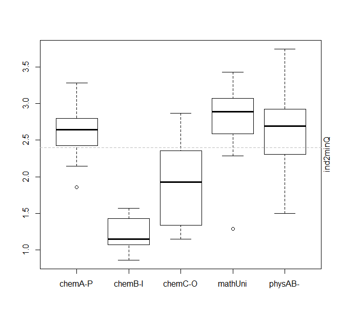

# Riding a (Topic) Horse You Don't See
["Give A Man A Horse He Can Ride"] says a poem (and ballad), but as a learner, you're riding a (topic) horse you don't see. Sometimes, it throws you off balance and off marks, raising doubts whether you *can* ride. You really don't know if you can ride, till you ride. If you stop riding, maybe you could have ridden if you continued.
["They can because they think they can"] says an epic poem, and forever armed with that self belief, let's deal with our topic.

Given a (discriminative or otherwise) set of questions, the probability of defective answers `DP` determines marks. An asymmetric marking scheme amplifies `DP`, e.g., `-1` for incorrect answer with `+4` for correct answer and `0` for not attempting. `DP` interacts with the probability of attempting to answer `att`. The [author](mailto:yadevinit@gmail.com) considers these for a competitive [JEE-Main] for a pair of extraordinary student learners `Ab` and `An` to cause `210 /300` marks by 2020-Jan *and* qualify for the [JEE-Advanced] of 2020-May.

## A Motivation for Topics
`DP` is really unknown ... and unknowable. But we know it varies, even for `Ab` and `An`. We can estimate it with some degree of (reliability or) confidence by using past data. Considering this Project's purpose, clearly we are interested in the tails of `DP` (population) distribution. Where `DP` is extremely high, our (possibility of performance's) "existence" is threatened, and we must trim `DP` there. Where `DP` is very low, we might like to perfect it, thereby making up for losses elsewhere. To answere "where," we need a "map" on which to locate `DP`. Test questions cannot be that map; almost certainly, they will not occur again (in a past exact form) in a future (discriminative) competitive test. Subject matter or *topics* can be that map. Teaching and learning, anyway, happens with topics. A question pertains to one or more topics; it tests the examinee's understanding and ability on those topics. Topics are pre-defined as part of any syllabus, possibly accompanied by prescribed allocation of marks and (teaching) time. Topics are covered in chapters, sections, units, or modules and their related activities, exercises, and tests, maybe using various pedagogies and paper, multi-media, or other technologies. Topics survive for decades, if not centuries. They evolve, as the world around evolves. So, let's choose [JEE-Main] topics as the basis for a map for this Project.

## Performance
A purpose of teaching-learning a topic is to lower the learners' `DP` for that topic. The author realizes that stating such a purpose might be perceived as "myopic" by educational purists and "disruptive" by advocates of conventional hierarchical organizations that "thin-task" for scale. But this stated purpose suffices to objectively (and quantitatively) deal with performance in that area. It is mathematically precise and focuses onto a skeletal framework to which relevant teaching-learning can be judiciously yet loosely coupled. For example:
- A strategy that lowers `DP` in lesser time and with lesser adversity can be preferred over other strategies.
- A culture of educational institutions collaborating with learners' families that systematically lowers `DP` for most learners year after year could be regarded as exhibiting superior performance compared to institutions that neither disclose such data nor make a specific promise of learning (as distinct from teaching). This is not to belittle those institutions, but the author chooses to clearly express a gap, which could present an institutional leader an opportunity for new action.

[India for PISA 2021] and [Joyful Maths] are consistent with this globally-connected and increasingly-skills-based (or competence-based or mastery-based) view.

## What's an Acceptable Performance?
A spreadsheet-based (formulaic) model [ADPexplore] has been developed for you to explore what's an "Acceptable" `DP` (`ADP`) for [JEE-Main]. It considers various what-if scenarios in different columns by varying the yellow-background cells. You can observe the following vis-a-vis the commitments declared by the learners earlier in this article:
- Scenario `att0.95DP0.23 JanJEEy0` gets `marks%=70%` when attempting most questions `att=95%` requiring a `DP=0.23` (in that sample of questions). [JEE-Main] can ask multiple questions for a topic, but targeting `att=95%` might allow a learner to divert resources to perform better on `95%` topics (during an exam and during preparation *before* an exam). That `95%=1-(3/65)` means resources could be diverted away from `3` of the `65` topics listed in the [JEE-Main] Syllabus. But beware that choice is not without risk: from those neglected topics, 4-5 questions could come. Attempting `95%` is really on questions, which might not be uniformly distributed across topics in a given paper.
- Scenario `att0.7DP0.12 JanJEEy0` gets `marks%=60%` when attempting fewer questions `att=0.7` requiring a `DP=0.12` (in that sample of questions). You can see `DP` required is significantly lower (for fewer attempted questions).
- Scenario `att0.9DP0.5 JanJEEy0` gets `marks%=33%`, i.e., `att=0.9` requires a `DP=0.50` (in that sample of questions).

Following graphs correspond to these scenarios, after fitting a [Binomial Distribution] with 25-Bernoulli trials considering that each subject is tested with 25 questions at [JEE-Main]). Each trial has a probability of success (or correct answer) as per specified `1 - DP`. Note that the y-axis `pExceed` has cumulative probability of *exceeding* the corresponding x-axis value, e.g., the first graph shows (a) almost certainty to exceed `mark.pct=33%` marked by the left vertical line and (b) about `0.4` chance to exceed `mark.pct=70%` marked by the right vertical line. Such probabilistic distributions were not available with our earlier [ADPexplore].


The [JEE-Main] Syllabus for 2020 shows 65 topics, with no distinction drawn (or stated policy weightage) between class 11 and 12. (For example, [Resonance Detailed Analysis 2018] shows a `class 11:12` Overall Marks Distribution of `48:52`.) The exam has `25*3=75` questions. To the author, it is natural to expect a question for each topic, with some more questions being allocated to some topics, e.g., the Syllabus states `20%` weightage within Physics for topic `Experimental Skills`.

## Findings from this Project for Topic Performance
### Topic-wise `DP` and Related Iterative Improvement
The author searched and did not find topic-wise `DP` data on the www. So, data in sheet `topicTrack` at [JanJEEy0-track] is being generated by extraordinary learners. Here's what you can observe through the following code block, which also shows `topicTrack` data structure and is further illustrated in subsequent plots:
- There still were topics to be separately tested; those showed up as `24 NA's` on 2019-Dec-15, but given the more-recent data, the `DP=0.50` that scenario `att0.9DP0.5 JanJEEy0` can be met as Ind2 further lowered `DP` for topics where this is violated.
- You can see that median `ind2DP` stayed around `0.29` while the mean lowered from around `0.33` to around `0.29` after an iteration of improvement actions, despite including about 24 more topics. `DP` wanted is `0.23` as per scenario `att0.95DP0.23 JanJEEy0` discussed earlier. `DP` lowering conventionally would require over half the topics to be worked on. Instead, the author recommended that this lowering of `DP` be done iteratively by working on few topics at a time corresponding to extreme ends of the distribution's tails. The iterations can be stopped once the required `DP` is met. (We'll come back to this "when to stop" question.)

```r
> str(topicTrack)
'data.frame':   65 obs. of  12 variables:
 $ topic            : Factor w/ 65 levels "A-Physical Chemistry-Unit1: some basic concepts in chemistry",..: 50 58 59 60 61 62 63 64 65 51 ...
 $ subject          : Factor w/ 3 levels "chemistry","maths",..: 2 2 2 2 2 2 2 2 2 2 ...
 $ dates            : Factor w/ 5 levels "","11/12/2019",..: 1 1 1 1 1 1 1 1 1 1 ...
 $ questionSources  : Factor w/ 5 levels "","Mtg past yrs",..: 1 1 1 1 1 1 1 1 1 1 ...
 $ questionCount    : int  NA NA NA NA NA NA NA NA NA NA ...
 $ defectCount      : int  NA NA NA NA NA NA NA NA NA NA ...
 $ minutes          : int  NA NA NA NA NA NA NA NA NA NA ...
 $ dates.1          : Factor w/ 8 levels "","10/12/2019",..: 6 6 5 6 5 6 1 6 5 1 ...
 $ questionSources.1: Factor w/ 11 levels "","ace manual",..: 2 2 3 3 10 3 1 2 10 1 ...
 $ questionCount.1  : int  7 14 7 7 7 7 NA 7 7 NA ...
 $ defectCount.1    : int  3 5 1 3 0 2 NA 4 2 NA ...
 $ minutes.1        : int  19 40 20 24 18 22 NA 21 22 NA ...
> ind1DP <- topicTrack$defectCount / topicTrack$questionCount
> ind2DP <- topicTrack$defectCount.1 / topicTrack$questionCount.1
> ind1minQ <- topicTrack$minutes / topicTrack$questionCount
> ind2minQ <- topicTrack$minutes.1 / topicTrack$questionCount.1
> date()
[1] "Sun Dec 15 22:59:54 2019"
> summary(ind2DP); hist(ind2DP)
   Min. 1st Qu.  Median    Mean 3rd Qu.    Max.    NA's 
 0.0000  0.1429  0.2857  0.3323  0.4286  1.0000      24 
> median.rmNA(ind1DP); mean(ind1DP, na.rm=TRUE) # summary(ind1DP)
[1] 0.3513986
[1] 0.3780803
> summary(ind2minQ)
   Min. 1st Qu.  Median    Mean 3rd Qu.    Max.    NA's 
 0.8571  1.7143  2.5714  2.3527  2.8571  3.7500      24 
> median.rmNA(ind1minQ)
[1] 1.044372
> ### --- after an iteration of improvement actions:
> date()
[1] "Sat Dec 28 20:11:07 2019"
> summary(topt$ind2DP)
   Min. 1st Qu.  Median    Mean 3rd Qu.    Max.    NA's 
 0.0000  0.1429  0.2857  0.2862  0.4286  0.8571       2 
> summary(topt$ind2minQ)
   Min. 1st Qu.  Median    Mean 3rd Qu.    Max.    NA's 
 0.8571  1.7857  2.5714  2.3763  2.8619  3.7500       2
> ### --- after yet another improvement iteration:
> date()
[1] "Sun Jan 05 13:12:18 2020"
> summary(topt$ind2DP); summary(topt$ind2minQ)
   Min. 1st Qu.  Median    Mean 3rd Qu.    Max. 
 0.0000  0.1429  0.2308  0.2263  0.2857  0.5417 
   Min. 1st Qu.  Median    Mean 3rd Qu.    Max. 
 0.8571  1.7632  2.5344  2.3466  2.8462  3.7500 
>   # ind2DP median 0.23 (mean too); 3rd quartile 0.29.
```

The following histogram on left shows the earlier emerging `DP` distribution's shape: it's right skewed, i.e., has a relatively-long right tail. The graph on right shows topics sorted on descending `DP`. Lines for `ADP` as per committed Results help you see the extent of gap and corresponding work to be done to lower `DP` to Acceptable levels in time.


The following shows these after an iteration of improvement actions:


And the following shows these after yet another iteration of improvement actions:


### How Performance Varies with Topic's Subject and Other Groupings
Here's a boxplot of how performance varies by `subject` after an improvement iteration (on left) and (to its right) a more-recent iteration, with comments in adjacent code block:


```r
>   # 2020Jan04: consider overlay with jitter to show raw observations which might be masked inadvertently by boxplot.
>   #   physics boxplot shows least variation, relative to others.
>   # 2019Dec28: can ind2 plan for these:
>   # chemistry shows the most variation. physics is missing those low-DP scores.
>   # can maths and physics be broken into subsec (though JEE Syllabus doesn't say so), eg, by clustering
>   # (or grouping separated by median) on both ind2DP and ind2minQ which then allows quadrants to be targeted
>   # with outputs including sets of 7 questions and Spacing at least 3 times?  (This is now available in 2020.)
```

From the following pairs of graphs after consecutive improvement iterations, what you can observe is embedded as comments in adjacent code block. `subsec` is got by concatenating the leftmost 4 `subject` characters with the leftmost 3 section characters from the beginning of (JEE) `topic` names. That's for subject Chemistry. More recently for Maths and Physics, this author chose to judgmentally aggregate groups of topics, considering Resonance's analysis reports; refer [Topic Grouping](./dat-topicGrp.csv) for the mapping. Recall that `ind2minQ` (or `ind1minQ`) is the time (minutes) used per question by Ind2 (or Ind1).





```r
> # count of topics in each `subSec`:
> summary(topt$subSec)
            cA-P             cB-I             cC-O        mCalculus 
              10                8               10                3 
       mGeometry           mOther pElectrodynamics       pMechanics 
               3               10                5                5 
          pOther 
              11 
>   # 2020Jan04: cC-O shows most variation and exceedance of higher DP limit; then mOther.
>   #   mGeometry shows highest median; cA-P shows least median.  Consider jitter for raw observations.
>   # till 2019Dec28: [B] ind2DP: "chemC-O" shows largest quartile intervals; so locate source & lower it.
>   #   "chemA-P" "chemB-I" show narrow; so exploit
>
>   # 2020Jan04: pOther (with also highest variation) pMechanics then mCalculus then cA-P show relatively high ind2minQ.
>   #   cB-I shows least ind2minQ.
>   # till 2019Dec28:
>   # 2019Dec28: ind2 to note the peak to the right of the (optimal) specified limit. let's take that on (and dissolve it)!
>   # ind2minQ: "chemB-I" shows least quartile intervals; so exploit.
>   # "mathUni" highest quartiles beyond (mean) limit, then "physAB-"; so locate source & lower it.
>   # overall: (a) maximize low DP & quick (topics of) "chemB-I" then "chemA-P".
>   # (b) ref [B] above.
```
### When to Stop the Improvement Iterations?
Now, let's deal with the question of "when to stop" the iterations. Here's what's done in creating the following graphs:
- On the left plot, fit a (discrete) Negative-Binomial distribution and plot it (as the solid red "stepped-S-shaped" curve). Then, overlay it with 95%-Confidence intervals (as the adjoining pair of dashed red curves) to show the degree of uncertainty in corresponding fitted-median estimates.
- On the right side, show its diagnostic plots that compare the empirical (observed) distribution (in black) with the theoretical distribution (in red). For example, in the histogram-like Density sub-plot, there are big gaps between the empirical (black) bars which are "re-distributed" in the theoretical distribution (red) bars.


Here's what you can observe from those graphs:
- That x-axis value of (observed) topic-wise `DP=50%` corresponds to a y-axis CDF of at least `0.8`, i.e., with 95% Confidence, you can say that 80% of topics' `DP` does not exceed `0.50`. You can relate this with earlier scenario `att0.9DP0.5 JanJEEy0`.
- That there's at least CDF 40% corresponding to x-axis limit marked by the vertical line. You can relate this with earlier scenario `att0.95DP0.23 JanJEEy0`.

After a more-recent improvement iteration, the (Gaussian) Normal distribution fitted better, with details (including estimated quantiles) in adjacent code block:


```r
> fdnorm <- fitdist(topt.ssti2$ind2DP, "norm")
> summary(fdnorm)
Fitting of the distribution ' norm ' by maximum likelihood 
Parameters : 
      estimate Std. Error
mean 0.2262676 0.01477347
sd   0.1191075 0.01044310
Loglikelihood:  46.07138   AIC:  -88.14275   BIC:  -83.79398 
Correlation matrix:
     mean sd
mean    1  0
sd      0  1

> quantile(bd, prob=c(0.5, 2*(45:50)/100))
(original) estimated quantiles for each specified probability (non-censored data)
             p=0.5   p=0.9    p=0.92    p=0.94    p=0.96    p=0.98 p=1
estimate 0.2262676 0.37891 0.3936222 0.4114528 0.4347875 0.4708845 Inf
Median of bootstrap estimates
             p=0.5     p=0.9    p=0.92    p=0.94    p=0.96    p=0.98 p=1
estimate 0.2278983 0.3801304 0.3947205 0.4122445 0.4354067 0.4707056 Inf

two-sided 95 % CI of each quantile
           p=0.5     p=0.9    p=0.92    p=0.94    p=0.96    p=0.98 p=1
2.5 %  0.2013829 0.3389065 0.3520646 0.3672840 0.3865024 0.4159228 Inf
97.5 % 0.2559239 0.4190277 0.4354498 0.4553528 0.4813995 0.5219769 Inf
>  # `bd` is bootstrapped to reflect uncertainty in parameter estimates of the fitted `norm` distribution. As per that:
>  # 96% of topic-wise DP is <= X where (a) X median is estimated as 0.44 and
>  # (b) X lies within 0.39 and 0.48 estimated with 95% Confidence.
> date()
[1] "Sun Jan 05 15:56:05 2020"
```

So now, we can now use these plots to inform Ind2's readiness to perform across topics in a [JEE-Main] exam and to a level that matters. To relate with the design of such competitive exams, imagine each topic has a bag of many questions, and there are 65 such bags corresponding to the 65 topics. Imagine each bag is hung from a chess board's (small black-or-white) square.  Well yes, that accounts for 64 bags. The 65th bag is hung across multiple squares. Then imagine the exam designer (a) chooses a representative sample of questions (75 of them for 2020) by dipping into those bags and (b) lays it out onto a question paper. As a (teacher-)learner, what you can do is sow seeds of learning. Sow them well, for it matters where (topic bags) you sow and how well. [The Sower] is there for inspiration.

## Lowering `DP` with Velocity and for Long
A school [SKCH-Principal] pointed this author to [Tony Buzan]. Another school [JKV-Principal] pointed to the memory of students.
With due acknowledgment to their institutions, the author found experimental research on what's called *Retrieval-based Learning with Spacing*, which is related to Testing Effect and elaborative rehearsal through graphic organizers such as [Mind Maps]. Sheet `references` at [JanJEEy0-track] has links to relevant articles. In case you didn't locate it, one link in the `reference` sheet is a [compilation of self-learning research], e.g., forethought-performance-reflection, weakest students least understand their learning gaps, and Retrieval Practice gives best results.

As an as-is example for Physics topic `Rotational Mechanics`, here are copies of related mind maps from the author's notes. The left one is of an incomplete-looking one that can be overlaid (for adding a usage/skill perspective) onto the other dense one (that's content based) on the right:


And then there's always an avenue: being a leader (of one's life or an organizational life) presents a universally-available option, for any matter anywhere. What speech act (conversation) and with whom can cause the future that matters, almost right now? That's what can be generated using a transformative leadership intervention [Declaring Breakdowns: powerfully creating a future that matters]. Do consider.

## Milestone Results for `Ab` and `An`

| By when         | Milestone Result |
|-----------------|------------------|
| 2020-Jan-07 Tue | `DP<=0.23` for each of `att=0.95` topics.<br/>(That's consistent with 70% marks at [JEE-Main].) |
| 2019-Dec-31 Tue | `DP<=0.30` for each of `att=0.95` topics. |
| 2019-Dec-24 Tue | `DP<=0.50` for each of `att=0.95` topics. |

In case any of these is unfulfilled a day prior, what's possible is to complete it in conversation with a teacher, mentor, or a peer.

## Appendix: Risk Prioritization Within a Topic
[topicRisk-class11&12] has a risk prioritization for bridging (sub-)topic-wise learning gaps.
It has the author's scores for subtopics of Physics topic `Rotational Mechanics` (11th class). Scores are for Homework questions in an educational institution D's Assignment Manual. Considering about 5 questions attempted per subtopic, it averages 58% score per question, i.e., `mean DP=(1 - 0.58)=0.42`. More importantly, it classifies subtopics such as `Kinetic energy and work-energy theorem` and `Newton's second law with rolling bodies (on horizontal and inclined surfaces)` into High Risk, where scores average below 50%. Subtopic `14.18` gets labelled Low Risk. So, the author can choose to divert resources, e.g., instead of doing further problems from `14.18`, the author can clarify concepts for the High-Risk subtopics.

## Appendix: Other `DP` Distribution Fitting
Following plots (a) explore discrete and continuous distributions for fitting with `DP` observations that this Project generated and then (b) fits a Gaussian (normal) distribution:


## Appendix: Extending this Project
As usual, you are welcome to extend this Project: here's the [R-source code](src-defectProb.R) and [data](JanJEEy0-track&#32;-&#32;topicTrack.csv).

["Give A Man A Horse He Can Ride"]: <https://en.wikipedia.org/wiki/Geoffrey_O%27Hara>
["They can because they think they can"]: <https://en.wikiquote.org/wiki/Virgil#Book_V>
[JEE-Main]: <https://jeemain.nta.nic.in/webinfo/public/home.aspx>
[JEE-Advanced]: <https://jeeadv.ac.in/>
[India for PISA 2021]: <https://pib.gov.in/newsite/PrintRelease.aspx?relid=187830>
[Joyful Maths]: <http://cbseacademic.nic.in/web_material/Manuals/JoyfulTeachingAndLearningOfMathematics.pdf>
[JanJEEy0 Community Project]: <https://docs.google.com/document/d/1_28dq4Vy9IH1ND76kL9Z769t8kKYM8dDTN2NMUaM_wQ/edit>
[JanJEEy0-track]: <https://docs.google.com/spreadsheets/d/1xkfQmmtMdM2sEU0KZD4-NTY5R6vILvt7oFC5xYyx6DQ/edit##gid=503847526>
[ADPexplore]: <https://docs.google.com/spreadsheets/d/1RJs9LErXD3c73cUN6sS9ZrrLMJGakKRJDt5XWSyXr4g/edit?usp=sharing>
[Mind Maps]: <https://bustingjeemain.com/category/mind-maps>
[compilation of self-learning research]: <https://d32ogoqmya1dw8.cloudfront.net/files/sage2yc/studentsuccess/GSA2013/self-regulated_learnerslearnin.pptx>
[SKCH-Principal]: <http://cbse-mls.kumarans.org/>
[JKV-Principal]: <http://jyothyvidyalaya.org/>
[Tony Buzan]: <https://www.tonybuzan.com/speed-reading-videos/>
[Declaring Breakdowns: powerfully creating a future that matters]: <http://sameerdua.com/declaring-breakdowns/>
[topicRisk-class11&12]: <https://docs.google.com/spreadsheets/d/1gnODxmLylPB1Mfb3z5McDAIAYAZ8rzVzl9sGKdcLJJo/edit#gid=2050370756>
[Binomial Distribution]: <http://ncert.nic.in/ncerts/l/lemh207.pdf>
[Resonance Detailed Analysis 2018]: <https://www.resonance.ac.in/answer-key-solutions/JEE-Main/2018/Detailed-Analysis-v2.pdf>
[The Sower]: <https://en.wikipedia.org/wiki/Wheat_Fields_(Van_Gogh_series)#June_-_The_Sower>
