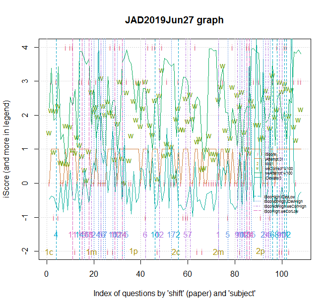
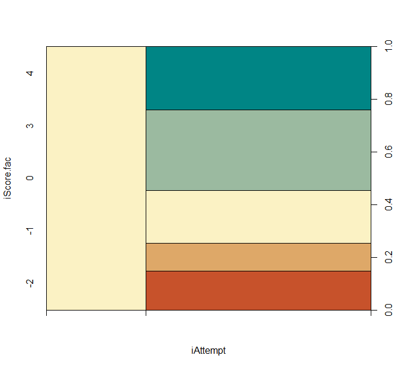

# Ind Twilight
Listening to an evening raga, the [author](mailto:yadevinit@gmail.com) dwells on an earlier Project [JEE: Enlighten]. While some things worked really well for that individual student learner Ind, some things (including a recent one) did not: marks dropped in the latest test. That's life. Can Ind be seen in new light: a twilight? Can past light from another Project [Chapter Skipped?] show the way as Ind nears a [JEE]?

## Data
[Data] from the past is already described at [Chapter Skipped?]. Following is a code block showing a `head` slice of that data `JAD2019Jun27`, along with its `str` structure (types of data columns), from a practice test. That test was conducted by an institution D for over 1000 students as per a 'competitive' JEE-Advanced pattern on a 12th-standard part of the syllabus. Please bear with the text wrap-around of each row of data:

``` {R}
> head(qao)
  qNum weAttempt weCorrect weIncorrect Difficulty                                            Chapter
1    1     55.45     37.19       62.81       Easy                         Haloalkanes and Haloarenes
2    2     84.44     53.69       46.31       Easy                         Haloalkanes and Haloarenes
3    3     46.30     23.11       76.89       Easy                                   p-Block Elements
4    4     48.05     53.04       46.96   Moderate Dual Nature of Radiation and Matter; Radioactivity
5    5     85.80     56.69       43.31       Easy                                  Chemical Kinetics
6    6     32.10     15.15       15.76   Moderate                         Haloalkanes and Haloarenes
                  Concept CorrectAnswer YourResponse iScore iDeviate subject shift qaType weAtCorrect countweAtCorrect
1                   SN E2             B   Unanswered      0    -1.38       c     1   -1:3       20.62             2062
2 Halogenation of toluene             B            B      3    -1.15       c     1   -1:3       45.34             4534
3                     SO2             A            D     -1    -1.21       c     1   -1:3       10.70             1070
4     Dissintegration ty2             B            B      3    -1.93       c     1   -1:3       25.49             2549
5       Activation Energy             B            C     -1    -2.41       c     1   -1:3       48.64             4864
6 Friedel crafts reaction           A,B   Unanswered      0    -0.13       c     1   -1:3        4.86              486
  DifficultyGrp qaTypeGrp iAttempt qao.id iScore.fac
1   notModerate       x:3    FALSE     1c          0
2   notModerate       x:3     TRUE     1c          3
3   notModerate       x:3     TRUE     1c         -1
4      Moderate       x:3     TRUE     1c          3
5   notModerate       x:3     TRUE     1c         -1
6      Moderate       x:3    FALSE     1c          0
> str(qao)
'data.frame':   108 obs. of  21 variables:
 $ qNum            : int  1 2 3 4 5 6 7 8 9 10 ...
 $ weAttempt       : num  55.5 84.4 46.3 48 85.8 ...
 $ weCorrect       : num  37.2 53.7 23.1 53 56.7 ...
 $ weIncorrect     : num  62.8 46.3 76.9 47 43.3 ...
 $ Difficulty      : Factor w/ 3 levels "Difficult","Easy",..: 2 2 2 3 2 3 3 1 2 2 ...
 $ Chapter         : chr  "Haloalkanes and Haloarenes" "Haloalkanes and Haloarenes" "p-Block Elements" "Dual Nature of Radiation and Matter; Radioactivity" ...
 $ Concept         : chr  "SN E2" "Halogenation of toluene" "SO2" "Dissintegration ty2" ...
 $ CorrectAnswer   : chr  "B" "B" "A" "B" ...
 $ YourResponse    : chr  "Unanswered" "B" "D" "B" ...
 $ iScore          : int  0 3 -1 3 -1 0 0 4 0 4 ...
 $ iDeviate        : num  -1.38 -1.15 -1.21 -1.93 -2.41 -0.13 -2.53 0.21 -2.37 1.15 ...
 $ subject         : Factor w/ 3 levels "c","m","p": 1 1 1 1 1 1 1 1 1 1 ...
 $ shift           : Factor w/ 2 levels "1","2": 1 1 1 1 1 1 1 1 1 1 ...
 $ qaType          : Factor w/ 3 levels "-1:3","-2:4",..: 1 1 1 1 1 1 2 2 2 2 ...
 $ weAtCorrect     : num  20.6 45.3 10.7 25.5 48.6 ...
 $ countweAtCorrect: int  2062 4534 1070 2549 4864 486 525 623 311 2626 ...
 $ DifficultyGrp   : Factor w/ 2 levels "Moderate","notModerate": 2 2 2 1 2 1 1 2 2 2 ...
 $ qaTypeGrp       : Factor w/ 2 levels "-2:4","x:3": 2 2 2 2 2 2 1 1 1 1 ...
 $ iAttempt        : logi  FALSE TRUE TRUE TRUE TRUE FALSE ...
 $ qao.id          : Factor w/ 6 levels "1c","1m","1p",..: 1 1 1 1 1 1 1 1 1 1 ...
 $ iScore.fac      : Factor w/ 5 levels "-2","-1","0",..: 3 4 2 4 2 3 3 5 3 5 ...
```

## What Happened Then
From `JAD2019Jun27`, here are Ind's aggregate scores, e.g., which say `iScore` totalled 0 (out of 62) in `shift=2,subject=c` and 28 (out of 62) in `shift=1,subject=p`:

```
> aggregate(qao["iScore"], by=list(qao$shift, qao$subject), FUN=sum)
  Group.1 Group.2 iScore
1       1       c     23
2       2       c      0
3       1       m     17
4       2       m     24
5       1       p     28
6       2       p     20
```

The author knows from other data that `we` for institution D has a mean 17.4% (`=11/62`) and maximum about 74.7% (`=46/62`) for this 'competitive' practice exam. Ind's `iScore` is better than D's `we` mean; at the same time, a 0 can eliminate Ind's eligibility from a (open General-Category) Common-Merit List rank at [JEE], considering a policy of minimum 10% in each subject for eligibility. Let's "bookmark" this "extreme event" (of total `iScore 0`) as **dotBall0** to ease locating and tracing this conversational thread in this article's text. What would (scientifically) explain the phenomenon of **dotBall0**? What [Mistake Proofing] can be done so that it never happens again? Given `iAttempt` (what Ind attempted), where does Ind lose more `iScore={-2,-1}` (downside)? Where could Ind have got more `iScore={3,4}`? Where could Ind raise `iAttempt`, especially where `weAtCorrect` is high (feasible upside)? What is that minimal high-leverage action? A cascade of questions floods the author. Using `JAD2019Jun27`, the following unravels and graphs what happened question-wise:



On the x-axis is a "ball-by-ball" account of 108 question-answers making up the 2 `shift` papers: `1` in the morning, the other `2` in the afternoon. `1c` labels where `shift=1 subject=chemistry` begins its 18 question "balls," at the rate of about 3 minutes per "ball" question. While `shift=1` precedes `shift=2`, the sequence of attempting subjects within each `shift` is really up to each examinee and is not mandated by the test. In fact, Ind revealed to the author that `2c` felt difficult on first glance and was attempted (by Ind) after the other subjects. With this graph, what strikes the author foremost is that so much is happening in such an exam: almost overwhelming! The author deeply acknowledges Ind for (a) containing any spillover and adverse impact from that first glance and (b) no obvious carry-over of any "gloom" (or "shock") from a question to adjacent questions, i.e., no "auto-correlation in time series" as a statistician or econometrician would call it. Looks like Ind doesn't reflect back in time; sometimes, it's good to leave the past behind where it belongs. Here in this Project, the author has chosen to look back in time and generate light that would guide into a future. Such an information light would strengthen Ind's Intuition which operates in the mental background while Ind Extraverts with the external world: Perceiving when learning and Judging when dealing with exam questions; that's what someone acquainted with [MBTI Personality Type] would say.

Whether Ind attempts a question is flagged as `iAttempt=TRUE`. Its line is shown in the graph at `y=1` wherever Ind attempts a question. It's shown at `y=0` when `iAttempt=FALSE`. Corresponding `iScore` points are labelled `i`. In the data, `iScore=0` when `iAttempt=FALSE` and also when Ind attempts a question *and* scores `0`. For each question, `iDeviate` points are shown as `iDeviate/3` for easy viewing on the same graph. A legend shows these time series as 'iAttempt.01', 'iScore', and 'iDeviate/3'. A lower legend says what various vertical lines denote for Ind's corrective actions. From this graph and correspondingly what's tabulated in code block ahead, we can observe the following:
  - Considering the `iScoHigh.iDevLow` vertical lines, Ind can acknowledge oneself (and people who caused it) for quickly and correctly answering those labelled questions, e.g., Ind scored high `{3,4}` on `1c` (`shift` 1's `subject` Chemistry) question `4` and `2c` question `2` within about a minute.
  - `iScoNotHigh.iDevHigh` is where Ind must investigate what's taking longer on those questions without correct answers being generated. On some of these, Ind invested time and did not give an answer. This category shows many `m` (Maths) questions. This is related with **dotBall0**.
  - Consider `iScoNotHigh.weCorHigh`. That's where `iScore` is not high *and* `weCorrect` is high (above its 75th percentile) which means a high proportion of D's competing `we` group that attempted that question got it correct. For example, `1p` question 6 has `weAttempt*weCorrect=69.65*74.58=` about 52%, i.e., over half of D's `we` group attempt *and* get it correct, whereas `iScore=-1`. Ind can discuss with `we` group and get what's being missed in learning. Incidentally, this category has fewer Chemistry questions than other subjects.
  - Consider `iScoHigh.weCorLow`. Ind can acknowledge oneself (and community) for correctly answering those labelled questions where `weCorrect` is low. For example, `1c` question 18 has over 90% `weAttempt` and less than a quarter `weCorrect` get it right; Ind got it right.
  - There are not many vertical lines for `2c` that could have explained **dotBall0**. (There are many more calling for action for `2p`.) Line `iScoHigh.iDevLow` labelled question `2` is a good sign worth acknowledging. `iScoNotHigh.weCorHigh` labels questions `5,7`; that's where Ind must investigate what got missed.

```
[1] "qao.iScoHigh.iDevLow"
    qao.id qNum qaType iAttempt iScore iDeviate weAttempt weCorrect
4       1c    4   -1:3     TRUE      3    -1.93     48.05     53.04
14      1c   14   -2:4     TRUE      3    -2.59     96.89     28.11
32      1m   14   -2:4     TRUE      3    -1.94     88.91     18.16
46      1p   10   -2:4     TRUE      4    -2.28     62.06     60.82
56      2c    2   -1:3     TRUE      3    -1.97     55.14     55.13
85      2m   13   -2:4     TRUE      4    -1.93     56.60     25.19
96      2p    6   -1:3     TRUE      3    -2.68     90.15     79.53
98      2p    8   -2:4     TRUE      4    -2.21     61.22     54.45
101     2p   11   -2:4     TRUE      4    -2.09     53.25     73.23
102     2p   12   -2:4     TRUE      4    -1.98     29.56     69.50
[1] "qao.iScoNotHigh.iDevHigh"
   qao.id qNum qaType iAttempt iScore iDeviate weAttempt weCorrect
16     1c   16   +0:3     TRUE      0     1.37     90.47      9.68
20     1m    2   -1:3    FALSE      0     1.94     71.98     52.70
22     1m    4   -1:3    FALSE      0    12.68     45.14     48.71
23     1m    5   -1:3    FALSE      0     2.80     52.14     77.24
24     1m    6   -1:3    FALSE      0     1.71     25.29     56.92
25     1m    7   -2:4    FALSE      0     2.83     21.98     50.44
28     1m   10   -2:4     TRUE     -2     4.95     60.89     49.52
30     1m   12   -2:4    FALSE      0     2.34     23.15     43.70
33     1m   15   +0:3     TRUE      0     3.93     92.02      0.42
53     1p   17   +0:3     TRUE      0     3.66     86.19     26.86
73     2m    1   -1:3    FALSE      0     3.01     53.88     61.48
77     2m    5   -1:3     TRUE     -1     2.07     51.78     24.29
82     2m   10   -2:4     TRUE     -2     3.00     62.26     56.57
84     2m   12   -2:4    FALSE      0     2.44     50.73     37.60
87     2m   15   +0:3     TRUE      0     1.72     98.95     60.38
92     2p    2   -1:3    FALSE      0    10.99     67.51     33.85
95     2p    5   -1:3     TRUE     -1     5.63     51.99     40.32
[1] "qao.iScoNotHigh.weCorHigh"
    qao.id qNum qaType iAttempt iScore iDeviate weAttempt weCorrect
19      1m    1   -1:3    FALSE      0     0.62     40.27     67.15
23      1m    5   -1:3    FALSE      0     2.80     52.14     77.24
42      1p    6   -1:3     TRUE     -1    -0.71     69.65     74.58
48      1p   12   -2:4    FALSE      0     0.97     26.85     64.49
59      2c    5   -1:3     TRUE     -1    -2.20     77.57     62.43
61      2c    7   -2:4    FALSE      0    -0.19     49.69     65.40
73      2m    1   -1:3    FALSE      0     3.01     53.88     61.48
81      2m    9   -2:4    FALSE      0    -1.95     25.79     65.04
83      2m   11   -2:4    FALSE      0    -2.37     17.19     67.07
93      2p    3   -1:3    FALSE      0    -1.62     44.65     68.08
94      2p    4   -1:3    FALSE      0    -0.38     46.54     63.06
99      2p    9   -2:4     TRUE     -2    -1.74     66.88     74.29
100     2p   10   -2:4     TRUE     -2    -0.22     45.07     67.44
[1] "qao.iScoHigh.weCorLow"
   qao.id qNum qaType iAttempt iScore iDeviate weAttempt weCorrect
11     1c   11   -2:4     TRUE      4    -1.40     56.81     24.32
15     1c   15   +0:3     TRUE      3    -1.30     96.50     20.16
18     1c   18   +0:3     TRUE      3    -1.82     91.63     23.35
29     1m   11   -2:4     TRUE      4    -1.09     60.89     17.57
32     1m   14   -2:4     TRUE      3    -1.94     88.91     18.16
85     2m   13   -2:4     TRUE      4    -1.93     56.60     25.19
86     2m   14   -2:4     TRUE      4    11.61     55.35     22.35
```

## Attempt to Score
Following code block and spine-plot shows:
+ `iAttempt=TRUE` for about 70% of the questions. `weAttempt` typically about 61% for a question. JEE-Advanced data across 6 years from another Project [JEE Insight] shows `uOtot` (`unattempted / tot`) typically about 25%, which means about 75% attempted.
```
> summary(qao$iAttempt); 75/(33+75)
   Mode   FALSE    TRUE 
logical      33      75 
[1] 0.6944444
> summary(qao$weAttempt)
   Min. 1st Qu.  Median    Mean 3rd Qu.    Max. 
  14.79   44.81   60.89   62.14   86.53   98.95
> summary(JEEdata.use$rOtot)
   Min. 1st Qu.  Median    Mean 3rd Qu.    Max. 
 0.0030  0.1290  0.2150  0.2481  0.3290  0.8620 
> summary(JEEdata.use$uOtot)
   Min. 1st Qu.  Median    Mean 3rd Qu.    Max. 
 0.0110  0.0990  0.2520  0.2785  0.4280  0.8000 
> att <- JEEdata.use$tot - JEEdata.use$unattempted; rOatt <- JEEdata.use$right / att
> summary(rOatt)
    Min.  1st Qu.   Median     Mean  3rd Qu.     Max. 
0.004009 0.213759 0.313668 0.339795 0.448787 0.905276
```
+ When `iAttempt=TRUE`, `iScore` is correct `{3,4}` in over half the questions. (Refer scale on right of spine-plot.) `weCorrect` is typically about 45%. [JEE Insight] data's equivalent `rOatt` is typically about 31%, as seen in code block above. Trivially, one would like Ind to avoid those `iScore=0` when `iAttempt=TRUE`, which happened about 20% of the time; and instead, convert those to `{3,4}`. One would also like Ind to score in the present `iAttempt=FALSE` zone. This relates with **dotBall0**.



From the following code block:
+ Consider impact of `qaType` on `iAttempt`:
  - `iAttempt=TRUE` for all `+0:3`, which is healthy.
  - `iAttempt=TRUE` for `-2:4` is likelier (for Ind in `JAD2019Jun27`) than for `-1:3`. The author found this unexpected. As a marking scheme, `-2:4` offers a riskier pay-off than `-1:3` since `-2/4=-0.5` is more negative than `-1/3=-0.33` and `-2` can put your score further back than `-1`. (All this, of course, assumes equally-likely options offered in those questions.)
+ Consider impact of `qaType` on `iScore`. `iScore` pay-offs from both `-2:4` and `-1:3` seem fine; apparently, Ind need not worry about them. (This dispels the author's earlier surprise.) Instead, Ind must alter the many 0s in `+0:3`, which are all attempted as observed earlier. This relates with **dotBall0**.
+ Consider impact of `qao.id` on `iScore`. `iScore` high `{3,4}` were not scored in `2c` as much as in `2p` or `1m` though negative `iScore={-2,-1}` occurrence is better than for `2p` and `iScore=0` is similar for `1m`. This would explain **dotBall0**.
```
[1] "impact of qaType on iAttempt :"
  Group.1        iAttempt
1    -1:3 logical, 16, 20
2    -2:4 logical, 17, 31
3    +0:3     logical, 24
[1] "impact of qao.id on iAttempt :"
  Group.1 iAttempt.Mode iAttempt.FALSE iAttempt.TRUE
1      1c       logical              5            13
2      1m       logical              7            11
3      1p       logical              3            15
4      2c       logical              7            11
5      2m       logical              7            11
6      2p       logical              4            14
[1] "impact of qaType on iScore.fac :"
  Group.1 iScore.fac.-2 iScore.fac.-1 iScore.fac.0 iScore.fac.3 iScore.fac.4
1    -1:3             0             9           16           11            0
2    -2:4            10             0           18            2           18
3    +0:3             0             0           14           10            0
[1] "impact of qao.id on iScore.fac :"
  Group.1 iScore.fac.-2 iScore.fac.-1 iScore.fac.0 iScore.fac.3 iScore.fac.4
1      1c             1             2            7            5            3
2      1m             2             0           10            3            3
3      1p             1             1            7            5            4
4      2c             2             3           11            1            1
5      2m             1             1            8            5            3
6      2p             3             2            5            4            4
```

Let's investigate impact of `qao.id` on `iScore` further. From the following code block, you can observe the following:
+ Given a random question from `JAD2019Jun27`, Odds of high `iScore {3,4}` (over not-high `iScore {-2,-1,0}`) are 0.612.
+ Given a question whose `shift subject` is known to be `2c`, Odds of high `iScore` (over not-high `iScore`) outcome are 0.125.
+ Given a question whose `shift subject` is *not* `2c`, Odds of high `iScore` are raised to 6.1 times that for `2c`. (That "6.1 times" equals Odds of high `iScore` being 0.765.) Put concisely, Odds Ratio of high `iScore` for `not 2c` is 6.1 times that for `2c` category. This further explains **dotBall0**.
```
> myAgg <- aggregate(qao["iScore.fac"], by=list(qao$qao.id=='2c'), FUN=summary); print(myAgg)
  Group.1 iScore.fac.-2 iScore.fac.-1 iScore.fac.0 iScore.fac.3 iScore.fac.4
1   FALSE             8             6           37           22           17
2    TRUE             2             3           11            1            1
> oddsHiSco <- NULL
> oddsHiSco["2c"] <- (1+1) / (18-(1+1))
> oddsHiSco["not2c"] <- (22+17) / (108-18-(22+17))
> print(oddsHiSco); print(oddsHiSco["not2c"] / oddsHiSco["2c"])
       2c     not2c 
0.1250000 0.7647059 
   not2c 
6.117647 
> myAgg <- colSums(myAgg)[c(1:5)+1]; print(myAgg) # ignore "Group" var
iScore.fac.-2 iScore.fac.-1  iScore.fac.0  iScore.fac.3  iScore.fac.4 
           10             9            48            23            18 
> sum(myAgg[4:5]) / sum(myAgg[1:3])
[1] 0.6119403
```

Why not have Ind be maximum: fully express (intrinsic) *ability* by answering all questions? Yes, there might be extra incorrect answers out there, but it's possible there are correct answers too that Ind stopped from giving, e.g., due to fear of negative marks or using another reason to stop such as "it's enough." If Ind wishes a "safety net," this all-out maximum-answering risk posture (or attitude) can be experimented during mock tests or (internal) revision exams. Ind is quick and has time "up his sleeve." So, Ind can attempt questions as usual during a test, and then instead of exiting, Ind can do another round of attempting skipped questions, with a corresponding note for later evaluating the impact of this approach. Armed with that objective assessment of ability, Ind can choose to be that way in the [JEE] of 2020-Jan, of 2020-Apr, or both, or for some of the subjects for maximal achievement. Without that, Ind is self limiting and acting inconsistent with an aspiration, e.g., of joining IIT-Mumbai's Electronics-Engineering undergraduate program. Taking it a step further and deeper, Ind can choose to practise offering the best-possible answer in ordinary conversations too. In turn, all this would automatically demand another level of suitable preparation from Ind. It takes courage, and that self-confidence can be [re-generated]; in terms of leadership and self expression, it's a transformation. ([Distances could be deceptive], says a ghazal poem, as though in support.)

What's this got to do with statistics, you might ask. Well, normally, a test is supposed to reliably measure ability. Here, Ind scores 23 in `1c` and 0 in `2c`, which we are tracing as **dotBall0**. From that, you cannot make a conclusive statement regarding Ind's ability, though you can eliminate or rank Ind through the competition. Ind's ability, therefore, remains undiscovered. Estimating ability, distinguishing it from test 'difficulty' and 'discriminative power' of questions, and other such matters are in the domain of statistics (and psychometrics), e.g., refer [Item Response Theory].

## Where to Now
Night has fallen. The tabla-percussion sarod rhythm of that evening raga raised its pace towards a conclusion. It's amazing how music, often created by those long gone, inspires and moves us now. That's what you might call classic(al). In this digital age, you and I too can express what likely will live on beyond us, e.g., through this article over the `www`.

Back to more worldly matters, may Ind act as recommended through this Project. That's what matters right now. And you are welcome to extend this Project; here's the [R source code].

[JEE: Enlighten]: <https://notebooks.azure.com/yadevinit/projects/jeeenlighten>
[Chapter Skipped?]: <https://docs.google.com/document/d/16nh-mq1bF8kjx_t6UezKINf6SAK1GG2whWGeSvlcUbo/edit?usp=sharing>
[JEE]: <https://jeemain.nic.in>
[Data]: <./qaoJAD.csv>
[Mistake Proofing]: <https://asq.org/quality-resources/mistake-proofing>
[Item Response Theory]: <https://en.wikipedia.org/wiki/Item_response_theory>
[Distances could be deceptive]: <https://www.rekhta.org/couplets/faasla-nazron-kaa-dhoka-bhii-to-ho-saktaa-hai-nida-fazli-couplets>
[MBTI Personality Type]: <https://www.myersbriggs.org/my-mbti-personality-type/mbti-basics/home.htm?bhcp=1>
[R source code]: <./src-IndTwilight.R>
[JEE Insight]: <https://notebooks.azure.com/yadevinit/projects/jeeinsight>
[re-generated]: <https://landmarkinsights.com/2017/06/pleasure-disappoints-possibility-never/>
