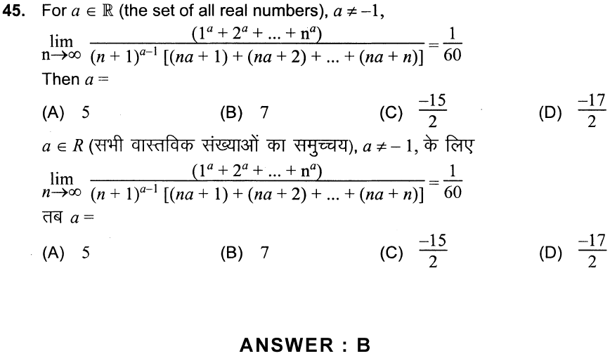
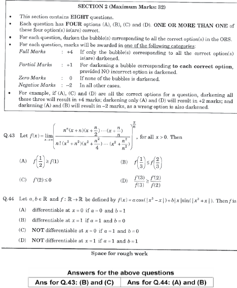

# Science Questions Stopped Learners
[JEE Insight] by this [author](mailto:yadevinit@gmail.com) observed questions that stopped over 90% of over 100s of 1000s of examinees in Physics, Chemistry, and Maths subjects during competitive [JEE Advanced] exams. Those stopped learners did not get it right, i.e., did not attempt or got those questions wrong. This Project shows you those most-difficult questions. You can empower yourself by solving them. Or you could alter science teaching and learning so that society is unstopped by these.

## The Pointer to Questions
An [output from JEE Insight](out-qaJEEadvanced.csv) is described at [JEE Insight]. Here's its relevant slice pointing to difficult questions:

```{R include=TRUE}
> head(JEEdata.use[order(JEEdata.use$rOtot, decreasing=FALSE),], 10)[,-c(5:6,15,17,19)]
    unattempted  wrong correct partCorrect1m   subject paper year qaNum           qaType markScheme right    tot uOtot rOtot
66        51399 103343     416            NA chemistry     2 2018    12           NumAns        +03   416 155158 0.331 0.003
44        49315 104377    1466            NA chemistry     1 2018     8           NumAns        +03  1466 155158 0.318 0.009
49        32951 120822    1385            NA chemistry     1 2018    13           NumAns        +03  1385 155158 0.212 0.009
99        30505 123303    1350            NA     maths     2 2018     9           NumAns        +03  1350 155158 0.197 0.009
360       10688 106718    2174            NA chemistry     1 2014    16            Compr       -103  2174 119580 0.089 0.018
92       112673  33585    1662          7238     maths     2 2018     2      MultCorrAns    -201234  3472 155158 0.726 0.022
549       92748  20382    2841            NA     maths     2 2013     5      MultCorrAns       -103  2841 115971 0.800 0.024
655       78802 389303   11546            NA     maths     1 2012    11      MultCorrAns        +03 11546 479651 0.164 0.024
502       84440  28610    2921            NA     maths     1 2013    18 SingDigitInteger       -104  2921 115971 0.728 0.025
313      117120  19763    1543          9252     maths     2 2016     7      MultCorrAns    -201234  3856 147678 0.793 0.026
```

`rOtot=right/tot` is referred to as `rightIR`, which stands for `right` Incidence Ratio, or simply, the proportion of right answers to a given question. It's a measure of difficulty. For example, the first and most-difficult question's data listed in the above code block shows it was `unattempted` by 51399, answered `wrong` by 103343, and answered `correct` (and including any `partCorrect`) by 416 out of `tot` 155158 examinees; so, `rOtot` is 0.003 which means about 3 per 1000 examinees got it `right`.

## The Questions
Here are screenshots of the questions as per the pointer `rOtot` sorted earlier in ascending order. The question papers are at [JEE Advanced]. And for answers (solutions or keys) to compare with, there are already resources such as [Resonance BASE] and [FIITJEE], e.g., for [2018 Resonance BASE].
### 1st Question


### 2nd and 3rd Questions
  * Refer question #8 (not #7): 
  * Refer question #13: 

### 4th Question
Refer question #9 (not #7 or #8):


### 5th Question


### 6th Question


### 7th Question



### 8th Question


### 9th Question


### 10th Question
Refer what's labelled #44 in:


## Missing Physics
Incidentally, no `physics` question got listed. In case you seek that, here is a slice of the most-difficult `physics` questions for you to explore:
```
> jdu <- head(JEEdata.use[order(JEEdata.use$rOtot, decreasing=FALSE),], 100)[,-c(5:6,15,17,19)]
> head(jdu[jdu$subject=='physics',], 10)
    unattempted  wrong correct partCorrect1m subject paper year qaNum           qaType markScheme right    tot uOtot rOtot
13        35553 113309    6296            NA physics     1 2018    13           NumAns          3  6296 155158 0.229 0.041
31        39325 109208    6625            NA physics     2 2018    13           NumAns          3  6625 155158 0.253 0.043
222       83413  48227    3178         12860 physics     1 2016    11      MultCorrAns    -201234  6393 147678 0.565 0.043
9         37834 110251    7073            NA physics     1 2018     9           NumAns          3  7073 155158 0.244 0.046
500       55720  54863    5388            NA physics     2 2013     1      MultCorrAns       -103  5388 115971 0.480 0.046
325       22967  90952    5661            NA physics     1 2014     6      MultCorrAns          3  5661 119580 0.192 0.047
578       79906 377243   22502            NA physics     1 2012    19 SingDigitInteger          3 22502 479651 0.167 0.047
390       56801  56946    5833            NA physics     2 2014    11            Compr       -103  5833 119580 0.475 0.049
320       17421  96224    5935            NA physics     1 2014     1      MultCorrAns          3  5935 119580 0.146 0.050
597       24530 427054   28067            NA physics     2 2012    18      MultCorrAns          3 28067 479651 0.051 0.059
```
And if you seek resources for strengthening ability, [The Art of Problem Solving in Physics] has worked out difficult problems in up to 6 different ways and could complement what you've got.

[JEE Insight]: <https://notebooks.azure.com/yadevinit/projects/jeeinsight>
[JEE Advanced]: <https://jeeadv.ac.in/>
[The Art of Problem Solving in Physics]: <https://www.sciencepyramid.co.in/>
[Resonance BASE]: <https://www.resonance.ac.in/answer-key-solutions/JEE-Advanced.aspx>
[FIITJEE]: <https://fiitjee.com/DownLoads/JEE-Advanced-(Earlier-IIT-JEE)-Solutions/13>
[2018 Resonance BASE]: <https://www.resonance.ac.in/answer-key-solutions/JEE-Advanced/2018/Answer-Key-Solution.aspx>
