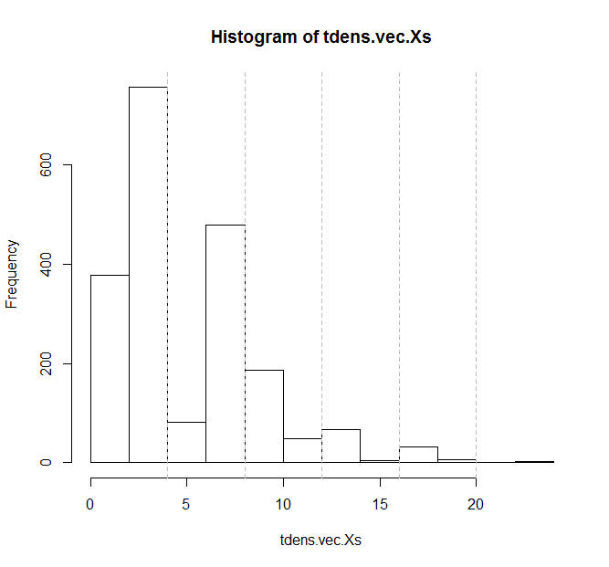

# Map of Topic Densities at JEE
As a learner preparing for a competitive exam, one deals with questions such as (a) "I don't have enough time; where do I really have to focus?" and (b) "I want to raise my scores in that exam; what are the important areas to work on?"
For subjects Physics, Chemistry, and Maths, [Resonance JEE Weightage Analysis] tabulates counts of questions for a list of topics observed year-wise at [JEE-Main] exams from 2002 to 2019. Resonance's report also tabulated averages: for each topic, the ratio of the sum of year-wise questions vs. the corresponding year-wise total questions for its subject. This [author](mailto:yadevinit@gmail.com) builds on that further here for aiding its informed use for a real [JEE-Main] exam setting.

## Data
This Project mapped Resonance's topics (98) to topics (65) in [Syllabus for JEE-Main-2020]. In the process, what was observed was (a) there are Resonance's topics that are not listed in [Syllabus for JEE-Main-2020] and (b) there are topics in [Syllabus for JEE-Main-2020] that do not have past data through Resonance's topics. These topics are listed in following code block:
```r
  print("dropping these JEE topics coz no prior data")
    # p B-Unit21: experimental skills
    # c C-Organic Chemistry-Unit27: chemistry in everyday life
  print("or dropping these Resonance topics coz not mapped to JEE-Main 2020 Syllabus topics")
    # m HEIGHT & DISTANCE
    # m SOLUTION OF TRIANGLE
    # m STATICS & DYNAMICS
```
After this mapping, (JEE-) topic-wise question densities were computed for each exam paper.

## Analysis Findings
2019 had various (offline) [JEE-Main] exam papers. The following scatter-plot shows mean values for 2019 densities vs. that for pre-2019 densities:


You can see from this previous plot that they are not independent of each other. In fact, you can visualize a fairly-linear relationship between the two. This means we cannot deny that the central tendencies of topic-wise question densities holds across time periods.

Now, let's see how these topic-wise question densities are distributed, not just their means:



```r
> summary(twt$avgWt) # topic-wise mean question densities across years (papers)
   Min. 1st Qu.  Median    Mean 3rd Qu.    Max. 
 0.2278  2.9581  4.5070  5.0000  6.2110 15.2170
> str(tdens.vec.Xs)
 num [1:2040] 13.33 1.33 12 6.67 3.64 ...
> summary(tdens.vec.Xs)
   Min. 1st Qu.  Median    Mean 3rd Qu.    Max. 
  0.000   3.333   3.333   5.000   6.667  22.667 
```
The graph has vertical grey dashed lines to relate with the x-axis, e.g., the leftmost line at `4% (=1*100/25)` helps identify question densities that were more (or less) frequent than that line which marks 1 question occurring in a 25-question subject paper.
The graph peaks at less than 4%, both typically (median) and on average (mean). The histogram shows it's right skewed, i.e., with a long tail to the right. So, some topics do get more than their "fair share" of questions in some papers.

Next, let's see if different subjects get differing (topic-wise) question densities in the following boxplot, with related comments in adjacent code block:


```r
>   summary(twt$subject)
 c  m  p 
26 16 18 
>   boxplot(tdens.vec.Xs.subjects)
Waiting to confirm page change...
>     # subject=m has greater proportion of topics with higher question densities, relative to other subjects.
>     # consider overlaying raw observations with recency and jitter
>   abline(h=c(1:5)*100/25, col="grey", lty="dashed") # mark integer count of questions in a 25-question paper.
```

Similarly, let's see if topics grouped (into subject-section) get differing question densities across (years') papers, with related comments in adjacent code block:


```r
>   str(subSec.fac) # note this doesn't include pB-U eg Experimental Skills with 20% weightage coz no past data!
 Factor w/ 5 levels "cA-P","cB-I",..: 4 4 5 4 5 5 5 5 4 4 ...
>   summary(subSec.fac)
cA-P cB-I cC-O mUni pA-U 
  10    8    8   16   18
>     # within subject chemistry, apparently, "cA-P" (Physical Chemistry median 40%) gets greater proportion of questions
>     # in papers; "cC-O" (Organic Chemistry median about 30%) is next and this varies least across (year-wise) papers.
>     # (There's only one group each for Maths and Physics; so, their question densities stay at 100%.)
>     # Now, consider the raw data shown as points with jitter:
>     # - for "cA-P", redder (recent-papers') points appear to be lower than less-red ones
>     # - for "cB-I", redder points appear to be higher.
>     # So, let's investigate their summaries:
>   for(i in 1:3){
+     asubSec <- dimnames(colXs.subSec.colSums.df)[[2]][i]
+     print(paste0(asubSec, " pre2019 then 2019on:"))
+     print(summary(colXs.subSec.colSums.df[(colXs.ixPre2019 - 2), asubSec]))
+     print(summary(colXs.subSec.colSums.df[(colXs.ix2019on - 2), asubSec]))
+   }
[1] "cA.P pre2019 then 2019on:"
   Min. 1st Qu.  Median    Mean 3rd Qu.    Max. 
  33.33   46.67   48.95   48.98   52.73   60.00 
   Min. 1st Qu.  Median    Mean 3rd Qu.    Max. 
  33.33   36.67   36.67   37.71   40.00   46.67 
[1] "cB.I pre2019 then 2019on:"
   Min. 1st Qu.  Median    Mean 3rd Qu.    Max. 
  13.33   16.67   20.67   21.30   26.00   33.33 
   Min. 1st Qu.  Median    Mean 3rd Qu.    Max. 
  20.00   26.67   30.00   30.00   33.33   36.67 
[1] "cC.O pre2019 then 2019on:"
   Min. 1st Qu.  Median    Mean 3rd Qu.    Max. 
  22.67   26.88   30.00   29.72   32.73   36.67 
   Min. 1st Qu.  Median    Mean 3rd Qu.    Max. 
  30.00   30.00   33.33   32.29   33.33   33.33
```

## The Map, Finally
The following boxplot "topic map" is overlaid with recency, using redder "heat-map" colours for data points nearer 2019. Those data points are shown with jitter; that's to avoid missing overlaps and possible misleading in interpreting boxplots. Median for each topic-wise boxplot (of question densities) is shown in thick black horizontal line (inside each "vertical box"), while mean is shown in green asterisk `*`. There are horizontal grey dashed lines to relate with the y-axis, e.g., the lowest line at `4% (=1*100/25)` helps identify topics (IDs on the x-axis) whose questions were more (or less) frequent than that line which marks 1 question occurring in a 25-question subject paper.


To view this boxplot closely, e.g., to observe the discrete nature of question densities, you can enlarge it after saving or downloading it or opening it into a new tab of your browser's graphical window. Following is its related code block that lists the JEE topics selected from it, with embedded comments:
```r
>     # topics on left extreme (~6) typically (median) get disproportionately more questions asked.
>     # similarly (~8) topics exist on right extreme with disproportionately fewer questions.
>   print(twt.summOrd[(twt.summOrd[,"50%"] >= (2*100/25)), col.qTopicMeans])
   subject                                       topicJEE       50%     avgWt
47       m                   Unit11: co-ordinate geometry 16.666667 15.217004
59       m Unit8: limit, continuity and differentiability 13.333333 12.749495
13       p                       A-Unit11: electrostatics 10.000000  8.853005
60       m                       Unit9: integral calculus 10.000000  8.749959
12       p               A-Unit10: oscillations and waves 10.000000  8.651833
14       p                  A-Unit12: current electricity  8.666667  8.033995
>     # mark/show topics with median >=2*100/25 as surely worth allocating more resources.
>
>   print(twt.summOrd[(twt.summOrd[,"75%"] >= (2*100/25)), col.qTopicMeans])
   subject                                                                 topicJEE       50%     avgWt       75%
47       m                                             Unit11: co-ordinate geometry 16.666667 15.217004 17.241379
59       m                           Unit8: limit, continuity and differentiability 13.333333 12.749495 13.793103
13       p                                                 A-Unit11: electrostatics 10.000000  8.853005 10.000000
60       m                                                 Unit9: integral calculus 10.000000  8.749959 10.344828
12       p                                         A-Unit10: oscillations and waves 10.000000  8.651833 10.000000
14       p                                            A-Unit12: current electricity  8.666667  8.033995 10.000000
24       p                                               A-Unit5: rotational motion  7.333333  8.309396 10.000000
18       p                                                         A-Unit16: optics  7.333333  8.164120 10.000000
49       m                                                   Unit13: vector algebra  6.920498  7.451155 10.000000
50       m                                       Unit14: statistics and probability  6.896552  7.569305  8.173077
19       p A-Unit18: atoms and nuclei;A-Unit17: dual nature of matter and radiation  6.666667  8.781704 10.000000
41       c          C-Organic Chemistry-Unit23: organic compounds containing oxygen  6.666667  7.488859 10.000000
5        c     A-Physical Chemistry-Unit4: chemical bonding and molecular structure  6.666667  6.120830  9.166667
28       p                                         A-Unit9: kinetic theory of gases  6.666667  5.588235 10.000000
38       c   C-Organic Chemistry-Unit20: some basic principles of organic chemistry  4.857143  5.896677  9.375000
>     # mark/show topics with 3rdQ >=2*100/25 as also worth allocating more resources.
>     # these now include subject=c too, despite its more topics.
>     # beware: there are 10 outliers that exceeded 16% (one in right extreme 2017!!),
>     # and there are 6 boxplot whiskers that exceeded 16%!  Rarer but occurred!
>
>   print(twt.summOrd[(twt.summOrd[,"50%"] < (1*(3/4)*(100/25))), col.qTopicMeans])
   subject                                                                           topicJEE      50%    avgWt      75%
22       p                                                            A-Unit3: laws of motion 2.159091 2.146613 3.333333
37       c C-Organic Chemistry-Unit19: purification and characterisation of organic compounds 1.666667 2.279475 3.833333
44       c              C-Organic Chemistry-Unit28: principles related to practical chemistry 1.666667 2.156863 3.333333
40       c                  C-Organic Chemistry-Unit22: organic compounds containing halogens 0.000000 2.098294 3.333333
42       c                  C-Organic Chemistry-Unit24: organic compounds containing nitrogen 0.000000 1.950980 3.333333
31       c                                             B-Inorganic Chemistry-Unit13: hydrogen 0.000000 1.176471 3.333333
56       m                                                      Unit5: mathematical induction 0.000000 0.227797 0.000000
>     # mark/show topics with median <(1*(3/4)*(100/25)) as candidates for diverting resources away from.
```

As usual, you are welcome to extend this Project. Here's the [R-source code](./src-topicWt.R) and [topic-density data](./qTopicDensityJEE.csv). You can download, sort, filter, and use this topic-density data to judiciously allocate resources to teaching-learning of topics.

[Resonance JEE Weightage Analysis]: <https://jeemain.resonance.ac.in/Assets/posts/JEE-Weightage-Analysis-Handout-v1.pdf>
[JEE-Main]: <https://jeemain.nta.nic.in/webinfo/public/home.aspx>
[Syllabus for JEE-Main-2020]: <https://jeemain.nta.nic.in/WebInfo/Handler/FileHandler.ashx?i=File&ii=13&iii=Y>
